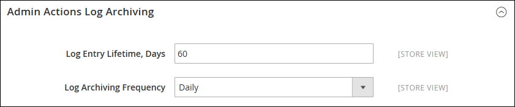

# Archivo de registro de acciones

{{ee-feature}}

El archivo de administración [actions](action-log.md) enumera los archivos de registro CSV almacenados en el servidor. En la configuración, puede especificar cuánto tiempo se almacenan las entradas de registro y con qué frecuencia se archivan. De forma predeterminada, el nombre de archivo incluye la fecha actual en formato ISO: `yyyyMMddHH`

>[!NOTE]
>
>El archivado de registros requiere que se configure un [trabajo cron](cron.md).

## Configuración del archivo de registro

1. En la barra lateral _Admin_, vaya a **[!UICONTROL Stores]** > _[!UICONTROL Settings]_>**[!UICONTROL Configuration]**.

1. En el panel izquierdo, expanda **[!UICONTROL Advanced]** y elija **[!UICONTROL System]**.

1. Expanda  en la sección **[!UICONTROL Admin Actions Log Archiving]** y establezca estas opciones:

   - **[!UICONTROL Log Entry Lifetime, Days]**: escriba el número de días que desea conservar las entradas de registro en la base de datos antes de quitarlas.
   - **[!UICONTROL Log Archiving Frequency]** — Se establece en `Daily`, `Weekly` o `Monthly`.

   {width="600" zoomable="yes"}

   Para obtener una lista detallada de las opciones de configuración, consulte [Archivado del registro de acciones de administración](../configuration-reference/advanced/system.md) en la _Referencia de configuración_.

1. Una vez finalizado, haga clic en **[!UICONTROL Save Config]**.

## Ver el archivo

En la barra lateral _Admin_, vaya a **[!UICONTROL System]** > _[!UICONTROL Actions Logs]_>**[!UICONTROL Archive]**.

{width="600" zoomable="yes"}
