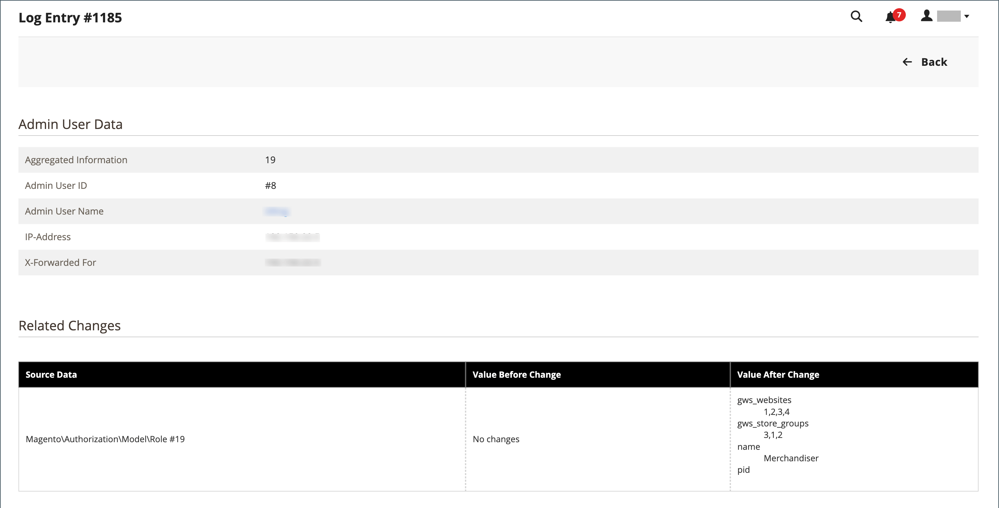

# Informe Registros de acciones

{{ee-feature}}

El informe _Registros de acciones_ muestra un registro detallado de todas las acciones de administración que están habilitadas para el registro. Cada registro tiene una marca de hora y registra la dirección IP y el nombre del usuario. El detalle del registro incluye los datos de usuario de administración y los cambios relacionados que se realizaron durante la acción.

Las acciones que desee mostrar en el informe deben habilitarse en la pantalla [Registro de acciones de administración](action-log.md) de la configuración del almacén. Si el tipo de acción está activado (habilitado), estos tipos de acciones de Administración se muestran en el informe Registros de acciones.

El informe se puede filtrar mediante las opciones de cada columna. Puede establecer una sola opción de filtro o definir opciones de filtro para varias columnas para reducir el informe a acciones específicas de la lista. También puede exportar los datos del informe en formato CSV o en formato XML de Excel.

El informe Registros de acciones incluye la siguiente información:

- **[!UICONTROL Time]**: fecha y hora en que se produjo la acción
- **[!UICONTROL Action Group]**: muestra el tipo de acción, se correlaciona con las acciones habilitadas en la pantalla _Registro de acciones de administración_ de la configuración de la tienda
- **[!UICONTROL Action]** - Muestra la acción que se registró
- **[!UICONTROL IP Address]** - Muestra la dirección IP del equipo en el que se realizó la acción
- **[!UICONTROL Username]** - Muestra el identificador de inicio de sesión del usuario que realizó la acción
- **[!UICONTROL Result]** - Muestra el éxito o el fracaso de la acción del usuario
- **[!UICONTROL Full Action Name]** - Muestra el nombre de la acción del servidor
- **[!UICONTROL Details]** - Muestra la categoría de acción del servidor
- **[!UICONTROL Full Details]** - Muestra todos los detalles registrados de la acción de administración

## Ver el informe Registros de acciones

1. En la barra lateral _Admin_, vaya a **[!UICONTROL System]** > _[!UICONTROL Actions Logs]_>**[!UICONTROL Report]**.

   {width="600" zoomable="yes"}

1. Para ver todos los detalles de una acción de administración enumerada, haga clic en **[!UICONTROL View]**.

   {width="600" zoomable="yes"}

## Filtrado del informe Registros de acciones

Puede definir los campos de opciones de filtro y luego hacer clic en **[!UICONTROL Search]** para reducir las acciones mostradas.

Para borrar las opciones de filtro y volver al informe completo, haga clic en **[!UICONTROL Reset Filter]**.

{width="600" zoomable="yes"}

| Campo | description |
|--- |--- |
| [!UICONTROL Time] | En **[!UICONTROL From]**, haga clic para seleccionar una fecha del calendario dinámico y definir la fecha de inicio del filtro. En **[!UICONTROL To]**, haga clic para seleccionar una fecha y definir la fecha final del filtro. |
| [!UICONTROL Action Group] | Elija un grupo de acción. |
| [!UICONTROL Action] | Elija una acción. |
| [!UICONTROL IP Address] | Introduzca la dirección IP del equipo utilizado para una acción. |
| [!UICONTROL Username] | Elija un nombre de usuario. El valor predeterminado es `All Users`. |
| [!UICONTROL Result] | Elija Éxito o Error. |
| [!UICONTROL Full Action Name] | Introduzca texto para que coincida la búsqueda en el campo. |
| [!UICONTROL Details] | Introduzca texto para que coincida la búsqueda en el campo. |

{style="table-layout:auto"}

## Exportación del informe Registros de acciones

1. Para **[!UICONTROL Export to]**, elija un formato de exportación:

   - `CSV`: archivo de valores separados por comas que contiene datos de texto sin formato
   - `Excel XML`: formato de datos de hoja de cálculo basado en XML

1. Haga clic en **[!UICONTROL Export]**.

   El archivo generado se guarda automáticamente en la carpeta designada para las descargas.

   {width="200"}
