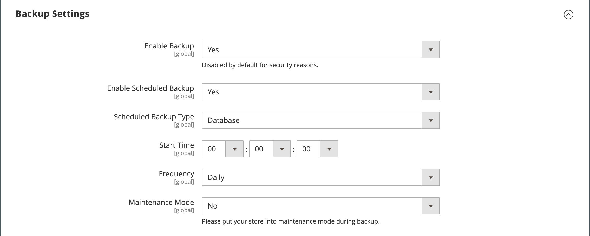

# Copias de seguridad del sistema

Adobe Commerce y Magento Open Source permiten realizar copias de seguridad de diferentes partes del sistema (como el sistema de archivos, la base de datos y los archivos multimedia) y revertirlas automáticamente. Aparece un registro para cada copia de seguridad en la cuadrícula de la página _Copias de seguridad_. Al eliminar un registro de la lista, también se elimina el archivo archivado. Los archivos de copia de seguridad de base de datos se comprimen con el formato GZ. Para las copias de seguridad del sistema y de la base de datos y las copias de seguridad de medios, se utiliza el formato TGZ. Como práctica recomendada, debe restringir el acceso a las herramientas de copia de seguridad y realizar copias de seguridad antes de instalar extensiones y actualizaciones.

- **Restringir el acceso a las herramientas de copia de seguridad.** El acceso a la herramienta de administración de copias de seguridad y reversiones se puede restringir configurando [roles de usuario](permissions-user-roles.md) para los recursos de copia de seguridad y reversión. Para restringir el acceso, deje la casilla de verificación correspondiente sin seleccionar. Para conceder acceso a los recursos de reversión, también debe conceder acceso a los recursos de copia de seguridad.

- **Haga una copia de seguridad antes de instalar extensiones y actualizaciones.** Realice siempre una copia de seguridad antes de instalar una extensión o actualización.

{{$include /help/_includes/backups-note.md}}

## Habilitar y programar copias de seguridad

1. En la barra lateral _Admin_, vaya a **[!UICONTROL Stores]** > _[!UICONTROL Settings]_>**[!UICONTROL Configuration]**.

1. En el panel izquierdo, expanda **[!UICONTROL Advanced]** y elija **[!UICONTROL System]**.

1. Expanda  en **[!UICONTROL Backup Settings]**.

1. Establezca **[!UICONTROL Enabled Schedule Backup]** en `Yes`.

1. Para programar copias de seguridad automáticas, defina las siguientes opciones de programación:

   - Establezca **[!UICONTROL Enabled Schedule Backup]** en `Yes`.
   - Establezca **[!UICONTROL Scheduled Backup Type]** en el tipo de copia de seguridad que se ejecutará a intervalos programados.
   - Establezca **[!UICONTROL Start Time]** a la hora del día para ejecutar la operación de copia de seguridad.
   - Establezca **[!UICONTROL Frequency]** en `Daily`, `Weekly` o `Monthly`.
   - Establezca **[!UICONTROL Maintenance Mode]** en `Yes`.

   {width="600" zoomable="yes"}

1. Una vez finalizado, haga clic en **[!UICONTROL Save Config]**.

## Crear una copia de seguridad

1. En la barra lateral _Admin_, vaya a **[!UICONTROL System]** > _[!UICONTROL Tools]_>**[!UICONTROL Backups]**.

1. En la esquina superior derecha, haga clic en el tipo de copia de seguridad que desee crear:

   - **[!UICONTROL System Backup]** - Crea una copia de seguridad completa de la base de datos y del sistema de archivos. Durante el proceso, puede elegir incluir la carpeta de medios en la copia de seguridad.

   - **[!UICONTROL Database and Media Backup]**: crea una copia de seguridad de la base de datos y de la carpeta multimedia.

   - **[!UICONTROL Database Backup]** - Crea una copia de seguridad de la base de datos.

   {width="600" zoomable="yes"}

1. Para poner el almacén en modo de mantenimiento durante la copia de seguridad, seleccione la casilla de verificación.

   Cuando se completa la copia de seguridad, el modo de mantenimiento se desactiva automáticamente.

1. Para una copia de seguridad del sistema, seleccione la casilla de verificación **[!UICONTROL Include Media folder to System Backup]** para incluir la carpeta multimedia.

1. Cuando se le solicite, confirme la acción.

<!-- Last updated from includes: 2023-02-22 09:59:54 -->
