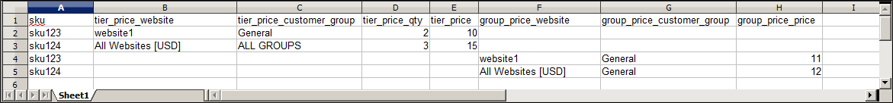

# Referencia de atributos de datos del producto

En la tabla siguiente se enumeran los atributos de una exportación de producto típica, en el orden predeterminado en que aparecen. Cada atributo se representa en el archivo CSV como una columna y los registros de productos se representan mediante filas. Las columnas que comienzan con un guion bajo contienen datos de servicio como propiedades o valores de opción para datos complejos. Puedes [exportar](data-export.md) un producto de tu catálogo para ver cómo se representa cada atributo en los datos.

La instalación utilizada para exportar estos datos tiene instalados los datos de ejemplo, y tiene dos sitios web y varias vistas de tiendas. Aunque esta lista incluye todas las columnas que se exportan normalmente, `sku` es el único valor requerido. Para importar datos, solo puede incluir las columnas con cambios. `sku` debe ser la primera columna, pero el orden del resto de los atributos no importa.

## Estructura de archivo CSV de producto simple

| Atributo | Descripción |
|--- |--- |
| `sku` | (Obligatorio) La unidad de mantenimiento de existencias es un identificador alfanumérico único que se utiliza para realizar el seguimiento del inventario. Un SKU puede tener hasta 64 caracteres de longitud. Por ejemplo: `sku123` **_Nota:_**Un SKU de más de 64 caracteres hace que la importación falle. |
| `store_view_code` | Identifica las vistas de tienda específicas donde el producto está disponible. Si está en blanco, el producto está disponible en la vista de tienda predeterminada. Por ejemplo: `storeview1`, `english`, `spanish` |
| `attribute_set_code` | Asigna el producto a un conjunto de atributos o plantilla de producto específicos, según el tipo de producto. Una vez creado el producto, no se puede cambiar el conjunto de atributos. Por ejemplo: `default` |
| `product_type` | Indica el tipo de producto. Valores: `simple` — Artículos tangibles que normalmente se venden como unidades individuales o en cantidades fijas. `grouped`: grupo de productos independientes que se vende como un conjunto. `configurable`: un producto con varias opciones que el cliente debe seleccionar antes de realizar una compra. El inventario se puede administrar para cada conjunto de variaciones porque representan un producto independiente con un SKU distinto. Por ejemplo, una combinación de color y tamaño para un producto configurable está asociada a un SKU específico del catálogo. `virtual`: un producto no tangible que no requiere envío y no se guarda en el inventario. Algunos ejemplos son servicios, suscripciones y suscripciones. `bundle`: un conjunto de productos personalizable de productos simples que se venden juntos. |
| `categories` | Indica cada categoría asignada al producto. Separe las categorías y subcategorías con una barra diagonal. Para indicar varias rutas de categorías, separe cada una con una barra vertical \| símbolo. Por ejemplo: `Default Category/Gear\|Default Category/Gear/Bags` |
| `product_websites` | El código del sitio web de cada sitio web donde está disponible el producto. Un solo producto se puede asignar a varios sitios web o limitarse a uno. Si especifica varios sitios web, sepárelos con una coma y sin espacios. Por ejemplo: `base` o `base,website2` |
| `name` | El nombre del producto aparece en todas las listas de productos y es el nombre que utilizan los clientes para identificar el producto. |
| `description` | La descripción del producto proporciona información detallada sobre el producto y puede incluir etiquetas HTML simples. |
| `short_description` | El uso de la descripción breve del producto depende de la temática. Puede aparecer en listados de productos y a veces se utiliza en listados de fuentes RSS enviados a sitios de compras. |
| `weight` | El peso del producto individual. El peso real del producto lo determina el transportista en el momento del envío. |
| product_online | Determina si el producto está disponible para la venta en la tienda. Valores: `1` — (Sí) El producto está habilitado y disponible para la venta. `2` — (No) El producto está deshabilitado y no está disponible para la venta. |
| `tax_class_name` | El nombre de la clase de impuestos asociada a este producto. |
| `visibility` | Determina si el producto está visible en el catálogo y si está disponible para la búsqueda. Valores: `Not Visible Individually` — El producto no se incluye en las listas de productos, aunque podría estar disponible como una variación de otro producto. `Catalog`: el producto aparece en todos los listados de catálogo. `Search`: el producto está disponible para operaciones de búsqueda. `Catalog, Search`: el producto está incluido en las listas de catálogos y también está disponible para la búsqueda. |
| `price` | El precio por el que el producto se ofrece a la venta en su tienda. |
| `special_price` | El precio con descuento del producto durante el intervalo de fechas especificado. |
| `special_price_from_date` | La fecha de inicio del período de tiempo en el que el precio especial está en vigor. |
| `special_price_to_date` | La última fecha del período de tiempo en que el precio especial está en vigor. |
| `url_key` | La parte de la dirección URL que identifica el producto. El valor predeterminado se basa en el nombre del producto. Por ejemplo: `product-name` |
| save_rewrites_history | Cuando se proporciona el valor `1` con un nuevo `url_key`, se genera una nueva reescritura de dirección URL 301 para que la dirección URL antigua se redirija a la nueva. |
| `meta_title` | El metatítulo aparece en la barra de título y en la pestaña del explorador y en las listas de resultados de búsqueda. El metatítulo debe ser único para el producto, incorporar palabras clave de alto valor y tener menos de 70 caracteres de longitud. |
| `meta_keywords` | Las metapalabras clave solo son visibles para los motores de búsqueda y algunos motores de búsqueda las ignoran. Elija palabras clave de alto valor, separadas por una coma. Por ejemplo: `keyword1`, `keyword2`, `keyword3` |
| `meta_description` | Las metadescripciones proporcionan una breve descripción del producto para las listas de resultados de búsqueda. Lo ideal es que una metadescripción tenga entre 150 y 160 caracteres de longitud, aunque el campo acepta hasta 255 caracteres. |
| `base_image` | La ruta relativa para la imagen principal de la página del producto. Commerce almacena los archivos internamente en una estructura de carpetas alfabética. Puede ver la ubicación exacta de cada imagen en los datos exportados. Por ejemplo: `/sample_data/m/b/mb01-blue-0.jpg` Para cargar una imagen nueva o escribir sobre una imagen existente, escriba el nombre del archivo, precedido de una barra diagonal. Por ejemplo: `/image.jpg` |
| `base_image_label` | La etiqueta asociada con la imagen base. |
| `small_image` | Nombre del archivo de la imagen pequeña que se utiliza en las páginas del catálogo, precedido de una barra diagonal. Por ejemplo: `/image.jpg` |
| `small_image_label` | La etiqueta asociada con la imagen pequeña. Por ejemplo: `Small Image 1`, `Small Image 2` |
| `thumbnail_image` | Nombres de archivo de cualquier imagen en miniatura que aparezca en la galería en la página del producto, precedidos de una barra diagonal. Por ejemplo: `/image.jpg` |
| `thumbnail_image_label` | La etiqueta asociada con cualquier imagen en miniatura. Por ejemplo: `Thumbnail 1`, `Thumbnail 2` |
| `created_at` | Indica la fecha en la que se creó el producto. La fecha se genera automáticamente cuando se crea el producto, pero se puede editar más adelante. |
| `updated_at` | Indica la fecha en la que se actualizó el producto por última vez. |
| `new_from_date` | Especifica la fecha &quot;desde&quot; para las nuevas listas de productos y determina si el producto se presenta como nuevo. |
| `new_to_date` | Especifica la fecha &quot;hasta&quot; para las nuevas listas de productos y determina si el producto se presenta como nuevo. |
| `display_product_options_in` | Si el producto tiene varias opciones, determina dónde aparecerán en la página del producto. Valores: Columna de información del producto/Bloque después de la columna de información |
| `map_price` | El precio mínimo anunciado del producto. (Sólo aparece si MAP está habilitado). |
| `msrp_price` | El precio de venta sugerido por el fabricante para el producto. (Sólo aparece si MAP está habilitado). |
| `map_enabled` | Determina si el precio mínimo anunciado está habilitado en la configuración. Valores: `1` — (Sí) El MAP está habilitado. `0` (o en blanco) — (No) MAP no está habilitado. |
| `gift_message_available` | Determina si se puede incluir un mensaje de regalo con la compra del producto. Valores: `1` — (Sí) La opción para incluir un mensaje de regalo se presenta al cliente. `0` (o en blanco) — (No) La opción para incluir un mensaje de regalo no se presenta al cliente. |
| `custom_design` | Enumera las temáticas disponibles que se pueden aplicar a la página del producto. |
| `custom_design_from` | Especifica la fecha de inicio en la que se aplica el tema seleccionado a la página del producto. |
| `custom_design_to` | Especifica la fecha de finalización en la que se aplica el tema seleccionado a la página del producto. |
| `custom_layout_update` | Código XML adicional que se aplica como actualización de diseño a la página del producto. |
| `page_layout` | Determina el diseño de página de la página de producto. Valores: `No layout updates` — No se realiza ningún cambio en el diseño de la página. `1 column`: aplica un diseño de una columna a la página del producto. `2 columns with left bar`: aplica un diseño de dos columnas con una barra lateral izquierda a la página de producto. `2 columns with right bar`: aplica un diseño de dos columnas con una barra lateral derecha a la página del producto. `3 columns`: aplica un diseño de tres columnas a la página del producto. `empty` — aplica un diseño en blanco a la página del producto. |
| `product_options_container` | Si el producto tiene varias opciones, determina dónde aparecerán en la página del producto. Valores: Columna de información del producto/Bloque después de la columna de información |
| `msrp_display_actual_price_type` | Determina si el cliente puede ver el precio real de un producto. Valores: `In Cart` — Muestra el precio real del producto en el carro de compras. `Before Order Confirmation`: muestra el precio real del producto al final del proceso de cierre de compra, justo antes de que se confirme el pedido. `On Gesture`: muestra el precio real del producto en una ventana emergente cuando el cliente hace clic en _Haga clic para ver el precio_ o _¿Qué es esto?_ vínculo. |
| `country_of_manufacture` | Identifica el país donde se fabricó el producto. |
| `additional_attributes` | Atributos adicionales creados para el producto. Por ejemplo:  `has_options=0,required_options=0color=Black,has_options=0,required_options=0,size_general=XS` |
| `qty` | La cantidad del producto que está actualmente en stock. |
| `out_of_stock_qty` | Nivel de stock que determina que el producto está agotado. |
| `use_config_min_qty` | Determina si se utiliza el valor predeterminado de la configuración y corresponde a la casilla de verificación Usar configuración de configuración. Valores:  `1` — (Sí) Se utiliza la configuración predeterminada para el valor de este atributo. `0` (o en blanco) — (No) La configuración predeterminada se puede anular para el valor de este atributo. |
| `is_qty_decimal` | Determina si el atributo qty tiene un valor decimal. Valores: `1` — (Sí) El valor del atributo qty es un valor decimal. `0` (o en blanco) — (No) El valor del atributo qty es un número entero (entero). |
| `allow_backorders` | Determina si la tienda permite pedidos pendientes y cómo se administran. |
| `use_config_backorders` | Determina si se utiliza la configuración predeterminada para los pedidos pendientes y corresponde al estado de la casilla de verificación Usar configuración de configuración. Valores: `1` — (Sí) El valor del atributo qty es un valor decimal. `0` (o en blanco) — (No) El valor del atributo qty es un número entero (entero). |
| `min_cart_qty` | Especifica la cantidad mínima del producto que se puede comprar en un único pedido. |
| `use_config_min_sale_qty` | Determina si se utiliza la configuración predeterminada para la cantidad mínima y corresponde al estado de la casilla de verificación Usar configuración de configuración. Valores: `1` — (Sí) `0` (o en blanco) — (No) |
| `max_cart_qty` | Especifica la cantidad máxima del producto que se puede comprar en un único pedido. |
| `use_config_max_sale_qty` | Determina si se utiliza la configuración predeterminada para la cantidad máxima y corresponde al estado de la casilla de verificación Usar configuración de configuración. Valores: `1` — (Sí) `0` (o en blanco) — (No) |
| `is_in_stock` | Indica si el producto está en stock. |
| `notify_on_stock_below` | Especifica el nivel de existencias que déclencheur una notificación _sin existencias_. |
| `use_config_notify_stock_qty` | Determina si se utiliza la configuración predeterminada para almacenar en déclencheur las notificaciones a nivel de stock y corresponde al estado de la casilla de verificación Usar configuración de configuración. Valores: `1` — (Sí) `0` (o en blanco) — (No) |
| `manage_stock` | Determina si se utiliza el control de inventario para administrar el producto. Valores: `1` — (Sí) Activa el control de inventario completo para administrar los niveles de stock del producto. `0` (o en blanco) — (No) El sistema no realiza el seguimiento del número de elementos que están actualmente en existencias. |
| `use_config_manage_stock` | Determina si se utiliza la configuración predeterminada para administrar existencias y corresponde al estado de la casilla de verificación Usar configuración de configuración. Valores: `1` — (Sí) `0` (o en blanco) — (No) |
| `use_config_qty_increments` | Determina si se utiliza la configuración predeterminada para los incrementos de cantidad y corresponde al estado de la casilla de verificación Usar configuración de configuración. Valores: `1` — (Sí) `0` (o en blanco) — (No) |
| `qty_increments` | Establece el número de productos que componen un incremento de cantidad. |
| `use_config_enable_qty_inc` | Determina si se utiliza la configuración predeterminada para habilitar los incrementos de cantidad y corresponde al estado de la casilla de verificación Usar configuración de configuración. Valores: `1` — (Sí) `0` (o en blanco) — (No) |
| `enable_qty_increments` | Determina si los incrementos de cantidad están activados para el producto. |
| `is_decimal_divided` | Determina si las partes del producto se pueden enviar por separado. Opciones: `Yes` / `No` |
| `website_id` | Para instalaciones con varios sitios web, identifica un sitio web específico donde el producto está disponible. Si está en blanco, el producto está disponible en todos los sitios web. |
| `related_skus` | Indica el SKU de cada producto que se ha identificado como producto relacionado. Por ejemplo: `24-WG080,24-UG03,24-UG01,24-UG02` |
| `related_position` | Determina la posición (criterio de ordenación) de los SKU que aparecen como productos relacionados en la columna related_skus. Por ejemplo: `1,2,3,4` |
| `crosssell_skus` | Indica el SKU de cada producto que se ha identificado como venta cruzada. |
| `crosssell_position` | Determina la posición (criterio de ordenación) de las SKU que se muestran como productos de venta cruzada en la columna `crosssell_skus`. |
| `upsell_skus` | Enumera el SKU de cada producto que se ha identificado como una venta ascendente. |
| `upsell_position` | Determina la posición (criterio de ordenación) de las SKU que se muestran como productos de ampliación de venta en la columna `upsell_skus`. |
| `additional_images` | Nombres de archivo de cualquier imagen adicional que se va a asociar al producto, precedidos de una barra diagonal. Por ejemplo: `/image.jpg` |
| `additional_image_labels` | Las etiquetas asociadas con cualquier imagen adicional. Por ejemplo: `Label 1`, `Label 2` |
| `custom_options` | Especifica las propiedades y los valores asignados a cada opción personalizada. Por ejemplo:  `name=Color, type=drop_down, required=1, price= price_type=fixed, sku=, option_title=Black|name=Color, type=drop_down, required=1, price=, price_type=fixed, sku=, option_title=White` |

{style="table-layout:auto"}

## Datos de servicio para variaciones de productos

| Atributo | Descripción | Se aplica a |
|--- |--- | --- |
| `_super_products_sku` | El SKU generado para una variación de producto configurable. Por ejemplo: WB03-XS-Green | Productos configurables |
| `_super_attribute_code` | El código de atributo de una variación de producto configurable. Por ejemplo: color | Productos configurables |
| `_super_attribute_option` | El valor de una variación de producto configurable. Por ejemplo: verde | Productos configurables |
| `_super_attribute_price_corr` | Un ajuste de precio asociado a una variación de producto configurable. | Productos configurables |
| `_associated_sku` | El SKU de un producto asociado a un producto agrupado. | Productos agrupados  Productos en paquete |
| `_associated_default_qty` | Determina la cantidad del producto asociado que se incluye. | Productos configurables Productos agrupados Productos agrupados |
| `_associated_position` | Determina la posición del producto asociado cuando se enumera con otros productos asociados. | Productos configurables Productos agrupados Productos agrupados |

{style="table-layout:auto"}

## Atributos de datos de producto complejos

El término datos complejos se refiere a los datos asociados con varias opciones de producto. Los siguientes tipos de producto utilizan datos que se originan en productos separados para crear variaciones de productos y múltiples opciones.

- [Configurable](../catalog/product-create-configurable.md)
- [Agrupado](../catalog/product-create-grouped.md)
- [Paquete](../catalog/product-create-bundle.md)

Si exporta un producto configurable, encontrará los atributos estándar que constituyen un producto simple, además de los atributos adicionales necesarios para administrar datos complejos.

{width="600" zoomable="yes"}

### Productos configurables

| Atributo | Descripción |
|--- |--- |
| `configurable_variation_labels` | Etiquetas que identifican variaciones de productos. Por ejemplo: `Choose Color:` o `Choose Size:` |
| `configurable_variations` | Describe los valores asociados con una variación de producto. Por ejemplo: `sku=sku-red xs,color=red,size=xs,price=10.99,display=1,image=/pub/media/import/image1.png|sku=sku-red-m,color=red,size=m,price=20.88,display=1,image=/pub/media/import/image2.png` |

{style="table-layout:auto"}

### Productos agrupados

| Atributo | Descripción |
|--- |--- |
| `associated_skus` | Identifica los SKU de los productos individuales que conforman el grupo. |

{style="table-layout:auto"}

### Paquete de productos

| Atributo | Descripción |
|--- |--- |
| `bundle_price_type` | Determina si el precio de un artículo agrupado es fijo o dinámico. |
| `bundle_sku_type` | Determina si a cada elemento se le asigna una variable, un SKU dinámico o si se utiliza un SKU fijo para el paquete. Opciones: fijo/dinámico |
| `bundle_weight_type` | Determina si el peso de un elemento de paquete es variable o fijo. |
| `bundle_values` | Describe enseñar valor asociado a una opción de paquete. Por ejemplo: `name=Bundle Option One,type=dropdown; required=1, sku=sku-option2,price=10, price_type=fixed` |

{style="table-layout:auto"}

## Atributos de precios avanzados

Importación/Exportación de Precios Avanzada le permite actualizar rápidamente la información de precios para grupos de productos y precios de nivel. El proceso para [importar](data-import.md) y [exportar](data-export.md) datos de precios avanzados es el mismo que cualquier otro tipo de entidad. El archivo CSV de ejemplo contiene los precios de nivel y de grupo de cada tipo de producto que admite precios avanzados. Cambiar los precios avanzados no afecta al resto del registro del producto.

{width="600" zoomable="yes"}

| Atributo | Descripción |
|--- |--- |
| `sku` | (Obligatorio) La unidad de mantenimiento de existencias es un identificador alfanumérico único que se utiliza para realizar el seguimiento del inventario. Un SKU puede tener hasta 64 caracteres de longitud. Por ejemplo: `sku123` **_Nota:_**Un SKU de más de 64 caracteres hace que la importación falle. |
| `tier_price_website` | El [código de sitio web](../stores-purchase/stores.md#add-websites) identifica cada sitio web donde los precios de nivel están disponibles. Por ejemplo: `-  website1 -  All Websites [USD]` |
| `tier_price_customer` | Identifica los [grupos de clientes](../customers/customer-groups.md) en los que los precios de nivel están disponibles. Por ejemplo: `-  ALL GROUPS -  NOT LOGGED IN -  General -  Wholesale -  Retailer` |
| `tier_price_customer_group` | Identifica los grupos de clientes donde los precios de nivel están disponibles. Por ejemplo: `-  ALL GROUPS -  NOT LOGGED IN -  General -  Wholesale -  Retailer` |
| `tier_price_qty` | La cantidad del producto que debe pedirse para recibir el descuento del precio del nivel. |
| `tier_price` | El precio de nivel descontado del producto. Para [productos agrupados](../catalog/product-create-bundle.md), el precio de nivel se calcula como un porcentaje. |
| `group_price_website` | El [código de sitio web](../stores-purchase/stores.md#add-websites) de cada sitio web donde estén disponibles los precios de grupo. Si especifica varios sitios web, sepárelos con una coma y sin espacios. Por ejemplo: `-  website1 -  All Websites [USD]` |
| `group_price_customer_group` | Identifica los grupos de clientes donde los precios de grupo están disponibles. Por ejemplo: `-  NOT LOGGED IN -  General -  Wholesale -  Retailer` |
| `group_price` | El precio de grupo descontado del producto. Para [productos agrupados](../catalog/product-create-bundle.md), el precio de grupo se calcula como un porcentaje. |

{style="table-layout:auto"}
