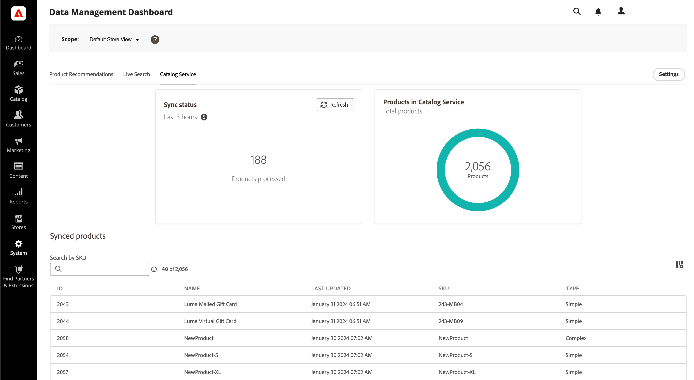

# Tablero de administración de datos

El panel de administración de datos ofrece una descripción general del estado de sincronización de los datos de producto transferidos desde la base de datos de Commerce a los servicios SaaS de Commerce. Los usuarios pueden monitorizar convenientemente los estados de sincronización de productos e iniciar la resincronización de datos desde un panel unificado. Esta función proporciona información valiosa sobre la disponibilidad de los datos de productos para su tienda, lo que garantiza que se puedan mostrar rápidamente a los compradores.

>[!NOTE]
>
>Si ha instalado el [Conector de Adobe Commerce Optimizer](https://experienceleague.adobe.com/en/docs/commerce/aco-optimizer-connector/overview) para exportar los datos del catálogo a Adobe Commerce Optimizer, utilice la [página de sincronización de datos](https://experienceleague.adobe.com/en/docs/commerce/optimizer/setup/data-sync) en Commerce Optimizer Studio para comprobar que la sincronización de datos se ha realizado correctamente, en lugar del panel de administración de datos.

## Público

El panel de administración de datos está disponible sin costo adicional para todos los comerciantes de Commerce que usen [[!DNL Product Recommendations v6.0.0]](https://experienceleague.adobe.com/en/docs/commerce/product-recommendations/guide-overview), [[!DNL Live Search v4.1.0]](https://experienceleague.adobe.com/en/docs/commerce/live-search/guide-overview) o [[!DNL Catalog Service v1.17]](https://experienceleague.adobe.com/en/docs/commerce/catalog-service/guide-overview) con una licencia activa.

El panel de administración de datos se encuentra en *Sistema* > Transferencia de datos > *Panel de administración de datos*.

El tablero contiene los campos siguientes:

| Campo | Descripción |
|--- |--- |
| Ámbito | Sitio web específico para los datos sincronizados. |
| [!DNL Product Recommendations] | Muestra el estado de sincronización, el número de productos sincronizados y una tabla de [productos sincronizados mostrables](https://experienceleague.adobe.com/en/docs/commerce-admin/config/catalog/inventory#stock-options) para [!DNL Product Recommendations]. |
| [!DNL Live Search] | Muestra el estado de sincronización, el número de productos sincronizados y una tabla de [productos sincronizados mostrables](https://experienceleague.adobe.com/en/docs/commerce-admin/config/catalog/inventory#stock-options) para [!DNL Live Search]. |
| [!DNL Catalog Service] | Muestra el estado de sincronización, el número de productos sincronizados y una tabla de los productos sincronizados de [!DNL Catalog Service]. |
| Configuración | Abre un cuadro de diálogo donde puede [resincronizar manualmente los datos del catálogo](#resync-catalog-data). |
| Estado de sincronización | Muestra el número de productos que se han transferido de la base de datos de Commerce a cualquiera de los servicios SaaS en las últimas tres horas. Si realiza actualizaciones poco frecuentes en el catálogo, este valor suele ser cero. Si hay una sincronización en curso, haga clic en **[!UICONTROL Refresh]** para obtener un recuento actualizado. |
| Recuento de productos | Refleja el número total de productos de catálogo disponibles para el servicio. Los paneles [!DNL Product Recommendations] y [!DNL Live Search] muestran el número total de _productos que se pueden mostrar_. [!DNL Catalog Service] no filtra productos por mostrables, por lo que si tiene instalados [!DNL Catalog Service] y [!DNL Live Search] o [!DNL Product Recommendations], es posible que los dos paneles muestren dos valores diferentes para el recuento de productos. |
| Productos sincronizados | Proporciona detalles sobre los productos del índice principal de Commerce. De forma predeterminada, esta tabla está ordenada por Última actualización. Para buscar un producto específico, utilice el campo **[!UICONTROL Search by SKU]**. Para controlar qué columnas se muestran, haga clic en **[!UICONTROL Customize Table]** a la derecha de la tabla. |

## Uso del panel de administración de datos

Al actualizar productos en la base de datos de Commerce, los datos de los productos se transfieren a los servicios SaaS según la configuración del sistema. Cuando se inicia el proceso de sincronización, **Product Count** indica el número de productos enviados a los servicios SaaS.

>[!IMPORTANT]
>
>El tiempo que se tarda en completar la sincronización varía en función del tamaño del catálogo y el volumen de datos actualizados.

Cuando el número de productos procesados coincide con el número de productos actualizados, indica que la sincronización ha finalizado.

>[!NOTE]
>
>Adobe también proporciona una interfaz de línea de comandos y registros del sistema que los desarrolladores e integradores de sistemas pueden utilizar para administrar y rastrear operaciones de sincronización y solucionar errores en los servicios SaaS de Commerce. Para obtener más información, consulte la [Guía de exportación de datos SaaS](https://experienceleague.adobe.com/en/docs/commerce/saas-data-export/overview).

### Lista de productos sincronizados

Para ver los detalles de un producto sincronizado, haga clic en el producto en la tabla.

### Resincronizar datos de catálogo

Para asegurarte de que los servicios SaaS de Commerce estén siempre actualizados con la información de productos más reciente, debes [implementar una programación](https://experienceleague.adobe.com/en/docs/commerce-operations/configuration-guide/cli/manage-indexers#reindex) para sincronizar los datos del catálogo.

Aunque puede [iniciar manualmente](#manually-resync-catalog) una resincronización de los datos del catálogo desde la base de datos de Commerce a los servicios SaaS, no se recomienda, ya que puede aumentar la carga en los recursos de hardware. Sin embargo, la resincronización manual del catálogo puede ser necesaria en los siguientes casos:

- Siempre que se realicen cambios significativos en el catálogo de productos, como añadir nuevos productos, actualizar detalles del producto o modificar categorías

- Si notas discrepancias o problemas de rendimiento en la visualización de datos de productos en tus tiendas

- Después de cualquier actualización o cambio en las integraciones entre la base de datos de Commerce y los servicios SaaS

- Al implementar personalizaciones o configuraciones que afectan a la administración de datos del producto o a los procesos de sincronización

Al seguir estas directrices y resincronizar proactivamente los datos del catálogo según sea necesario, puede mantener la coherencia, precisión y fiabilidad de los datos en todo el ecosistema de Adobe Commerce.

#### Resincronizar el catálogo manualmente

Si necesita volver a sincronizar los datos del catálogo, haga clic en **[!UICONTROL Settings]** en la parte derecha de la página para mostrar un cuadro de diálogo en el que puede iniciar una operación de resincronización. La resincronización de los datos del catálogo obliga al servicio a recuperar datos de la base de datos de Commerce a los servicios SaaS.

