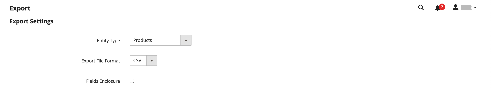

# Exportación de datos

La mejor manera de familiarizarse con la estructura de la base de datos es exportar los datos y abrirlos en una hoja de cálculo. Después de familiarizarse con el proceso, puede utilizarlo como una forma eficaz de administrar grandes cantidades de información.

Los caracteres especiales, como el signo igual, mayor y menor que los símbolos, las comillas simples y dobles, la barra invertida, la barra vertical y los símbolos ampersand, pueden causar problemas durante la transferencia de datos. Para asegurarse de que estos caracteres especiales se interpreten correctamente, se pueden marcar como _secuencia de escape_. Por ejemplo, si los datos incluyen una cadena de texto como `code="str"`, `code="str2"`, escribir el texto entre comillas dobles garantiza que las comillas dobles originales se entienden como parte de los datos: `"code="str""`. Cuando el sistema encuentra un conjunto doble de comillas dobles, entiende que el conjunto exterior de comillas dobles está encerrando los datos reales.

La exportación de datos es una operación asincrónica, que se ejecuta en segundo plano para que pueda seguir trabajando en el administrador sin esperar a que finalice la operación. El sistema muestra un mensaje cuando se completa la tarea.

## Exportar criterios

Los filtros de exportación se utilizan para especificar los datos que desea incluir en el archivo de exportación, según el valor del atributo. Además, puede especificar qué datos de atributo desea incluir o excluir de la exportación.

{width="600" zoomable="yes"}

### Exportar filtros

Puede utilizar filtros para determinar qué SKU se incluyen en el archivo de exportación. Por ejemplo, si se introduce un valor en el filtro País de fabricación, el archivo CSV exportado solo incluirá los productos fabricados en ese país.

El tipo de filtro corresponde al tipo de datos. Para los campos de fecha, puede elegir la fecha en el . Consulte [Tipos de entrada de atributos](../catalog/attributes-input-types.md) para obtener más información.

El formato de la fecha está determinado por la [configuración regional](../getting-started/store-details.md#locale-options).

Para incluir solo registros con un valor específico, como un SKU, introduzca el valor en el campo Filtro. Algunos campos, como Precio, Peso y Definir producto como nuevo, tienen un rango de valores de origen y destino.

### Excluir atributos

La casilla de verificación de la primera columna se utiliza para excluir atributos del archivo de exportación. Si se excluye un atributo, se incluye la columna asociada en los datos de exportación, pero vacía.

| Excluir | Filtrar | Resultado |
|--- |--- |--- |
|  | No | El archivo exportado contiene cada atributo para todos los registros existentes. |
|  | Sí | El archivo de exportación contiene cada atributo con solo los registros permitidos por el filtro. |
|  | No | El archivo de exportación no incluye la columna para el atributo excluido, pero sí incluye todos los registros existentes. |
|  | Sí | El archivo de exportación no incluye la columna para el atributo excluido y contiene solo los registros permitidos por el filtro. |

{style="table-layout:auto"}

## Exportación de datos

1. En la barra lateral _Admin_, vaya a **[!UICONTROL System]** > _[!UICONTROL Data Transfer]_>**[!UICONTROL Export]**.

1. En la sección _Configuración de exportación_, establezca **[!UICONTROL Entity Type]** en una de las siguientes opciones:

   - `Advanced Pricing`
   - `Products`
   - `Customer Finances`
   - `Customers Main File`
   - `Customer Addresses`
   - `Stock Sources`

   {width="600" zoomable="yes"}

1. Acepte el valor predeterminado **[!UICONTROL Export File Format]** del CSV.

1. Si desea incluir cualquier carácter especial que pueda encontrarse en los datos como una _secuencia de escape_, active la casilla de verificación **[!UICONTROL Fields Enclosure]**.

1. Si es necesario, cambie la visualización de los atributos de entidad.

   De forma predeterminada, la sección Atributos de entidad enumera todos los atributos disponibles en orden alfabético. Puede usar los [controles de lista](../getting-started/admin-grid-controls.md) estándar para buscar atributos específicos y ordenar la lista. Los controles Filtro de búsqueda y restablecimiento controlan la visualización de la lista, pero no tienen ningún efecto en la selección de atributos que se van a incluir en el archivo de exportación.

   {width="600" zoomable="yes"}

1. Para filtrar los datos exportados en función del valor del atributo, haga lo siguiente:

   - Para exportar sólo los registros con valores de atributo específicos, escriba el valor necesario en la columna **[!UICONTROL Filter]**. En el siguiente ejemplo, se exporta únicamente un SKU específico.

   - Para omitir un atributo de la exportación, active la casilla de verificación **[!UICONTROL Exclude]** al principio de la fila. Por ejemplo, para exportar solo las columnas `sku` y `image`, active la casilla de verificación de cada atributo. La columna aparece en el archivo de exportación, pero sin ningún valor.

1. Desplácese hacia abajo y haga clic en **[!UICONTROL Continue]** en la esquina inferior derecha de la página.

   Una vez finalizada la tarea, el archivo se procesa a través de una cola de mensajes (asegúrese de que el trabajo cron se esté ejecutando). El archivo exportado se guardará en `var/export/ folder`. Para obtener más información sobre la cola de mensajes, consulte [Administrar colas de mensajes](https://experienceleague.adobe.com/docs/commerce-operations/configuration-guide/message-queues/manage-message-queues.html?lang=es) en la _Guía de configuración_.

   Puede guardar o abrir el archivo CSV exportado como hoja de cálculo y, a continuación, editar los datos e importarlos de nuevo en su tienda.

   >[!NOTE]
   >
   >De manera predeterminada, todos los archivos exportados se encuentran en la carpeta `<Magento-root-directory>/var/export`. Si el módulo Almacenamiento remoto está habilitado, todos los archivos exportados se encuentran en la carpeta `<remote-storage-root-directory>/import_export/export`.

## Solución de problemas de recursos

Para obtener ayuda sobre la resolución de problemas de exportación de datos, consulte los siguientes artículos de la Base de conocimiento de asistencia de Commerce:

- [El archivo .csv de productos exportados no aparece](https://experienceleague.adobe.com/docs/commerce-knowledge-base/kb/troubleshooting/miscellaneous/exported-products-.csv-file-does-not-appear.html?lang=es)
