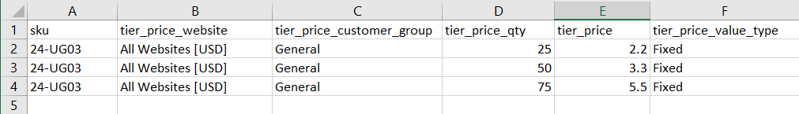

# Precios de nivel de importación

En lugar de entrar [precios de nivel](../catalog/product-price-tier.md) manualmente para cada producto, puede ser más eficiente [importar](data-import.md) los datos de precios. Antes de empezar, cree un archivo de muestra de datos de precios de nivel exportados que pueda utilizar como plantilla.

{width="700" zoomable="yes"}

## Paso 1: Exportar los datos de precios de nivel

El siguiente ejemplo exporta datos de precios de nivel para un solo producto. A continuación, puede utilizar los datos exportados como plantilla para las importaciones masivas de datos de precios de nivel. Para obtener más información sobre la exportación de datos de precios avanzados, consulte [Datos avanzados de precios](data-attributes-product.md#advanced-pricing-attributes).

{width="600" zoomable="yes"}

1. Activado _Administrador_ barra lateral, vaya a  **[!UICONTROL System]** > _[!UICONTROL Data Transfer]_>**[!UICONTROL Export]**.

1. En _[!UICONTROL Export Settings]_, configurado **[!UICONTROL Entity Type]**hasta `Advanced Pricing`.

1. En el **[!UICONTROL Entity Attributes]** , desplácese hacia abajo hasta los atributos SKU y haga lo siguiente:

   - Para los precios de nivel basados en un porcentaje de descuento, introduzca el SKU de cada producto que desea exportar, separados por una coma.

     {width="600" zoomable="yes"}

   - Para los precios de nivel basados en una cantidad fija, introduzca el SKU de cada producto.

   - Desplácese hacia abajo y haga clic **[!UICONTROL Continue]**.

1. Busque el archivo de exportación en la ubicación de descargas del explorador web y abra el archivo.

   {width="600" zoomable="yes"}

**_Datos de precios de nivel exportados_**

En los datos exportados se incluyen las siguientes columnas:

- `sku`
- `tier_price_website`
- `tier_price_customer_group`
- `tier_price_qty`
- `tier_price`
- `tier_price_value_type`

Los datos exportados se utilizan como plantilla para importar datos de precios de nivel.

## Paso 2: Actualización de los datos

1. Actualice los datos de precios de nivel para cada producto, según sea necesario.

   Cualquier producto sin actualizaciones de precios de nivel se puede eliminar del archivo CSV. No es necesario volver a importar productos que no hayan cambiado.

1. **[!UICONTROL Save]** el archivo CSV actualizado.

>[!NOTE]
>
>El tamaño de un archivo de importación no puede ser superior a 2 MB.

## Paso 3: Importación de los datos actualizados

1. Activado _Administrador_ barra lateral, vaya a **[!UICONTROL System]** > _[!UICONTROL Data Transfer]_>**[!UICONTROL Import]**.

1. En _Importar configuración_, configurado **[!UICONTROL Entity Type]** hasta `Advanced Pricing`.

1. Establecer **[!UICONTROL Import Behavior]** hasta `Add/Update`.

1. En **[!UICONTROL File to Import]**, haga clic en **[!UICONTROL Choose File]** y seleccione el archivo que ha preparado para importar desde su directorio.

1. En la esquina superior derecha, haga clic en **[!UICONTROL Check Data]**.

1. Si el archivo es válido, haga clic en **[!UICONTROL Import]**.

   De lo contrario, corrija cada problema con los datos que se enumeran en el mensaje e intente importar el archivo de nuevo.
