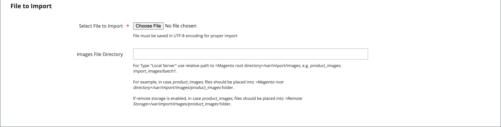

# Importación de imagen de producto

Se pueden importar varias imágenes de producto de cada tipo en Adobe Commerce y Magento Open Source y asociarlas a un producto específico. La ruta y el nombre de archivo de cada imagen de producto se introducen en el archivo CSV, y los archivos de imagen que se van a importar se cargan en la ruta correspondiente del servidor de Commerce o del servidor externo.

Commerce crea su propia estructura de directorios para imágenes de productos organizada alfabéticamente. Al exportar datos de productos con imágenes existentes a un archivo CSV, puede ver la ruta alfabética antes del nombre de archivo de cada imagen. Sin embargo, al importar nuevas imágenes, no es necesario especificar una ruta, ya que Commerce administra la estructura de directorios automáticamente. Pero asegúrese de introducir la ruta relativa al directorio de importación antes del nombre de archivo de cada imagen que desea importar.

Para cargar imágenes, debe tener credenciales de inicio de sesión y los permisos correctos para acceder a la carpeta Commerce en el servidor. Con las credenciales correctas, puede utilizar cualquier utilidad SFTP para cargar los archivos desde el equipo de escritorio al servidor.

Antes de intentar importar muchas imágenes, revise los pasos del método de importación que desee utilizar y ejecute el proceso con algunos productos. Después de entender cómo funciona, se sentirá seguro al importar grandes cantidades de imágenes.

>[!IMPORTANT]
>
>Se recomienda utilizar un programa que admita la codificación UTF-8 para editar archivos CSV, como Notepad++. Microsoft® Excel inserta caracteres adicionales en el encabezado de columna del archivo CSV, lo que puede impedir que los datos se importen de nuevo en Commerce.

## Método 1: importar imágenes del servidor local

1. En el servidor de Commerce, cargue los archivos de imagen en la carpeta `var/import/images` o en una subcarpeta, como `var/import/images/product_images`. Esta es la carpeta raíz predeterminada para importar imágenes de productos.

   ```
   <Magento root folder>/var/import/images
   ```

   >[!NOTE]
   >
   >A partir de la versión de Adobe Commerce y el Magento Open Source `2.3.2`, la ruta especificada en **[!UICONTROL Images File Directory]** se concatena para importarla al directorio base de imágenes: `<Magento-root-folder>/var/import/images`. Para versiones anteriores de Adobe Commerce y Magento Open Source, puede utilizar una carpeta diferente en el servidor de Commerce, siempre y cuando la ruta a la carpeta se especifique durante el proceso de importación.

1. En los datos CSV, escriba el nombre de cada archivo de imagen que se va a importar en la fila correcta, por `sku`, y en la columna correcta según el tipo de imagen (`base_image`, `small_image`, `thumbnail_image` o `additional_images`).

   >[!NOTE]
   >
   >Para las imágenes de la carpeta de importación predeterminada (`var/import/images`), no incluya la ruta de acceso antes del nombre de archivo en los datos CSV.

   El archivo CSV solo debe incluir la columna `sku` y las columnas de imagen relacionadas.

   {width="600" zoomable="yes"}

1. Siga las instrucciones para [importar](data-import.md) los datos.

1. Después de seleccionar el archivo a importar, ingrese la ruta relativa que sigue a **[!UICONTROL Images File Directory]**.

   ```
   var/import/images
   ```

   {width="600" zoomable="yes"}

   >[!TIP]
   >
   >Deje _[!UICONTROL Images File Directory]_&#x200B;en blanco para usar el directorio `<Magento-root-folder>/var/import/images`. A partir de Adobe Commerce y de la versión 2.3.2 de Magento Open Source, este es el directorio base predeterminado de importación de imágenes.

   Si importa varias imágenes para un único(a) `sku`, inserte las imágenes en una columna denominada `additional_images` (agregue la columna si no la ha agregado ya), separadas por comas. Ejemplo: `image02.jpg,image03.jpg`

## Método 2: importación de imágenes desde un servidor externo

1. Cargue las imágenes que desea importar a la carpeta designada en el servidor externo.

1. En los datos CSV, escriba la dirección URL completa de cada archivo de imagen en la columna correcta por tipo de imagen (`base_image`, `small_image`, `thumbnail_image` o `additional_images`).

   ```
   https://example.com/images/image.jpg
   ```

1. Siga las instrucciones para [importar](data-import.md) los datos.

## Método 3: Importación de imágenes con almacenamiento remoto

1. En el módulo Almacenamiento remoto, cargue los archivos de imagen en la carpeta `var/import/images` o en una subcarpeta, como `var/import/images/product_images`. Esta es la carpeta raíz predeterminada para importar imágenes de productos.

   ```bash
   <remote-storage-root-folder>/var/import/images
   ```

   >[!NOTE]
   >
   >A partir de la versión de Adobe Commerce y el Magento Open Source `2.3.2`, la ruta especificada en _[!UICONTROL Images File Directory]_&#x200B;se concatena para importarla al directorio base de imágenes: `<remote-storage-root-folder>/var/import/images`. Para versiones anteriores de Adobe Commerce y Magento Open Source, puede utilizar una carpeta diferente en el servidor de Commerce, siempre y cuando la ruta a la carpeta se especifique durante el proceso de importación.

1. En los datos CSV, escriba el nombre de cada archivo de imagen que se va a importar en la fila correcta, por `sku`, y en la columna correcta según el tipo de imagen (`base_image`, `small_image`, `thumbnail_image` o `additional_images`).

   >[!NOTE]
   >
   >Para las imágenes de la carpeta de importación predeterminada (`var/import/images`), no incluya la ruta de acceso antes del nombre de archivo en los datos CSV.

   El archivo CSV solo debe incluir la columna `sku` y las columnas de imagen relacionadas.

   {width="600" zoomable="yes"}

1. Siga las instrucciones para [importar](data-import.md) los datos.

1. Después de seleccionar el archivo a importar, ingrese la ruta relativa que sigue a **[!UICONTROL Images File Directory]**.

   ```
   var/import/images/product_images
   ```

   >[!TIP]
   >
   >Deje _[!UICONTROL Images File Directory]_&#x200B;en blanco para usar el directorio `<Magento-root-folder>/var/import/images`. A partir de Adobe Commerce y de la versión 2.3.2 de Magento Open Source, este es el directorio base predeterminado de importación de imágenes.

   Si importa varias imágenes para un único(a) `sku`, inserte las imágenes en una columna denominada `additional_images` (agregue la columna si no la ha agregado ya), separadas por comas: `image02.jpg,image03.jpg`

Para obtener más información acerca de cómo habilitar y administrar el módulo Almacenamiento remoto, consulte [Configurar almacenamiento remoto](https://experienceleague.adobe.com/docs/commerce-operations/configuration-guide/storage/remote-storage/remote-storage.html?lang=es) en la _Guía de configuración_.

>[!NOTE]
>
>La importación de imágenes de producto no inicia el cambio de tamaño de la imagen. `pub/get.php` cambia el tamaño de las imágenes de producto en el front-end. Asegúrese de que su `pub/get.php` funcione correctamente; de lo contrario, es posible que no se cambie el tamaño de las imágenes.
