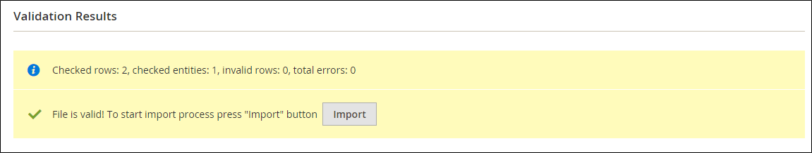

# Importar datos

Se pueden importar en la tienda datos de todos los tipos de productos. Además, puede importar productos, datos de precios avanzados, datos de clientes, datos de direcciones de clientes e imágenes de productos. La importación admite las siguientes operaciones:

- Agregar/actualizar
- Reemplazar
- Eliminar

## Importar directrices

### Nuevas entidades

- Las entidades se añaden con los valores de atributo especificados en el archivo CSV.
- Para un atributo requerido sin valor predeterminado establecido, la entidad (la fila o filas correspondientes) no se puede importar si no hay ningún valor o un valor no válido.
- Para un atributo requerido con un valor predeterminado establecido, la entidad (la fila o filas correspondientes) se importa y el valor predeterminado se establece para el atributo si no hay ningún valor o un valor no válido.
- Si los datos complejos no son válidos, la entidad (la fila o filas correspondientes) no se puede importar.

### Entidades existentes

- En el caso de los atributos que no son datos complejos, los valores del archivo de importación, incluidos los valores vacíos para los atributos no obligatorios, sustituyen a los valores existentes.
- Si no hay ningún valor, o hay un valor no válido, para un atributo requerido, el valor existente no se reemplaza.
- Si los datos complejos de la entidad no son válidos, la entidad (la fila o filas correspondientes) no se puede importar, excepto en el caso de que se haya seleccionado Eliminar entidades en el menú desplegable Comportamiento de importación.

### Datos complejos

Si existe un atributo especificado en el archivo de importación y su valor se deriva de un conjunto definido de valores, se aplica lo siguiente:

- Si el valor aún no se incluye en el conjunto de valores definido, la fila se puede importar y se establece un valor predeterminado, si se define, para el atributo.
- Si el valor ya está incluido en el conjunto definido, no se puede importar la fila correspondiente.
- Si el fichero de importación especifica un nombre de atributo que aún no se ha definido en el sistema, no se creará y sus valores no se importarán.

### Archivos no válidos

- No se puede importar un archivo si todas las filas no son válidas.
- En el archivo de importación se especifican datos de servicio no existentes o nombres de datos complejos, como una columna con un `_<non-existing name>` encabezado.

Es posible que el proceso de importación de Adobe Commerce no reconozca correctamente los archivos codificados en UTF-8 que utilizan una marca de orden de bytes (BOM). Los archivos que contienen una LDM pueden provocar problemas o errores durante el proceso de importación.

## Operaciones de importación

| Operación | Descripción |
| --------- | ----------- |
| Agregar/actualizar | Los nuevos datos de producto se agregan a los datos de producto existentes para las entradas existentes en la base de datos. Todos los campos excepto `sku` se puede actualizar.  Las nuevas clases de impuestos especificadas en los datos de importación se crean automáticamente.  Las nuevas categorías de productos especificadas en el archivo de importación se crean automáticamente.  Los nuevos SKU especificados en el archivo de importación se crean automáticamente   **_Nota:_**Para los productos, puede actualizar todos los campos excepto el SKU mediante importación.  **_Importante:_** Los valores de varios campos, como sitios web o categorías, no se pueden eliminar mediante la variable _Agregar/actualizar_ comportamiento de importación. Estos campos permanecen en la base de datos después de la importación si no aparecen en el archivo CSV. |
| Reemplazar | Los datos de productos existentes se reemplazan con datos nuevos.  **_Importante:_**Tenga cuidado al reemplazar los datos porque los datos de productos existentes se borran y se pierden todas las referencias del sistema.  Si un SKU en los datos de importación coincide con el SKU de una entidad existente, todos los campos, incluido el SKU, se eliminan y se crea un nuevo registro con los datos CSV. Se produce un error si el archivo CSV hace referencia a un SKU que no existe en la base de datos. Puede Comprobar datos para mostrar el error. |
| Eliminar | Cualquier entidad de los datos de importación que exista en la base de datos se eliminará de la base de datos.  Eliminar ignora todas las columnas de los datos de importación, excepto la SKU. Puede ignorar todos los demás atributos de los datos.  Se produce un error si el archivo CSV hace referencia a un SKU que no existe en la base de datos. Puede Comprobar datos para mostrar el error. |

{style="table-layout:auto"}

## Proceso de importación

El tamaño del archivo de importación viene determinado por la configuración de `php.ini` en el servidor. El mensaje del sistema en _Importar_ página indica el límite de tamaño actual. El tamaño predeterminado es 2 MB.

Los caracteres especiales (como el signo igual, mayor y menor que los símbolos, las comillas simples y dobles, la barra invertida, la barra vertical y los símbolos ampersand) pueden causar problemas durante la transferencia de datos. Para garantizar que estos caracteres especiales se interpreten correctamente, pueden marcarse como un _secuencia de escape_. Por ejemplo, si los datos incluyen una cadena de texto como `code="str"`, `code="str2"`Sin embargo, si elige escribir el texto entre comillas dobles, se garantiza que las comillas dobles originales se entienden como parte de los datos. Cuando el sistema encuentra un conjunto doble de comillas dobles, entiende que el conjunto exterior de comillas dobles está encerrando los datos reales.

Al importar datos de productos, se agregan nuevos datos de productos a las entradas de datos de productos existentes en la base de datos. Todos los campos, excepto el SKU, se pueden actualizar mediante la importación. Todos los datos de productos existentes se sustituyen por los nuevos datos importados. Tenga cuidado al reemplazar datos. Se borran todos los datos de productos existentes y se pierden todas las referencias del sistema.

{width="600" zoomable="yes"}

### Paso 1: Preparar los datos

1. En el _Administrador_ barra lateral, vaya a **[!UICONTROL System]** > _[!UICONTROL Data Transfer]_>**[!UICONTROL Import]**.

1. En _Importar configuración_, configurado **[!UICONTROL Entity Type]** a uno de los siguientes:

   - `Advanced Pricing`
   - `Products`
   - `Customer Finances`
   - `Customers and Addresses`
   - `Customers Main File`
   - `Customer Addresses`
   - `Stock Sources`

1. Clic **[!UICONTROL Download Sample File]**.

1. Busque el archivo de exportación en la ubicación de descargas del explorador web y abra el archivo.

   El archivo de ejemplo incluye encabezados de columna con datos de marcador de posición para los tipos de producto.

   {width="600" zoomable="yes"}

1. Examine la estructura del archivo de muestra y utilícelo para preparar el archivo de importación CSV, asegurándose de que los encabezados de columna estén escritos correctamente.

1. Compruebe que el tamaño del archivo de importación no supera el límite mostrado en el mensaje.

   {width="600"}

1. Si los datos de importación incluyen rutas a imágenes de productos, asegúrese de que los archivos de imagen se hayan cargado en la ubicación adecuada.

   La ubicación predeterminada en el servidor de Commerce es: `pub/media/import`.

   Si las imágenes residen en un servidor externo, asegúrese de que dispone de la dirección URL completa del directorio que contiene las imágenes.

### Paso 2: Elija el comportamiento de importación

{width="600" zoomable="yes"}

1. Establecer **[!UICONTROL Import Behavior]** a uno de los siguientes:

   - `Add/Update` (En el caso de los productos, puede actualizar todos los campos excepto el SKU mediante importación).
   - `Replace`
   - `Delete`

1. Para determinar qué sucede cuando se produce un error al importar datos, elija una de las siguientes opciones:

   - `Stop on Error`
   - `Skip error entries`

1. Para **[!UICONTROL Allowed Errors Count]**, introduzca el número de errores que pueden producirse antes de cancelar la importación.

   El valor predeterminado es 10.

1. Acepte el valor predeterminado de una coma (`,`) para **[!UICONTROL Field separator]**.

1. Acepte el valor predeterminado de una coma (`,`) para **[!UICONTROL Multiple value separator]**.

   En un archivo CSV, la coma es el separador predeterminado. Para utilizar un carácter diferente, asegúrese de que los datos del archivo CSV coincidan con el carácter especificado.

1. Aceptar el valor predeterminado `_EMPTY_VALUE_` para **[!UICONTROL Empty attribute value constant]**.

1. Si desea incluir cualquier carácter especial que se pueda encontrar en los datos como un _secuencia de escape_, seleccione la **[!UICONTROL Fields Enclosure]** casilla de verificación

### Paso 3: Identificar el archivo de importación

{width="600" zoomable="yes"}

1. Clic **[!UICONTROL Choose File]** para seleccionar el archivo que desea importar.

1. Busque el archivo CSV que ha preparado para importar y haga clic en **[!UICONTROL Open]**.

1. Para **[!UICONTROL Images File Directory]**, introduzca la ruta relativa a la ubicación del servidor de Commerce donde se almacenan las imágenes cargadas.

   Por ejemplo: `product_images`.

   >[!NOTE]
   >
   >Primeros pasos con Adobe Commerce y Magento Open Source `2.3.2` versión, la ruta especificada en _[!UICONTROL Images File Directory]_se concatena para la importación en el directorio base de imágenes: `<Magento-root-folder>/var/import/images`. Por ejemplo, coloque la variable `product_images` archivos en la `<Magento-root-directory>/var/import/images/product_images` carpeta. El directorio base de importación de imágenes se puede configurar en `\Magento\ImportExport\etc\config.xml` archivo. Si el módulo Almacenamiento remoto está habilitado, importe los archivos al `<remote-storage-root-directory>/var/import/images/product_images` carpeta.

   Para obtener más información sobre la importación de imágenes de productos, consulte [Importar imágenes de productos](data-import-product-images.md).

### Paso 4: Comprobación de los datos de importación

1. En la esquina superior derecha, haga clic en **[!UICONTROL Check Data]**.

1. Espere unos momentos para que se complete el proceso de validación.

   Si los datos de importación son válidos, aparecerá el siguiente mensaje:

   {width="600"}

1. Si el archivo es válido, haga clic en **[!UICONTROL Import]**.

   De lo contrario, corrija cada problema con los datos que se enumeran en el mensaje e intente importar el archivo de nuevo.

1. El proceso de importación continúa hasta el final de los datos, a menos que se encuentre un error.

   Si aparece un mensaje de error en los resultados de validación, corrija el problema en los datos e importe de nuevo el archivo.

   {width="600"}

   Aparecerá un mensaje cuando se complete la importación.

## Importar historial

Commerce mantiene un registro de los datos que se han importado en su tienda, incluida la fecha y hora de inicio, el usuario, el tiempo de ejecución y un vínculo al archivo importado. El _Tiempo de ejecución_ es la duración del proceso de importación.

**_Para ver el historial de importación:_**

En el _Administrador_ barra lateral, vaya a **[!UICONTROL System]** > _[!UICONTROL Data Transfer]_>**[!UICONTROL Import History]**.

{width="600" zoomable="yes"}

>[!NOTE]
>
>De forma predeterminada, los archivos de historial de importación se encuentran en `<Magento-root-directory>/var/import_history` carpeta. Si el módulo Almacenamiento remoto está habilitado, los archivos de historial de importación se encuentran en la `<remote-storage-root-directory>/import_export/import_history` carpeta.

| Campo | Descripción |
|--- |--- |
| [!UICONTROL ID] | Un número interno utilizado para designar una transferencia. |
| [!UICONTROL Start Date & Time] | Una fecha y hora específicas en que tuvo lugar la transferencia. |
| [!UICONTROL User] | El cliente que realizó la transferencia. |
| [!UICONTROL Imported file] | Vínculo para descargar el archivo importado. |
| [!UICONTROL Error file] | El archivo de error correspondiente. |
| [!UICONTROL Execution Time] | Intervalo de tiempo del proceso de importación. |
| [!UICONTROL Summary] | El número de elementos creados, actualizados y eliminados o el mensaje de error. |

{style="table-layout:auto"}

Para descargar _Importado/Error_ , haga clic en **[!UICONTROL Download]**.
