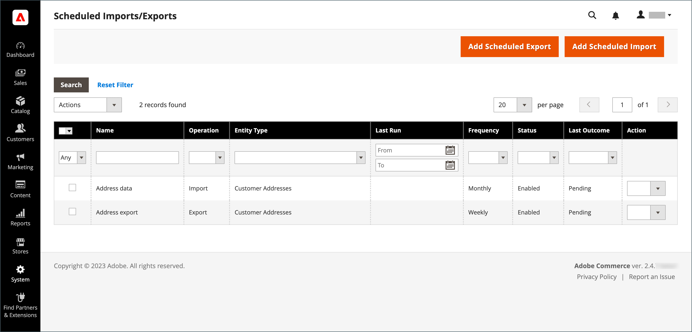
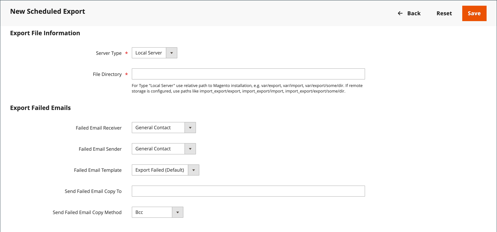

# Importación y exportación programadas

{{ee-feature}}

Las importaciones y exportaciones programadas se pueden ejecutar diariamente, semanalmente o mensualmente. Los archivos que se van a importar o exportar pueden residir en servidores Adobe Commerce locales o en servidores FTP remotos. La importación o exportación programadas se implementa de forma predeterminada y no requiere ninguna configuración adicional. El programador de trabajos de Cron administra todas las importaciones y exportaciones programadas.

## Acceso a importación/exportación programada

1. En el _Administrador_ barra lateral, vaya a **[!UICONTROL System]** > _[!UICONTROL Data Transfer]_>**[!UICONTROL Scheduled Imports/Exports]**.

   {width="700" zoomable="yes"}

1. Para crear un nuevo trabajo de importación o exportación programado, haga clic en el botón correspondiente y siga las instrucciones del tipo de trabajo programado.

   - [Añadir exportación programada](#schedule-an-export)
   - [Agregar importación programada](#schedule-an-import)

1. Cuando se guarda el registro, el trabajo aparece en la _[!UICONTROL Scheduled Import/Export]_rejilla.

   >[!NOTE]
   >
   >Al crear o actualizar una importación o exportación programada, se produce un cambio en la configuración del sistema. Después de guardar, asegúrese de dirigir el aviso de invalidación de caché que aparece en la parte superior de la página Administración y vacíe la caché para aplicar la programación nueva o actualizada.

1. Después de cada trabajo programado, se coloca una copia del archivo en la `var/log/import_export` en el servidor local de Adobe Commerce.

   Los detalles de cada operación no se escriben en el registro. Si se produce un error, se envía una notificación del trabajo de importación o exportación fallido, con una descripción del error.

## Programar una importación

Para el formato de fichero de importación disponible y los tipos de entidades de importación, el proceso de importación programado es similar al proceso de importación manual:

- El archivo de importación debe estar en formato .CSV
- Puede importar datos de productos y clientes

La ventaja de utilizar la importación programada es que puede importar automáticamente un archivo de datos varias veces después de especificar los parámetros de importación y programarlos solo una vez.

Los detalles de cada operación de importación no se escriben en un registro, pero cuando hay un error recibe un _Error de importación_ correo electrónico con una descripción del error. El resultado del último trabajo de importación programado se muestra en la columna Último resultado de la página Importación o exportación programadas.

Después de cada operación de importación, se coloca una copia del archivo de importación en la `var/log/import_export` en el servidor donde se implementa Adobe Commerce o Magento Open Source. La marca de tiempo, el marcador de la entidad importada (productos o clientes) y el tipo de operación (en este caso, importación) se añaden al nombre del archivo de importación.

Después de cada trabajo de importación programado, se realiza automáticamente una operación de reindexación. En el front-end, los cambios en las descripciones y otra información de texto se reflejan después de que los datos actualizados se dirijan a la base de datos, y los cambios en los precios solo se reflejan después de la operación de reindexación.

### Paso 1: Completar la configuración de importación

1. En el _Administrador_ barra lateral, vaya a **[!UICONTROL System]** > _[!UICONTROL Data Transfer]_>**[!UICONTROL Scheduled Import/Export]**.

1. En la esquina superior derecha, haga clic en **[!UICONTROL Add Scheduled Import]**.

1. Defina las opciones de programación e importación:

   - **[!UICONTROL Name]** — introduzca un nombre para la importación programada.

   - **[!UICONTROL Description]** — Introduzca una breve descripción que explique el propósito de la importación y cómo se va a utilizar.

   - **[!UICONTROL Entity Type]** — Configure a uno de los siguientes:

      - `Products`
      - `Advanced Pricing`
      - `Customers and Addresses (single file)`
      - `Customer Addresses`
      - `Customer Finances`
      - `Customers Main File`
      - `Stock Sources`

   - **[!UICONTROL Import Behavior]** — Configure a uno de los siguientes:

      - `Add/Update Complex Data` — Añade o actualiza nuevos datos complejos a los datos complejos existentes para las entradas existentes en la base de datos. Este es el valor predeterminado.
      - `Replace` — escribe sobre el complejo existente para las entidades existentes en la base de datos.
      - `Delete Entities` — elimina las entradas existentes en la base de datos.
      - `Custom Action` - Personaliza las entidades existentes en la base de datos.

     >[!NOTE]
     >
     >Para el _[!UICONTROL Advanced Pricing]_,_[!UICONTROL Products]_, _[!UICONTROL Customers and Addresses (single file)]_, y_[!UICONTROL Stock Sources]_ tipos de entidad, se muestran estos comportamientos de importación: `Add/Update`, `Replace`, y `Delete`. Para el _Finanzas del cliente_, _Archivo principal de clientes_, y _Clientes y direcciones_ tipos de entidad, se muestran estos comportamientos de importación: `Add/Update Complex Data`, `Delete Entities`, y `Custom Action`.

   - **[!UICONTROL Start Time]** — Se establece en la hora, minuto y segundo en que está programado que comience la importación.

   - **[!UICONTROL Frequency]** — Configure a uno de los siguientes: `Daily`, `Weekly`, o `Monthly`

   - **[!UICONTROL On Error]** - Establezca uno de los siguientes valores: `Stop Import` o `Continue Processing`

   - **[!UICONTROL Status]** — Para activar la importación programada, establezca en `Enabled`.

   - **[!UICONTROL Field Separator]** — introduzca el carácter utilizado para separar campos en el fichero de importación. El carácter predeterminado es una coma.

   - **[!UICONTROL Multiple Value Separator]** — introduzca el carácter que se utiliza para separar varios valores dentro de un campo.

   {width="600" zoomable="yes"}

### Paso 2: Completar la información del archivo de importación

1. Establecer **[!UICONTROL Server Type]** a uno de los siguientes:

   - `Local Server` : Importa los datos desde el mismo servidor donde está instalado Adobe Commerce.
   - `Remote FTP` - Importa los datos desde un servidor remoto.

   {width="600" zoomable="yes"}

   >[!NOTE]
   >
   >Cuando el módulo de almacenamiento remoto está habilitado, `Local Server` cambia automáticamente a `Remote Storage`.

1. Introduzca el **[!UICONTROL File Directory]** origen del archivo de importación.

   - `Local Server` : introduzca una ruta relativa en la instalación de Commerce. Por ejemplo, `var/import`. Si el módulo Almacenamiento remoto está configurado, utilice `import_export/import`.
   - `Remote FTP server` : introduzca la dirección URL completa y la ruta a la carpeta de importación en el servidor remoto.

1. Introduzca el **[!UICONTROL File Name]** para importar.

1. Para **[!UICONTROL Images File Directory]**, introduzca la ruta al directorio donde se almacenan las imágenes de producto.

   En un servidor local, introduzca una ruta relativa como: `var/import`. En un almacenamiento remoto, introduzca una ruta relativa como: `import_export/import` o `import_export/import/some/dir`.

### Paso 3: Configuración de los correos electrónicos con errores de importación

{width="600" zoomable="yes"}

1. Establecer **[!UICONTROL Failed Email Receiver]** al contacto de la tienda que va a recibir una notificación si se produce un error durante la importación.

1. Establecer **[!UICONTROL Failed Email Sender]** al contacto de tienda que aparece como remitente de la notificación.

1. Establecer **[!UICONTROL Failed Email Template]** a la plantilla que se utiliza para la notificación.

1. Para **[!UICONTROL Send Failed Email Copy To]**, introduzca la dirección de correo electrónico de cualquier persona que vaya a recibir una copia de la notificación.

   Separe varias direcciones de correo electrónico con una coma.

1. Establecer **[!UICONTROL Failed Email Copy Method]** a uno de los siguientes:

   - `Bcc` : envía una copia de cortesía oculta de la notificación de importación fallida. El nombre y la dirección del destinatario se incluyen en la distribución de correo electrónico original, pero no se ven.
   - `Separate Email` : envía una copia de la notificación de importación fallida como un correo electrónico independiente.

1. Cuando termine, haga clic en **[!UICONTROL Save]**.

   El nuevo trabajo de importación programado se agrega a la lista de _[!UICONTROL Scheduled Import/Export]_página. Desde esta página, se puede ejecutar inmediatamente para realizar pruebas y editarlo. El archivo de importación se valida antes de la ejecución de cada trabajo de importación.

>[!NOTE]
>
>Al crear o actualizar una importación o exportación programada, se produce un cambio en la configuración del sistema. Después de guardar, asegúrese de dirigir el aviso de invalidación de caché que aparece en la parte superior de la página Administración y vacíe la caché para aplicar la programación nueva o actualizada.

### Descripciones de campos

#### [!UICONTROL Import Settings]

| Campo | Descripción |
| ----- | ----------- | 
| [!UICONTROL Name] | Nombre de la importación. Ayuda a distinguirlo si se crean muchas importaciones programadas diferentes. |
| [!UICONTROL Description] | (Opcional) Puede introducir una descripción. |
| [!UICONTROL Entity Type] | Define los datos que se van a importar. |
| [!UICONTROL Import Behavior] | Define cómo se gestionan los datos complejos si las entidades que se importan existen en la base de datos. Los datos complejos de los productos incluyen categorías, sitios web, opciones personalizadas, precios de nivel, productos relacionados, aumento de ventas, ventas cruzadas y datos de productos asociados. Los datos complejos para clientes incluyen direcciones. Opciones: **[!UICONTROL Add/Update Complex Data]**: los nuevos datos complejos se agregan o actualizan a los datos complejos existentes para las entradas existentes en la base de datos. Este es el valor predeterminado. **[!UICONTROL Add/Update]** - Se añaden nuevos datos a las entradas existentes en la base de datos. Todos los campos excepto `sku` se puede actualizar para los productos de. Cualquier valor de campo múltiple que no aparezca en el archivo CSV, como categorías o sitios web, permanecerá en la base de datos después de la importación. **[!UICONTROL Replace]**: se sustituyen los datos complejos existentes para las entidades existentes. **[!UICONTROL Delete Entities]** : si existen entidades importadas en la base de datos, se eliminan de esta. **[!UICONTROL Custom Action]**- Las entidades complejas existentes se personalizan durante el proceso de importación. |
| [!UICONTROL Start Time] | Establezca la hora, los minutos y los segundos de inicio de la importación. |
| [!UICONTROL Frequency] | Defina la frecuencia con la que se ejecuta la importación. Opciones: `Daily` / `Weekly` / `Monthly` |
| [!UICONTROL On Error] | Defina el comportamiento del sistema en caso de que se encuentren errores durante la validación del archivo. Opciones: **Detener importación** — El fichero no se importa si se encuentran errores durante la validación. Este es el valor predeterminado. **Continuar procesamiento** : Si se encuentran errores durante la validación, pero la importación es posible, se importa el archivo. |
| [!UICONTROL Status] | La importación está activada de forma predeterminada. Puede suspenderlo si establece el Estado en `Disabled`. |
| [!UICONTROL Field Separator] | Determina el carácter que se utiliza para separar campos. Valor predeterminado: `,` (coma) |
| [!UICONTROL Multiple Value Separator] | Determina el carácter utilizado para separar varios valores dentro de un campo. Valor predeterminado: `,` (coma) |

{style="table-layout:auto"}

#### [!UICONTROL Import File Information]

| Campo | Descripción |
| ----- | ----------- | 
| [!UICONTROL Server Type] | Puede importar desde un archivo en el mismo servidor en el que está implementado Commerce (seleccione `Local Server`) o del servidor FTP remoto (seleccione `Remote FTP`). Si selecciona _[!UICONTROL Remote FTP]_, aparecerán opciones adicionales para las credenciales y la configuración de transferencia de archivos. Si el módulo de almacenamiento remoto está habilitado, `Local Server` el tipo se cambia automáticamente a `Remote Storage`. |
| [!UICONTROL File Directory] | Especifique el directorio en el que se encuentra el archivo de importación. Si el tipo de servidor está establecido en _[!UICONTROL Local Server]_, especifique la ruta relativa al directorio de instalación de Commerce. Por ejemplo: `var/import` o `import_export/import` para almacenamiento remoto. |
| [!UICONTROL File Name] | Especifique el nombre del archivo de importación. |
| [!UICONTROL Images File Directory] | Introduzca la ruta al directorio donde se almacenan las imágenes de producto. Para un servidor local, introduzca una ruta relativa. Por ejemplo: `var/import` o `import_export/import` para almacenamiento remoto. |

{style="table-layout:auto"}

#### [!UICONTROL Import Failed Emails]

| Campo | Descripción |
| ----- | ----------- | 
| [!UICONTROL Failed Email Receiver] | Especifique la dirección de correo electrónico a la que se envía una notificación por correo electrónico (error al importar el correo electrónico) si la importación falla. |
| [!UICONTROL Failed Email Sender] | Especifique la dirección de correo electrónico que se utiliza como remitente para el correo electrónico con error en la importación. |
| [!UICONTROL Failed Email Template] | Seleccione una plantilla para el correo electrónico con errores de importación. De forma predeterminada, solo está disponible la opción Error al importar (plantilla predeterminada de configuración regional). Las plantillas personalizadas se pueden crear en _[!UICONTROL System]_>_[!UICONTROL Transactional Emails]_. |
| [!UICONTROL Send Failed Email Copy To] | La dirección de correo electrónico a la que se envía una copia del correo electrónico con error de importación. |
| [!UICONTROL Send Failed Email Copy Method] | Seleccione el método de envío de copias para el correo electrónico con errores de importación. |

{style="table-layout:auto"}

## Programar una exportación

La exportación programada es similar a un manual [Exportar](data-export.md) en el formato de fichero de exportación disponible y en los tipos de entidades que se pueden exportar:

- Puede exportar a formato CSV
- Puede exportar datos de productos y clientes

La ventaja de utilizar Exportación programada es que puede exportar datos varias veces automáticamente, después de especificar los parámetros de exportación, y programarlos solo una vez.

Los detalles de cada exportación no se escriben en un registro, pero si se produce un error, recibirá un correo electrónico de error de exportación que contiene la descripción del error. El resultado del último trabajo de exportación aparece en la columna Último resultado de la página Importación/Exportación programada.

Después de cada exportación, el archivo de exportación se coloca en la ubicación definida por el usuario y se copia en la `var/log/import_export` en el servidor donde se implementa Adobe Commerce o Magento Open Source. La marca de tiempo y el marcador de la entidad exportada (productos o clientes) y el tipo de operación (en este caso, exportación) se añaden al nombre del archivo de exportación.

### Paso 1: Completar la configuración de exportación

1. En el _Administrador_ barra lateral, vaya a **[!UICONTROL System]** > _[!UICONTROL Data Transfer]_>**[!UICONTROL Scheduled Import/Export]**.

1. En la esquina superior derecha, haga clic en **[!UICONTROL Add Scheduled Export]** y haga lo siguiente:

   - Introduzca una **[!UICONTROL Name]** para la exportación programada.

   - Escriba una descripción breve **[!UICONTROL Description]** que explica el propósito de la exportación y cómo se va a utilizar.

   - Establecer **[!UICONTROL Entity Type]** a uno de los siguientes:

      - `Advanced Pricing`
      - `Products`
      - `Customer Financing`
      - `Customers Main File`
      - `Customer Addresses`
      - `Stock Sources`

     El _[!UICONTROL Entity Attributes]_en la parte inferior de la página se actualiza para reflejar el tipo de entidad seleccionado.

   - Establecer **[!UICONTROL Start Time]** la hora, los minutos y el segundo en que está programado que comience la exportación.

   - Establecer **[!UICONTROL Frequency]** a uno de los siguientes:

      - `Daily`
      - `Weekly`
      - `Monthly`

1. Para activar la exportación programada, establezca **[!UICONTROL Status]** hasta `Enabled`.

1. Aceptar `CSV` como valor predeterminado **[!UICONTROL File Format]**.

   {width="600" zoomable="yes"}

### Paso 2: Completar la información del archivo de exportación

1. Establecer **[!UICONTROL Server Type]** a uno de los siguientes:

   - `Local Server` : Para guardar el archivo de exportación en el mismo servidor en el que está instalado Commerce.
   - `Remote FTP` — Para guardar el archivo de exportación en un servidor remoto.

   {width="600" zoomable="yes"}

   >[!NOTE]
   >
   >Cuando el módulo de almacenamiento remoto está habilitado, la variable `Local Server` cambia automáticamente a `Remote Storage`.

1. Para **[!UICONTROL File Directory]**, introduzca el directorio donde se guardará el archivo de exportación de la siguiente manera:

   - Para **[!UICONTROL Local Server]**, introduzca una ruta relativa dentro de la instalación de Commerce, como `var/export`. Si el módulo de almacenamiento remoto está configurado, utilice `import_export/export`.
   - Para **[!UICONTROL Remote FTP server]**, introduzca la dirección URL completa y la ruta a la carpeta de destino en el servidor de destino.

1. Si la variable _[!UICONTROL Remote FTP]_Si el servidor está seleccionado, introduzca las credenciales de conexión al servidor y seleccione la configuración adicional:

   - Para **[!UICONTROL FTP Host[:Port]]**, introduzca la dirección del host FTP remoto.
   - Para **[!UICONTROL User Name]**, introduzca el nombre de usuario utilizado para acceder al servidor remoto.
   - Para **[!UICONTROL Password]**, introduzca la contraseña de la cuenta de nombre de usuario proporcionada.
   - Para **[!UICONTROL File Mode]**, elija `Binary` o `ASCII`.
   - Para **[!UICONTROL Passive Mode]**, elija `No` o `Yes`.

### Paso 3: Configuración de los correos electrónicos con errores de exportación

1. Establecer **[!UICONTROL Failed Email Receiver]** al contacto de la tienda que va a recibir una notificación si se produce un error durante la exportación.

1. Establecer **[!UICONTROL Failed Email Sender]** al contacto de tienda que aparece como remitente de la notificación.

1. Establecer **[!UICONTROL Failed Email Template]** a la plantilla que se utiliza para la notificación.

1. Para **[!UICONTROL Send Failed Email Copy To]**, introduzca la dirección de correo electrónico de cualquier persona que vaya a recibir una copia de la notificación.

   Para varias direcciones de correo electrónico, sepárelas con una coma.

1. Establecer **[!UICONTROL Failed Email Copy Method]** a uno de los siguientes:

   - `Bcc` - Envía una copia de cortesía a ciegas. El nombre y la dirección del destinatario se incluyen en la distribución de correo electrónico original, pero no se ven.
   - `Separate Email` — envía la copia como un correo electrónico independiente.

### Paso 4: Elija los atributos de entidad

1. En el _[!UICONTROL Entity Attributes]_, elija los atributos que desea incluir en los datos de exportación.

   - Para filtrar los datos de exportación por valor de atributos, introduzca el valor del atributo en _[!UICONTROL Filter]_columna.
   - Para excluir productos o clientes con determinados valores de atributo, introduzca los valores de los atributos que desea excluir y active la casilla de verificación de la columna Omitir.

1. Cuando termine, haga clic en **[!UICONTROL Save]**.

   El nuevo trabajo de exportación programado se agrega a la lista de _[!UICONTROL Scheduled Import/Export]_página. Desde esta página se puede ejecutar inmediatamente, para realizar pruebas y editarlo.

>[!NOTE]
>
>Al crear o actualizar una importación o exportación programada, se produce un cambio en la configuración del sistema. Después de guardar, asegúrese de dirigir el aviso de invalidación de caché que aparece en la parte superior de la página Administración y vacíe la caché para aplicar la programación nueva o actualizada.

### Descripciones de campos

#### [!UICONTROL Export Settings]

| Campo | Descripción |
| ----- | ----------- | 
| [!UICONTROL Name] | Nombre de la exportación. Ayuda a distinguirlo si se crean muchas exportaciones programadas diferentes. |
| [!UICONTROL Description] | (Opcional) Descripción de la exportación programada. |
| [!UICONTROL Entity Type] | Identifica los datos que se van a exportar. Una vez realizada la selección, los Atributos de entidad aparecen a continuación. Opciones: `Advanced Pricing` / `Products` / `Customer Finances` / `Customers Main File` / `Customer Addresses` / `Stock Sources` |
| [!UICONTROL Start Time] | Establezca la hora, los minutos y los segundos de inicio de la exportación. |
| [!UICONTROL Frequency] | Defina la frecuencia con la que se ejecuta el trabajo de exportación. Opciones: `Daily` / `Weekly` / `Monthly` |
| [!UICONTROL Status] | Una nueva exportación programada está habilitada de forma predeterminada. Puede suspenderlo si establece el estado en Deshabilitado. Opciones: `Enabled` / `Disabled` |
| [!UICONTROL File Format] | Seleccione el formato del archivo de exportación. Actualmente solo el `.CSV` está disponible. |

{style="table-layout:auto"}

#### [!UICONTROL Export Settings Information]

| Campo | Descripción |
| ----- | ----------- | 
| [!UICONTROL Server Type] | Determina la ubicación del archivo de exportación. Opciones: **Servidor local** : coloca el archivo de exportación en el mismo servidor en el que está implementado Commerce. Si el módulo Almacenamiento remoto está habilitado, `Local Server` se cambia a `Remote Storage`. **FTP remoto** — coloca el archivo de exportación en un servidor remoto. Aparecerán opciones adicionales para las credenciales y la configuración de transferencia de archivos. |
| [!UICONTROL File Directory] | Especifique el directorio en el que se coloca el archivo de exportación. En caso de _[!UICONTROL Server Type]_se establece en `Local Server`, especifique la ruta relativa a la ruta de instalación de Commerce. Por ejemplo, `var/export`, o `import_export/export` para almacenamiento remoto. |

{style="table-layout:auto"}

#### [!UICONTROL Export Failed Emails]

| Campo | Descripción |
| ----- | ----------- | 
| [!UICONTROL Failed Email Receiver] | Especifique la dirección de correo electrónico a la que se envía una notificación por correo electrónico (correo electrónico con error de exportación) si la exportación falla. |
| [!UICONTROL Failed Email Sender] | Especifique la dirección de correo electrónico que se utiliza como remitente de correo electrónico con errores de exportación. |
| [!UICONTROL Failed Email Template] | Seleccione una plantilla para el correo electrónico de exportación fallido. De forma predeterminada, solo la variable `Export Failed (Default Template from Locale)` está disponible. |
| [!UICONTROL Send Failed Email Copy To] | Dirección de correo electrónico a la que se envía una copia del correo electrónico de exportación que ha dado error. |
| [!UICONTROL Send Failed Email Copy Method] | Especifique el método de envío de copias para el correo electrónico con errores de exportación. |

{style="table-layout:auto"}
