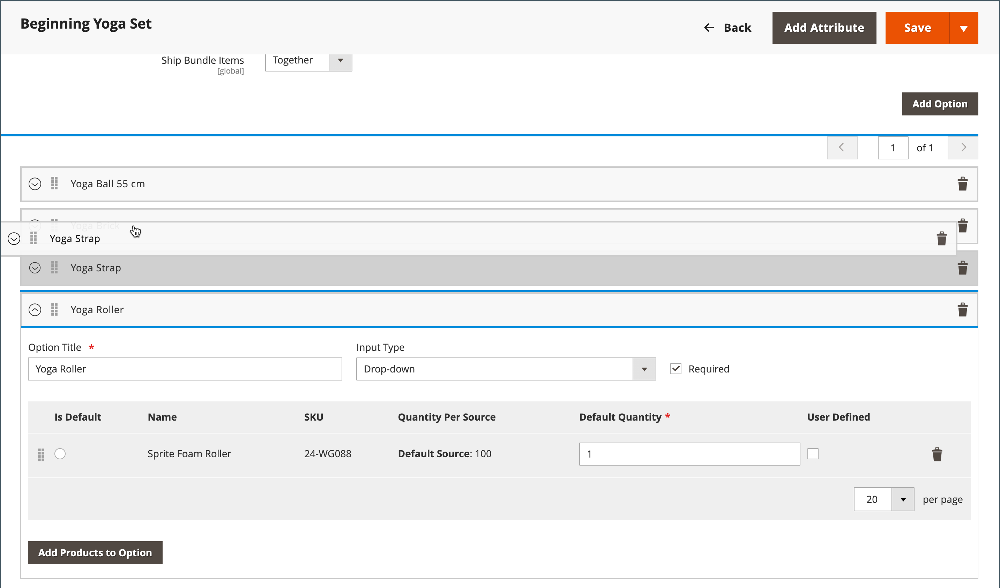

# Importar productos agrupados

Un paquete de productos presenta una selección de artículos y permite a los clientes elegir los que desean comprar. Todos los elementos que componen un paquete existen en el catálogo como [Productos simples](../catalog/product-create-simple.md) o [Productos virtuales](../catalog/product-create-virtual.md). Normalmente, los productos agrupados se crean y actualizan desde el Administrador. Sin embargo, también puede importar datos para crear un producto agrupado o puede exportar productos agrupados existentes, editar los datos e importarlos de nuevo en el catálogo. El Sprite Yoga Companion Kit es un paquete de productos en los datos de muestra que se utilizan en los siguientes ejemplos.

{width="700" zoomable="yes"}

## Cambiar el orden de los elementos del paquete

Existen dos maneras de cambiar el orden de los elementos en un producto agrupado.

### Método 1: arrastrar y soltar

Al trabajar con un [Paquete](../catalog/product-create-bundle.md) desde Admin, puede arrastrar y soltar elementos y secciones en su posición.

{width="600" zoomable="yes"}

### Método 2: editar los datos del producto

La mejor manera de comprender la estructura de un producto agrupado es exportar el producto y examinar los datos en una hoja de cálculo. Puede cambiar el orden de los elementos del paquete exportando el producto y agregando un parámetro de posición a los datos de cada elemento. Los datos del elemento se encuentran en `bundle_values` del producto exportado. Cuando se abren en una hoja de cálculo, todos los elementos asociados con el producto se encuentran en una sola celda como una larga cadena de texto. El `bundle_values` contiene los siguientes elementos para cada elemento:

- Nombre de la sección del elemento
- Control de entrada
- Indicador de elemento obligatorio
- SKU
- Color
- Precio
- Indicador de opción predeterminado
- Cantidad predeterminada
- Tipo de precio
- Indicador de cantidad editable

#### Paso 1: Exportar el producto del paquete

En este paso, el Sprite Yoga Companion Kit se exporta como un ([CSV](data-csv.md) archivo. Puede utilizar cualquier otro producto del paquete que tenga en su catálogo.

1. En el _Administrador_ barra lateral, vaya a **[!UICONTROL System]** > _[!UICONTROL Data Transfer]_>**[!UICONTROL Export]**.

1. En _Configuración de exportación_, configurado **[!UICONTROL Entity Type]** hasta `Products`.

1. En la lista de atributos de producto, desplácese hacia abajo hasta **[!UICONTROL SKU]** e introduzca el SKU del producto del paquete que desea exportar.

   El SKU es `24-WG080` para el producto en este ejemplo.

1. Desplácese hasta la parte inferior de la sección y haga clic en **[!UICONTROL Continue]**.

1. En el _[!UICONTROL Action]_de la columna_[!UICONTROL File name]_ cuadrícula, haga clic en **[!UICONTROL Select]** y elija `Download`.

   El archivo aparece en la ubicación de descarga utilizada por el explorador.

#### Paso 2: Editar los datos

1. Abra el archivo CSV descargado en una hoja de cálculo.

1. Desplácese hacia la derecha, hasta que vea el `bundle_values` columna.

   En el `bundle_values` , cada elemento se separa con una coma y cada elemento del paquete se separa del siguiente con una barra vertical. (El último elemento no termina con una barra vertical.) Los datos del paquete exportados deben tener un aspecto similar al siguiente ejemplo:

   {width="600" zoomable="yes"}

1. Para facilitar la edición, puede copiar el `bundle_values` datos, péguelos en un editor de texto y, a continuación, agregue un salto de línea después de cada elemento, de modo que cada elemento esté en una línea independiente.

1. Después de editar los datos, elimine cuidadosamente los saltos de línea y pegue los datos editados de nuevo en la `bundle_values` columna.

   En la siguiente ilustración, aparece un `position=[number]` Se agrega un parámetro a cada correa de yoga para cambiar el orden de los artículos en el listado de la tienda.

   {width="500" zoomable="yes"}

1. Después de editar los datos, **[!UICONTROL Save]** el archivo CSV.

#### Paso 3: Importar el producto actualizado

1. En el _Administrador_ barra lateral, vaya a **[!UICONTROL System]** > _[!UICONTROL Data Transfer]_>**[!UICONTROL Import]**.

1. En _[!UICONTROL Import Settings]_, configurado **[!UICONTROL Entity Type]**hasta `Products`.

1. Establecer **[!UICONTROL Import Behavior]** hasta `Replace`.

   Esta opción sobrescribe los datos anteriores del producto del paquete en lugar de agregar los cambios como elementos adicionales.

1. Desplácese hacia abajo hasta el _Archivo para importar_ y haga clic en **[!UICONTROL Choose File]**.

1. Seleccione el archivo CSV que ha editado.

1. Clic **[!UICONTROL Check Data]** y espere unos momentos a que se comprueben los datos.

1. Si el archivo es válido, haga clic en **[!UICONTROL Import]**.

1. Una vez completado el proceso, vaya a **[!UICONTROL System]** > _[!UICONTROL Tools]_>**[!UICONTROL Cache Management]**y haga clic en **[!UICONTROL Flush Cache Storage]**.

   Esto garantiza que el producto actualizado esté disponible inmediatamente en la tienda.
