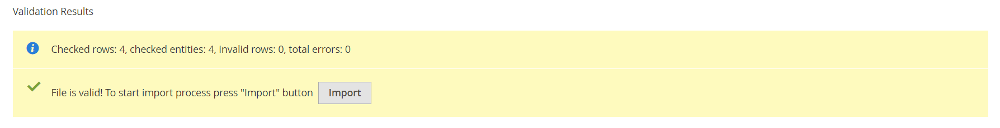

# Importar productos configurables

La mejor manera de comprender cómo se estructuran los datos de productos configurables es exportar un producto configurable y sus variaciones, y examinar los datos en una hoja de cálculo.

En el ejemplo siguiente, se agrega un conjunto de variaciones de productos para un nuevo tamaño en cada color. En primer lugar, exporte el producto configurable y examine la estructura de datos. A continuación, actualice los datos y vuelva a importarlos en el catálogo. Si no desea realizar el ejercicio de exportación de datos, puede descargar el archivo CSV que se utiliza en el ejemplo.

{width="700" zoomable="yes"}

## Paso 1: Verificar la configuración y los valores de los atributos

1. Antes de empezar, asegúrese de que los atributos que se utilizan para las variaciones de productos tienen la configuración de propiedad necesaria.

   - [**[!UICONTROL Scope]**](../getting-started/websites-stores-views.md#scope-settings) - `Global`
   - [**[!UICONTROL Catalog Input Type for Store Owner]**](data-attributes-product.md) - El tipo de entrada de cualquier atributo que se use para una variación de producto debe ser uno de los siguientes:

      - `Dropdown`
      - `Visual Swatch`
      - `Text Swatch`
      - `Multi-Select`

   - **[!UICONTROL Values Required]** - `Yes`

1. Si va a añadir un tamaño o un color, o va a realizar cualquier otro cambio en un atributo existente, asegúrese de actualizar el atributo con el nuevo valor.

1. En la barra lateral _Admin_, vaya a **[!UICONTROL Stores]** > _[!UICONTROL Attributes]_>**[!UICONTROL Product]**.

1. Busque el atributo en la lista y ábralo en modo de edición.

1. Agregue el nuevo valor al atributo.

   En el ejemplo siguiente, se añade un nuevo tamaño a una muestra de texto.

   {width="500" zoomable="yes"}

1. Una vez finalizado, haga clic en **[!UICONTROL Save Attribute]**.

1. Si está agregando un atributo, siga las instrucciones para [crear el atributo](../catalog/attribute-product-create.md) antes de comenzar.

## Paso 2: Exportar el producto configurable

1. En la barra lateral _Admin_, vaya a **[!UICONTROL Catalog]** > **[!UICONTROL Products]**.

1. Busque el producto configurable que desea exportar:

   - Haga clic en **[!UICONTROL Filters]**.
   - Establezca **[!UICONTROL Type]** en `Configurable Product` y haga clic en **[!UICONTROL Apply Filters]**.
   - Elija el producto configurable que desea utilizar para la exportación de prueba y tome nota de **[!UICONTROL SKU]**.

1. En la barra lateral _Admin_, vaya a **[!UICONTROL System]** > _[!UICONTROL Data Transfer]_>**[!UICONTROL Export]**.

   {width="600" zoomable="yes"}

1. En _[!UICONTROL Export Setting]s_, haga lo siguiente:

   - Establezca **[!UICONTROL Entity Type]** en `Products`.

   - Establezca **[!UICONTROL Export File Format]** en `CSV`.

1. En _[!UICONTROL Entity Attributes]_, desplácese hacia abajo o utilice el filtro de etiqueta de atributo para localizar el atributo **[!UICONTROL SKU]**y haga lo siguiente:

   - Introduzca la SKU del producto configurable que ha elegido exportar y haga clic en **[!UICONTROL Continue]**.

     {width="600" zoomable="yes"}

   - Busque el archivo en la ubicación de descarga del explorador web y ábralo como una hoja de cálculo.

     El archivo CSV tiene una fila independiente para cada variación de producto simple y una fila para el producto configurable. `product_type column` muestra varias variaciones de productos simples que están asociados con un producto configurable.

     {width="600" zoomable="yes"}

   - Desplácese hasta el extremo derecho de la hoja de cálculo para buscar las columnas siguientes.

      - `configurable_variations`: define la relación &quot;uno a varios&quot; entre el registro de producto configurable y cada variación.
      - `configurable_variation_labels`: define la etiqueta que identifica cada variación.

     En este ejemplo, los datos se pueden encontrar en las columnas CG y CH. Según el número de variaciones, la cadena de datos de la columna `configurable_variations` puede ser larga. Los datos se utilizan como índice para las variaciones de productos asociadas y tienen la siguiente estructura:

     ```text
     sku={{SKU_VALUE}},attribute1={{VALUE}},attribute2={{VALUE}}| sku={{SKU_VALUE}},attribute1={{VALUE}},attribute2={{VALUE}}
     ```

     Cada SKU está separado por un símbolo de barra vertical (|) y los atributos están separados por una coma. El valor de cada atributo se representa mediante el código de atributo, en lugar de la etiqueta de atributo. Así es como aparecen los datos reales:

     ```text
     sku=MH01-XS-Black,size=XS,color=Black|sku=MH01-XS-Gray,size=XS,color=Gray|sku=MH01-XS-Orange,size=XS,color=Orange</pre>
     ```

1. Cuando comprenda la estructura de los datos de productos configurables, puede editar los datos o añadir nuevas variaciones directamente al archivo CSV.

   Para obtener más información, consulte [Datos complejos](data-attributes-product.md#complex-product-data-attributes).

## Paso 3: Editar los datos

En el ejemplo siguiente, el conjunto de tamaños XML se copia y se pega en la hoja de cálculo para crear un conjunto de variaciones de productos para un nuevo tamaño en cada color.

1. Copie el conjunto de variaciones de productos que desee utilizar como plantilla para los nuevos productos.

   {width="600" zoomable="yes"}

1. Inserte los registros de filas copiados en la hoja de cálculo.

   Ahora tiene dos conjuntos idénticos de variaciones de productos simples.

   {width="600" zoomable="yes"}

1. Actualice los datos en las siguientes columnas de las nuevas variaciones, según sea necesario.

   - `sku`
   - `name`
   - `url_key`
   - `additional_attributes`

   Para este ejemplo, todas las referencias de `XL` se cambian a `XXL`.

1. Actualice la información de la columna `product_variations` del registro de producto configurable, de modo que las nuevas variaciones se incluyan como parte del producto configurable.

   En la fila con el registro de producto configurable, haga clic en la celda que contenga los datos de `product_variations`. A continuación, en la barra de fórmulas, copie el último conjunto de parámetros, empezando por el símbolo de barra vertical.

   {width="600" zoomable="yes"}

1. Pegue los parámetros al final de los datos y edítelos según sea necesario para las nuevas variaciones.

   En este ejemplo, los parámetros `sku` y `size` se actualizan para el nuevo tamaño XXL.

1. Antes de volver a importar los datos en el catálogo, elimine las filas que no hayan cambiado.

   En este ejemplo, solo se importan de nuevo en el catálogo las tres variaciones nuevas para el nuevo tamaño y la fila con el producto configurable actualizado. Las demás filas se pueden eliminar del archivo CSV. Sin embargo, asegúrese de no eliminar la fila de encabezado con etiquetas de columna.

   {width="600" zoomable="yes"}

1. **[!UICONTROL Save]** el archivo CSV.

   Los datos están listos para importarse en el catálogo.

   >[!NOTE]
   >
   >El tamaño de un archivo de importación no puede ser superior a 2 MB.

## Paso 4: Importación de los datos actualizados

1. En la barra lateral _Admin_, vaya a **[!UICONTROL System]** > _[!UICONTROL Data Transfer]_>**[!UICONTROL Import]**.

1. En _[!UICONTROL Import Settings]_, establezca **[!UICONTROL Entity Type]**en `Products`.

1. En _[!UICONTROL Import Behavior]_, establezca **[!UICONTROL Import Behavior]**en `Add/Update`.

   {width="600" zoomable="yes"}

1. En _[!UICONTROL File to Import]_, haga clic en **[!UICONTROL Choose File]**y vaya al archivo CSV que ha preparado para la importación y elija el archivo.

   {width="600" zoomable="yes"}

1. En la esquina superior derecha, haga clic en **[!UICONTROL Check Data]**.

1. Si el archivo es válido, haga clic en **[!UICONTROL Import]**.

   De lo contrario, corrija los problemas encontrados en los datos e inténtelo de nuevo.

   {width="600" zoomable="yes"}

1. Cuando finalice la importación, haga clic en **[!UICONTROL Cache Management]** en el mensaje en la parte superior de la página y actualice todas las cachés no válidas.

   Las nuevas variaciones de productos ya están disponibles en el catálogo desde el Administrador y en la tienda. En este ejemplo, la sudadera con capucha ahora está disponible en la talla XXL para todos los colores.
