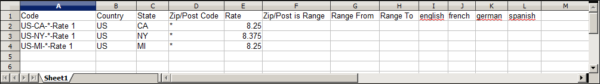

# Actualizar datos de tasa de impuestos

Si realiza operaciones comerciales en varios estados y envía una gran cantidad de productos, la introducción manual de tasas de impuestos puede llevar mucho tiempo. Es más rápido y eficiente descargar las tasas de impuestos por código postal e importarlas en Commerce. En el siguiente ejemplo se muestra cómo importar un conjunto de tasas de impuestos específicas del estado descargadas de una fuente de confianza. Avalara proporciona [tablas de tipos impositivos](https://www.avalara.com/taxrates/en/download-tax-tables.html), que puede descargar sin coste alguno, para cada código postal de Estados Unidos.

>[!NOTE]
>
>Si está interesado en automatizar sus ventas y utilizar el cumplimiento de impuestos y la creación de informes, puede encontrar opciones de confianza de Commerce en la [Socios comerciales](https://solutionpartners.adobe.com/s/directory/?solution=commerce) sitio.

## Paso 1: Exportar los datos de tasa de impuestos de Commerce

1. En el _Administrador_ barra lateral, vaya a **[!UICONTROL System]** > _[!UICONTROL Data Transfer]_>**[!UICONTROL Import/Export Tax Rates]**.

1. Haga clic **[!UICONTROL Export Tax Rates]**.

1. Busque el archivo en la ubicación de descarga de su explorador web.

1. Guarde y abra el archivo en una hoja de cálculo.

   Este ejemplo utiliza [!DNL OpenOffice Calc].

   Los datos de tipos impositivos comerciales exportados incluyen las siguientes columnas:
   - Código
   - País
   - Estado
   - Código postal
   - Tarifa
   - Intervalo desde
   - Intervalo hasta
   - Una columna para cada vista de tienda

   {width="500" zoomable="yes"}

1. Abra los nuevos datos de tipos impositivos en una segunda instancia de la hoja de cálculo para verlos en paralelo.

1. En los nuevos datos de tipos impositivos, tome nota de cualquier dato adicional de tipos impositivos que necesite configurar en su tienda antes de importar los datos.

   Por ejemplo, los datos de tasa impositiva para California también incluyen:

   - `TaxRegionName`
   - `CombinedRate`
   - `StateRate`
   - `CountyRate`
   - `CityRate`
   - `SpecialRate`

   Si necesita importar más [zonas y tipos impositivos](../stores-purchase/tax-zones-rates.md), primero debe definirlos desde el Administrador de su tienda y actualizar el [reglas fiscales](../stores-purchase/tax-rules.md) según sea necesario. A continuación, exporte los datos y abra el archivo en un editor de texto para que se pueda utilizar como referencia. Sin embargo, para que este ejemplo sea sencillo, importamos solo las columnas de tipo impositivo estándar.

## Paso 2: Preparación de los datos de importación

Tiene dos hojas de cálculo abiertas, una al lado de la otra. Uno contiene la estructura de archivos de exportación de Commerce y el otro contiene los nuevos datos de tipos impositivos que desea importar.

1. Para crear un lugar para trabajar en la hoja de cálculo con los nuevos datos de tasa de impuestos, inserte tantas columnas en blanco a la derecha como sea necesario para agregar datos del archivo de exportación de Commerce. Utilice las funciones de cortar y pegar para añadir los datos y, a continuación, reorganizar las columnas para que coincidan con el orden del archivo de datos de exportación de Commerce.

1. Cambie el nombre de los encabezados de columna para que coincidan con los datos de exportación de Commerce.

1. Elimine las columnas que no tengan datos.

   De lo contrario, la estructura del archivo de importación debe coincidir con los datos de exportación originales de Commerce.

1. Antes de guardar el archivo, desplácese hacia abajo y asegúrese de que las columnas de tipo impositivo contienen únicamente datos numéricos.

   Cualquier texto encontrado en una columna de tasa de impuestos impide que se importen los datos.

1. Guarde los datos preparados como un archivo .CSV.

   Cuando se le solicite, compruebe que se utiliza una coma como delimitador de campo y comillas dobles como delimitador de texto. Luego haga clic en **[!UICONTROL OK]**.

## Paso 3: Importación de los tipos impositivos

1. En el _Administrador_ barra lateral, vaya a **[!UICONTROL System]** > _[!UICONTROL Data Transfer]_>**[!UICONTROL Import/Export Tax Rates]**.

1. Clic **[!UICONTROL Choose File]** y elija el archivo de tipo impositivo CSV que ha preparado para importar.

1. Haga clic **[!UICONTROL Import Tax Rates]**.

   La importación de los datos puede tardar varios minutos en completarse. Una vez completado el proceso, la variable `The tax rate has been imported` aparece un mensaje. Si recibe un mensaje de error, corrija el problema en los datos e inténtelo de nuevo.

1. En el _Administrador_ barra lateral, vaya a **[!UICONTROL Stores]** > _[!UICONTROL Taxes]_>**[!UICONTROL Tax Zones and Rates]**.

   Las tasas importadas aparecen en la lista.

1. Utilice los controles de página para ver los nuevos tipos impositivos.

   {width="600" zoomable="yes"}

1. Ejecute algunas transacciones de prueba en su tienda con clientes de diferentes códigos postales para asegurarse de que las nuevas tasas de impuestos funcionan correctamente.
