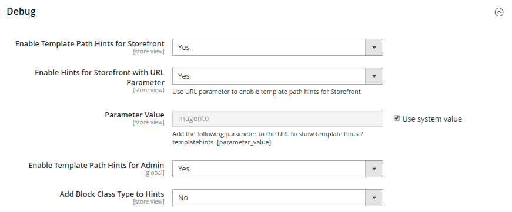

# Herramientas para desarrolladores

Utilice las herramientas avanzadas para desarrolladores para determinar el modo de compilación durante el desarrollo de front-end, crear una lista de permitidos de direcciones IP y mostrar sugerencias de ruta de plantillas. También hay herramientas para realizar fácilmente cambios puntuales en el texto en la interfaz de la tienda y el administrador.

- [Registros de acciones](action-log.md)  (solo Adobe Commerce)
- [Flujo de trabajo de desarrollo de frontEnd](#frontend-development-workflow)
- [Uso de firmas de archivos estáticos](#static-file-signatures)
- [Optimización de archivo de recursos](#optimizing-resource-files)
- [Restricciones de cliente de desarrollador](#client-restrictions)
- [Sugerencias de ruta de plantilla](#template-path-hints)
- [Traducir en línea](#translate-inline)

## Modos de funcionamiento

Su instancia de Adobe Commerce o Magento Open Source se puede implementar para ejecutarse en _producción_ o en _modo de desarrollador_. Solo se puede tener acceso a las herramientas y opciones de configuración diseñadas específicamente para desarrolladores mientras la tienda se ejecuta en _modo de desarrollador_.

Un usuario con los permisos adecuados solo puede cambiar el modo de operación desde la línea de comandos del servidor. Consulte [Establecer el modo de operación](https://experienceleague.adobe.com/docs/commerce-operations/configuration-guide/cli/set-mode.html) en la _Guía de configuración_ para obtener más información.

La mayoría de los temas de la documentación del comerciante se aplican a una instancia de Commerce que se ejecuta en el modo de producción. Sin embargo, las siguientes opciones de configuración y herramientas sólo se pueden utilizar cuando la instalación se ejecuta en modo de desarrollador.

## Flujo de trabajo de desarrollo de front-end

El tipo de flujo de trabajo de desarrollo de front-end determina si se produce menos compilación en el lado del cliente o del servidor durante el desarrollo. Less es una extensión de CSS que tiene características y convenciones adicionales y que produce código optimizado. Se recomienda la compilación Less del lado del cliente para el desarrollo de temas. La compilación del lado del servidor es el modo predeterminado. Las opciones del flujo de trabajo de desarrollo no están disponibles para tiendas en modo de producción.
Consulte [Compilación LESS del lado del cliente frente a la del lado del servidor](https://developer.adobe.com/commerce/frontend-core/guide/css/quickstart/compilation-mode/){:target="_blank"} en la documentación para desarrolladores de Commerce.

>[!NOTE]
>
>La configuración del flujo de trabajo de desarrollo de front-end solo está disponible en [modo de desarrollador](../systems/developer-tools.md#operation-modes).

{width="600" zoomable="yes"}

1. En la barra lateral _Admin_, vaya a **[!UICONTROL Stores]** > _[!UICONTROL Settings]_>**[!UICONTROL Configuration]**.

1. En el panel izquierdo, expanda **[!UICONTROL Advanced]** y elija **[!UICONTROL Developer]**.

1. Expanda  en la sección **[!UICONTROL Front-end Development Workflow]**.

1. Establezca **[!UICONTROL Workflow Type]** en una de las siguientes opciones:

   - `Client side less compilation`: la compilación se realiza en el explorador con la biblioteca nativa `less.js`.
   - `Server side less compilation`: la compilación se realiza en el servidor utilizando la biblioteca Less PHP. Este es el modo predeterminado para la producción.

1. Una vez finalizado, haga clic en **[!UICONTROL Save Config]**.

## Firmas de archivo estáticas

Añadir una firma digital a la URL de los archivos estáticos permite a los exploradores detectar cuándo está disponible una versión más reciente del archivo. Los archivos estáticos que se pueden rastrear con firmas digitales son JavaScript, CSS, imágenes y fuentes. La firma se anexa a la ruta directamente después de la dirección URL base. Si la firma de un archivo difiere de lo que se almacena en la caché del explorador, se utiliza la versión más reciente del archivo.

Consulte [Firma de contenido estático](https://experienceleague.adobe.com/docs/commerce-operations/configuration-guide/cache/static-content-signing.html){:target="_blank"} en la documentación para desarrolladores de Commerce.

>[!NOTE]
>
>La configuración del archivo estático solo está disponible cuando se trabaja en [modo de desarrollador](../systems/developer-tools.md#operation-modes).

{width="600" zoomable="yes"}

Para obtener una lista detallada de las opciones de configuración, consulte [_Configuración de archivo estático_](../configuration-reference/advanced/developer.md) en la _Referencia de configuración_.

**_Para habilitar los archivos estáticos firmados:_**

1. En la barra lateral _Admin_, vaya a **[!UICONTROL Stores]** > _[!UICONTROL Settings]_>**[!UICONTROL Configuration]**.

1. En el panel izquierdo, expanda **[!UICONTROL Advanced]** y elija **[!UICONTROL Developer]**.

1. Expanda  en la sección **[!UICONTROL Static Files Settings]**.

1. Establezca **[!UICONTROL Sign Static Files]** en `Yes`.

1. Una vez finalizado, haga clic en **[!UICONTROL Save Config]**.

## Optimización de archivo de recursos

El tiempo que se tarda en cargar archivos de recursos se puede reducir combinando y agrupando archivos y minimizando el código.

- La combinación combina archivos independientes del mismo tipo en un solo archivo.
- El agrupamiento es una técnica que agrupa archivos independientes para reducir el número de solicitudes HTTP necesarias para cargar una página.
- La minificación elimina los espacios, los saltos de línea y los comentarios, pero no afecta a la funcionalidad del código. Como los archivos minimizados no se pueden editar, el proceso solo debe aplicarse cuando esté listo para entrar en producción.

De forma predeterminada, Adobe Commerce y Magento Open Source no combinan, agrupan ni minimizan archivos, y el desarrollador del proyecto debe determinar qué métodos de optimización de archivos se deben utilizar.

Consulte [Prácticas recomendadas de rendimiento](https://experienceleague.adobe.com/docs/commerce-operations/performance-best-practices/overview.html) para obtener más información.

>[!NOTE]
>
>Los archivos CSS y JavaScript solo se pueden optimizar en [Modo de desarrollador](../systems/developer-tools.md#operation-modes).

| Tipo de archivo | Operaciones compatibles |
| --------------- | -------------------- |
| Archivos CSS | `MergeMinify` |
| Archivos de JavaScript | `MergeBundleMinify` |
| Archivos de plantilla | `Minify` |

{style="table-layout:auto"}

**_Para optimizar los archivos de recursos:_**

1. En la barra lateral _Admin_, vaya a **[!UICONTROL Stores]** > _[!UICONTROL Settings]_>**[!UICONTROL Configuration]**.

1. En el panel izquierdo, expanda **[!UICONTROL Advanced]** y elija **[!UICONTROL Developer]**.

1. Para optimizar los archivos CSS, expanda  en la sección **[!UICONTROL CSS Settings]** y haga lo siguiente:

   - Establezca **[!UICONTROL Merge CSS Files]** en `Yes`.
   - Establezca **[!UICONTROL Minify CSS Files]** en `Yes`.

   {width="600" zoomable="yes"}

[_Configuración de CSS_](../configuration-reference/advanced/developer.md)

1. Para optimizar los archivos de JavaScript, expanda  en la sección **[!UICONTROL JavaScript Settings]** y haga lo siguiente:

   - Establezca **[!UICONTROL Merge JavaScript Files]** en `Yes`.
   - Establezca **[!UICONTROL Minify JavaScript Files]** en `Yes`.

   {width="600" zoomable="yes"}

1. Para minimizar los archivos de plantilla PHTML, expanda  en la sección **[!UICONTROL Template Settings]** y establezca **[!UICONTROL Minify Html]** en `Yes`.

   {width="600" zoomable="yes"}

1. Una vez finalizado, haga clic en **[!UICONTROL Save Config]**.

## Restricciones de cliente

Antes de usar una herramienta como [sugerencias de ruta de plantillas](#template-path-hints), asegúrese de agregar su dirección IP a la lista de permitidos Restricciones de cliente para desarrolladores para evitar que se interrumpa la experiencia de compra de los clientes en la tienda. Si no conoce su dirección IP, puede buscarla en línea.

>[!NOTE]
>
>Las restricciones de cliente para desarrolladores solo se pueden establecer en [Modo para desarrolladores](../systems/developer-tools.md#operation-modes).

Para obtener información técnica, consulte [VCL personalizado para permitir solicitudes](https://experienceleague.adobe.com/docs/commerce-cloud-service/user-guide/cdn/custom-vcl-snippets/fastly-vcl-allowlist.html) en la _Guía de infraestructura en la nube de Commerce_.

**_Para agregar su dirección IP a la lista de permitidos:_**

1. En la barra lateral _Admin_, vaya a **[!UICONTROL Stores]** > _[!UICONTROL Settings]_>**[!UICONTROL Configuration]**.

1. En el panel izquierdo, expanda **[!UICONTROL Advanced]** y elija **[!UICONTROL Developer]**.

1. Expanda  en la sección **[!UICONTROL Developer Client Restrictions]**.

   {width="600" zoomable="yes"}

1. Para **[!UICONTROL Allow IPs]**, ingrese su dirección IP.

   Si se necesita acceso desde varias direcciones IP, sepárelas con una coma.

1. Una vez finalizado, haga clic en **[!UICONTROL Save Config]**.

1. Cuando se le solicite, actualice las cachés no válidas.

## Sugerencias de ruta de plantilla

Las sugerencias de ruta de plantilla son una herramienta de diagnóstico que agrega notación con la ruta a cada plantilla que se utiliza en la página. Las sugerencias de ruta de plantilla se pueden habilitar para la tienda o para el administrador.

>[!NOTE]
>
>Las sugerencias de ruta de plantillas solo se pueden editar en [modo para desarrolladores](../systems/developer-tools.md#operation-modes).

Consulte [Buscar plantillas, diseños y estilos](https://developer.adobe.com/commerce/frontend-core/guide/themes/debug/){:target="_blank"} en la documentación para desarrolladores de Commerce.

{width="700" zoomable="yes"}

### Paso 1: Añadir su dirección IP a la lista de permitidos

Antes de usar sugerencias para las rutas de plantillas, agrega tu dirección IP a la [lista de permitidos](#client-restrictions) para evitar interferencias con los clientes que están comprando en la tienda. Cuando haya terminado, asegúrese de borrar la caché de Commerce para eliminar todas las sugerencias de la tienda.

{width="600" zoomable="yes"}

### Paso 2: Habilitar sugerencias de ruta de plantilla

1. En la barra lateral _Admin_, vaya a **[!UICONTROL Stores]** > _[!UICONTROL Settings]_>**[!UICONTROL Configuration]**.

1. En el panel izquierdo, expanda **[!UICONTROL Advanced]** y elija **[!UICONTROL Developer]**.

1. Expanda  en la sección **[!UICONTROL Debug]** y haga lo siguiente:

   {width="600" zoomable="yes"}

   - Para activar sugerencias de ruta de acceso de plantilla para el almacén, establezca **[!UICONTROL Enabled Template Path Hints for Storefront]** en `Yes`.

   - Para habilitar sugerencias de ruta de acceso de plantilla para el almacén solo cuando la dirección URL incluya el parámetro `templatehints`, establezca **Habilitar sugerencias para tienda con el parámetro de dirección URL** en `Yes`. Luego establezca el valor del parámetro si es necesario. El valor predeterminado es `magento`, pero puede usar un valor personalizado. Por ejemplo, si cambia el valor a `lorem`, utilizaría `mymagento.com?templatehints=lorem` para mostrar sugerencias de plantilla.

   - Para activar sugerencias de ruta de acceso de plantilla para el administrador, establezca **[!UICONTROL Enabled Template Path Hints for Admin]** en `Yes`.

   - Para incluir los nombres de los bloques, establezca **[!UICONTROL Add Block Class Type to Hints]** en `Yes`.

1. Una vez finalizado, haga clic en **[!UICONTROL Save Config]**.

### Paso 3: Borrar la caché

1. En la barra lateral _Admin_, vaya a **[!UICONTROL System]** > _[!UICONTROL Tools]_>**[!UICONTROL Cache Management]**.

1. En la esquina superior derecha, haga clic en **[!UICONTROL Flush Magento Cache]**.

## Traducir en línea

Puede usar la herramienta Traducir en línea en [modo de desarrollador](../systems/developer-tools.md#operation-modes) para retocar texto en la interfaz y reflejar su voz y marca. Cuando se activa el modo Traducir en línea, cualquier texto de la página que se pueda editar se delineará en rojo. Es fácil editar las etiquetas de campo, los mensajes y otro texto que aparece en la tienda y en el administrador. Por ejemplo, muchos temas usan terminología como _Mi cuenta_, _Mi lista de deseos_ y _Mi tablero_ para ayudar a los clientes a encontrar el camino. Sin embargo, es posible que prefiera usar simplemente las palabras _Cuenta_, _Lista de deseos_ y _Tablero_.

>[!NOTE]
>
>La herramienta Traducir en línea solo está disponible cuando se trabaja en [modo de desarrollador](../systems/developer-tools.md#operation-modes).

Consulte [Resumen de traducciones](https://developer.adobe.com/commerce/frontend-core/guide/translations/) en la documentación para desarrolladores de Commerce.

{width="700" zoomable="yes"}

Si su tienda está disponible en varios idiomas, puede realizar ajustes precisos en el texto traducido para la configuración regional. En el servidor, el texto de la interfaz se mantiene en un archivo CSV independiente para cada bloque de salida y se organiza según la configuración regional. Como alternativa, en lugar de usar la herramienta _Traducir en línea_, también puede editar los archivos CSV directamente en el servidor. Los archivos de traducción se almacenan en `app/code/Magento/<module_name>/i18n/<language_locale>.csv`.

>[!NOTE]
>
>Para utilizar la herramienta Traducir en línea, el explorador debe permitir ventanas emergentes.

### Paso 1: Deshabilitar cachés de salida

1. En la barra lateral _Admin_, vaya a **[!UICONTROL System]** > _[!UICONTROL Tools]_>**[!UICONTROL Cache Management]**.

1. Seleccione las siguientes casillas de verificación:

   - `Blocks HTML output`
   - `Page Cache`
   - `Translations`

1. Establezca el control **[!UICONTROL Actions]** en `Disable` y haga clic en **[!UICONTROL Submit]**.

### Paso 2: Habilitar la herramienta Traducir en línea

1. En la barra lateral _Admin_, vaya a **[!UICONTROL Stores]** > _[!UICONTROL Settings]_>**[!UICONTROL Configuration]**.

1. Para trabajar con una vista de tienda específica, configure **[!UICONTROL Store View]** para que se actualice.

1. En el panel izquierdo, expanda **[!UICONTROL Advanced]** y elija **[!UICONTROL Developer]**.

1. Expanda  en la sección **[!UICONTROL Translate Inline]**.

   Desactive la casilla de verificación **[!UICONTROL Use Website]** según sea necesario para modificar esta configuración.

   La opción _[!UICONTROL Enabled for Admin]_&#x200B;no está disponible al editar una vista de tienda específica.

   {width="600" zoomable="yes"}

1. Establezca **[!UICONTROL Enabled for Storefront]** en `Yes`.

1. Una vez finalizado, haga clic en **[!UICONTROL Save Config]**.

1. Cuando se le solicite, actualice las cachés no válidas, pero deje las cachés deshabilitadas tal y como están por ahora.

### Paso 3: Actualizar el texto

1. Abra la tienda en un navegador y vaya a la página que desee editar.

   Si es necesario, utilice el selector de idioma para cambiar la vista de la tienda. Cada cadena de texto que se puede traducir se destaca en rojo. Cuando pasa el ratón por encima de cualquier cuadro de texto, aparece un icono de libro (  ).

1. Haga clic en el icono de libro para abrir la ventana _Traducir_ y haga lo siguiente:

   - Si el cambio es para la vista de tienda específica, seleccione la casilla de verificación **[!UICONTROL Store View Specific]**.

   - Escriba el nuevo texto de **[!UICONTROL Custom]**.

1. Una vez finalizado, haga clic en **[!UICONTROL Submit]**.

   {width="700" zoomable="yes"}

1. Para ver los cambios en la tienda, actualice el explorador.

1. Repita este proceso para cualquier elemento del almacén que desee cambiar.

### Paso 4: Restaurar la configuración original

1. Vuelva al administrador de la tienda.

1. En la barra lateral _Admin_, vaya a **[!UICONTROL Stores]** > _[!UICONTROL Settings]_>**[!UICONTROL Configuration]**.

1. Establezca **[!UICONTROL Store View]** en la vista específica que se editó.

1. En el panel izquierdo, expanda **[!UICONTROL Advanced]** y elija **[!UICONTROL Developer]**.

1. Expanda  en la sección **[!UICONTROL Translate Inline]**.

1. Establezca **[!UICONTROL Enabled for Frontend]** en `No`.

1. Una vez finalizado, haga clic en **[!UICONTROL Save Config]**.

1. En la barra lateral _Admin_, vaya a **[!UICONTROL System]** > _[!UICONTROL Tools]_>**[!UICONTROL Cache Management]**.

1. Seleccione la casilla de verificación de las siguientes cachés de salida que estaban deshabilitadas anteriormente:

   - `Blocks HTML output`
   - `Page Cache`
   - `Translations`

1. Establezca el control **[!UICONTROL Actions]** en `Enable` y haga clic en **[!UICONTROL Submit]**.

1. Cuando se le solicite, actualice las cachés no válidas.

### Paso 5: Verifica los cambios en tu tienda

Vaya a la tienda y examine todas las páginas que se actualizaron para asegurarse de que los cambios son correctos. En este ejemplo, `Customer Login` se cambió a `Customer Sign In`. Si se han realizado cambios en una vista específica, utilice el Selector de idioma para cambiar a la vista correcta.

{width="700" zoomable="yes"}
