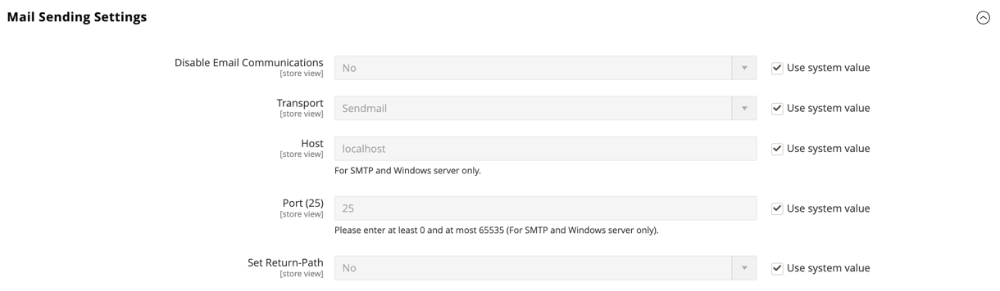

# Configurar comunicaciones por correo electrónico

El _Configuración de envío de correo_ le permite dirigir los correos electrónicos devueltos o las respuestas a correos electrónicos a una dirección específica. Si el almacén se está ejecutando en un servidor SMTP o Windows, puede comprobar la configuración del host y del puerto.

>[!IMPORTANT]
>
>**Aviso de seguridad** Todos los comerciantes deben establecer inmediatamente su configuración de envío de correo para protegerse contra un posible ataque de ejecución de código remoto identificado recientemente. Hasta que se resuelva, es muy recomendable que evite utilizar [!DNL Sendmail] para comunicaciones por correo electrónico. En el _[!UICONTROL Mail Sending Settings]_, asegúrese de que_[!UICONTROL Set Return Path]_ se establece en `No`.

Para obtener una lista detallada de los ajustes de configuración, consulte [_[!UICONTROL Mail Sending Settings]_](../configuration-reference/advanced/system.md) en el _Referencia de configuración_.

## Configurar comunicaciones por correo electrónico

1. En el _Administrador_ barra lateral, vaya a **[!UICONTROL Stores]** > _[!UICONTROL Settings]_>**[!UICONTROL Configuration]**.

1. En el panel izquierdo, expanda **[!UICONTROL Advanced]** y elija **[!UICONTROL System]**.

1. Expandir  el **[!UICONTROL Mail Sending Settings]** y haga lo siguiente:

   {width="600" zoomable="yes"}

   - Si es necesario, establezca **[!UICONTROL Disable Email Communications]** hasta `No`.

   - Para **[!UICONTROL Transport]**, elija el tipo de transporte para las comunicaciones por correo electrónico desde la tienda: `Sendmail` o `SMTP`

   - Si se ejecuta en un servidor SMTP o Windows, compruebe la siguiente configuración:

      - **[!UICONTROL Host]** - `localhost` u otros

      - **[!UICONTROL Port (25)]** - `25` u otros

   - Para **[!UICONTROL Set Return Path]**, elija una de las siguientes opciones:

      - `No` - (Medida de seguridad recomendada) Las rutas devolvieron el correo electrónico a la dirección de correo electrónico predeterminada de la tienda.
      - `Yes` - Rutas devueltas por correo electrónico a la dirección de correo electrónico predeterminada de la tienda.
      - `Specified` - Rutas devueltas por correo electrónico a la dirección especificada en **[!UICONTROL Return Path Email]**.

   - Si se ejecuta en un servidor SMTP, configure la conexión:

      - **[!UICONTROL Username]** - Introduzca el nombre de usuario de inicio de sesión para el servidor SMTP.
      - **[!UICONTROL Password]** - Introduzca la contraseña para el inicio de sesión del servidor SMTP.
      - **[!UICONTROL Auth]** - Elija el tipo de autenticación para la conexión del servidor SMTP: `NONE` , `PLAIN`, o `LOGIN`
      - **[!UICONTROL SSL]** - Elija el tipo de verificación para el certificado de seguridad del servidor: `SSL` o `TLS`

     {width="600" zoomable="yes"}

1. En el panel izquierdo, expanda **[!UICONTROL Sales]** y elija **[!UICONTROL Sales Emails]**.

1. Expandir  el **[!UICONTROL General Settings]** sección.

1. Establecer **[!UICONTROL Asynchronous sending]** hasta `Enable`.

   {width="600" zoomable="yes"}

   Para obtener una lista detallada de los ajustes de configuración, consulte [_Configuración general_](../configuration-reference/sales/sales-emails.md) en el _Referencia de configuración_.

1. Cuando termine, haga clic en **[!UICONTROL Save Config]**.
