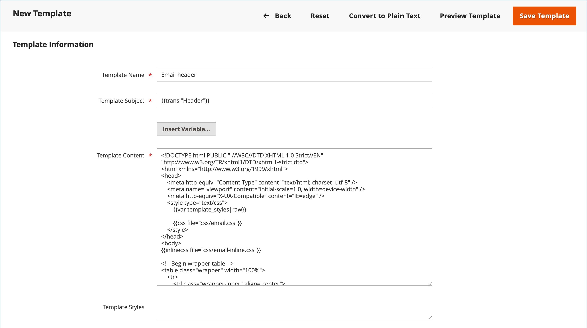

# Personalizar plantillas de correo electrónico

Commerce incluye una plantilla de correo electrónico predeterminada para la sección del cuerpo de cada mensaje que envía el sistema. La plantilla para el contenido del cuerpo se combina con las plantillas de encabezado y pie de página para crear el mensaje completo. El contenido tiene formato de HTML y CSS y se puede editar, editar y personalizar fácilmente añadiendo [variables](variables-predefined.md) y [widgets](../content-design/widgets.md). Las plantillas de correo electrónico se pueden personalizar para cada sitio web, tienda o vista de tienda. Si utiliza plantillas personalizadas, asegúrese de actualizar el [configuración del sistema](email-templates.md#configure-email-templates) para asegurarse de que se utiliza la plantilla correcta.

{width="500" zoomable="yes"}

Las plantillas predeterminadas incluyen su logotipo y la información de la tienda, y se pueden utilizar sin más personalización. Sin embargo, como práctica recomendada, debe ver cada plantilla y realizar los cambios necesarios antes de enviarla a los clientes.

- [Plantilla de encabezado](email-template-custom.md#header-template)
- [Plantilla de pie](email-template-custom.md#footer-template)
- [Plantillas de mensajes](email-template-custom.md#message-templates)

{width="700" zoomable="yes"}

## Información de plantilla

| Campo | Descripción |
| ----- | ----------- |
| [!UICONTROL Template Name] | Nombre de la plantilla personalizada. |
| [!UICONTROL Insert Variable] | Inserta una variable en la plantilla en la ubicación del cursor. |
| [!UICONTROL Template Subject] | El asunto de la plantilla aparece en la columna Asunto y se puede utilizar para ordenar y filtrar las plantillas de la lista. |
| [!UICONTROL Template Content] | El contenido de la plantilla en HTML. |
| [!UICONTROL Template Styles] | Cualquier declaración de estilo CSS necesaria para dar formato a la plantilla se puede introducir en la variable _[!UICONTROL Template Styles]_cuadro. |

{style="table-layout:auto"}

## Plantilla de encabezado

Después de completar la [configuración](email-templates.md#configure-email-templates), la plantilla de encabezado de correo electrónico incluye su logotipo vinculado a la tienda. Si tiene conocimientos básicos de HTML, puede utilizar fácilmente [variables predefinidas](variables-predefined.md) para agregar información de contacto de la tienda al encabezado.

### Paso 1. Cargar la plantilla predeterminada

1. En el _Administrador_ barra lateral, vaya a **[!UICONTROL Marketing]** > _[!UICONTROL Communications]_>**[!UICONTROL Email Templates]**.

1. Haga clic **[!UICONTROL Add New Template]**.

1. En el **[!UICONTROL Load default template]** , haga clic en **[!UICONTROL Template]** y elija `Magento_Email` > `Header`.

   {width="600" zoomable="yes"}

1. Haga clic **[!UICONTROL Load Template]**.

   El código del HTML y las variables de la plantilla aparecen en el formulario.

### Paso 2. Personalización de la plantilla

1. Introduzca el **[!UICONTROL Template Name]** para el encabezado personalizado.

1. Introduzca una **[!UICONTROL Template Subject]** para organizar las plantillas.

   En la cuadrícula, la lista de plantillas se puede ordenar y filtrar por la variable _[!UICONTROL Subject]_columna.

   {width="600" zoomable="yes"}

1. En el **[!UICONTROL Template Content]** , modifique el HTML según sea necesario.

   >[!NOTE]
   >
   >Cuando trabaje con el código de plantilla, asegúrese de no sobrescribir nada que esté entre llaves dobles.

1. Para insertar un [variable](variables-reference.md), coloque el cursor en el código donde desee colocar la variable y haga clic en **[!UICONTROL Insert Variable]**.

1. Elija la variable que desea insertar.

   {width="600" zoomable="yes"}

   Cuando se selecciona una variable, una variable [etiqueta de marcado](markup-tags.md) para la variable se inserta en el código.

   Aunque las variables Almacenar dirección de correo electrónico son las que se incluyen con mayor frecuencia en el encabezado, puede introducir el código de cualquier sistema o [variable personalizada](variables-custom.md) directamente en la plantilla.

1. Si necesita realizar alguna declaración CSS, introduzca los estilos en la **[!UICONTROL Template Styles]** cuadro.

1. Cuando esté listo para revisar su trabajo, haga clic en **[!UICONTROL Preview Template]**.

   Realice los cambios necesarios en la plantilla.

1. Cuando termine, haga clic en **[!UICONTROL Save Template]**.

   El encabezado personalizado ahora aparece en la lista de plantillas de correo electrónico disponibles.

### Paso 3. Actualizar la configuración

1. En el _Administrador_ barra lateral, vaya a **[!UICONTROL Content]** > _[!UICONTROL Design]_>**[!UICONTROL Configuration]**.

1. En la cuadrícula, busque la vista de tienda que desee configurar y haga clic en **[!UICONTROL Edit]** en el _[!UICONTROL Action]_columna.

1. Desplazarse hacia abajo y expandir  el **[!UICONTROL Transactional Emails]** sección.

1. Elija la **[!UICONTROL Header Template]** que se utiliza de forma predeterminada para las notificaciones por correo electrónico.

1. Cuando termine, haga clic en **[!UICONTROL Save Config]**.

{width="600" zoomable="yes"}

## Plantilla de pie

El pie de la plantilla de correo electrónico contiene la línea de cierre y firma del mensaje de correo electrónico. Puede cambiar el cierre para que se ajuste a su estilo y agregar información adicional, como el nombre de la empresa y la dirección debajo de su nombre.

### Paso 1. Cargar la plantilla predeterminada

1. En el _Administrador_ barra lateral, vaya a **[!UICONTROL Marketing]** > _[!UICONTROL Communications]_>**[!UICONTROL Email Templates]**.

1. Haga clic **[!UICONTROL Add New Template]**.

1. En el **[!UICONTROL Load default template]** , haga clic en **[!UICONTROL Template]** y elija `Magento_Email` > `Footer`.

1. Haga clic **[!UICONTROL Load Template]**.

   El código del HTML y las variables de la plantilla aparecen en el formulario.

### Paso 2. Personalización y previsualización de la plantilla

1. Introduzca el **[!UICONTROL Template Name]** para el pie de página personalizado.

1. Introduzca una **[!UICONTROL Template Subject]** para organizar las plantillas.

   En la cuadrícula, las plantillas se pueden ordenar y filtrar por la variable _[!UICONTROL Subject]_columna.

   {width="600" zoomable="yes"}

1. En el **[!UICONTROL Template Content]** , modifique el HTML según sea necesario.

   >[!NOTE]
   >
   >Cuando trabaje con el código de plantilla, asegúrese de no sobrescribir nada que esté entre llaves dobles.

1. Para insertar un [variable](variables-reference.md), coloque el cursor en el código donde desee colocar la variable y haga clic en **[!UICONTROL Insert Variable]**.

1. Elija la variable que desea insertar.

   Cuando se selecciona una variable, una variable [etiqueta de marcado](markup-tags.md) para la variable se inserta en el código.

   Aunque las variables Contacto de tienda son las que se incluyen con mayor frecuencia en el pie de página, puede escribir el código de cualquier sistema o [variable personalizada](variables-custom.md) directamente en la plantilla.

1. Si necesita realizar alguna declaración CSS, introduzca los estilos en la **[!UICONTROL Template Styles]** cuadro.

### Paso 3. Actualizar la configuración

1. En el _Administrador_ barra lateral, vaya a **[!UICONTROL Content]** > _[!UICONTROL Design]_>**[!UICONTROL Configuration]**.

1. En la cuadrícula, busque la vista de tienda que desee configurar y haga clic en **[!UICONTROL Edit]** en el _[!UICONTROL Action]_columna.

1. Desplazarse hacia abajo y expandir  el **[!UICONTROL Transactional Emails]** sección.

1. Elija la **[!UICONTROL Footer Template]** que se utiliza como pie de página predeterminado en las notificaciones por correo electrónico.

1. Cuando termine, haga clic en **[!UICONTROL Save Config]**.

{width="600" zoomable="yes"}

## Plantillas de mensajes

El proceso de personalizar el cuerpo de cada mensaje es el mismo que para personalizar el encabezado o el pie de página. La única diferencia es la plantilla de mensaje para cada actividad o evento que almacena en déclencheur una notificación. Puede usar las plantillas tal cual, o personalizarlas para que coincidan con su voz y marca. Además del texto de plantilla, existe una amplia selección de [predefinido](variables-predefined.md) variables y [personalizado](variables-custom.md) variables que se pueden crear e incorporar en la plantilla.

### Paso 1. Cargar la plantilla predeterminada

1. En el _Administrador_ barra lateral, vaya a **[!UICONTROL Marketing]** > _[!UICONTROL Communications]_>**[!UICONTROL Email Templates]**.

1. Haga clic **[!UICONTROL Add New Template]**.

   {width="600" zoomable="yes"}

1. Haga lo siguiente:

   - En **[!UICONTROL Load default template]**, elija la **[!UICONTROL Template]** que desee personalizar.

   - Haga clic **[!UICONTROL Load Template]**.

### Paso 2. Personalización de la plantilla

1. Para **[!UICONTROL Template Name]**, introduzca un nombre para la plantilla personalizada.

1. Si es necesario, cambie el **[!UICONTROL Template Subject]**.

   Esta es la primera línea del mensaje, que es el saludo de forma predeterminada. Puede dejarlo tal cual, o puede introducir algo más descriptivo.

1. Tome nota de la **[!UICONTROL Currently Used For]** ruta a la plantilla, que es la ruta utilizada para actualizar la configuración.

   {width="600" zoomable="yes"}

1. En el **[!UICONTROL Template Content]** , modifique el HTML según sea necesario.

   El contenido consiste en una combinación de etiquetas de HTML, directivas CSS, variables y texto.

   >[!NOTE]
   >
   >Cuando trabaje con el código de plantilla, asegúrese de no escribir accidentalmente el código entre llaves dobles.

1. Para insertar una variable, coloque el cursor en el código donde desee que aparezca la variable.

   La selección de variables varía según la plantilla e incluye los elementos permitidos [predefinido](variables-predefined.md) y [personalizado](variables-custom.md) variables, si están disponibles.

1. Clic **[!UICONTROL Insert Variable]** y elija la variable que desea insertar.

   Un comando para insertar la variable se coloca entre llaves y se agrega al código en la ubicación del cursor. Por ejemplo:

   `customVar code=my_custom_variable`

1. Para realizar declaraciones CSS, introduzca los estilos en **[!UICONTROL Template Styles]**.

   {width="600" zoomable="yes"}

   >[!NOTE]
   >
   >Los estilos personalizados se aplican al correo electrónico solo si `{{template config_path="design/email/header_template"}}` está presente en el _[!UICONTROL Template Styles]_. Para utilizar CSS personalizado sin una plantilla de encabezado predeterminada, debe proporcionarlos aquí dentro de la variable `<style>` Etiqueta de HTML.

### Paso 3. Actualizar la configuración

El _[!UICONTROL Currently Used For]_la ruta de exploración muestra dónde se utiliza la plantilla. En este ejemplo, la configuración de la plantilla se encuentra en_[!UICONTROL Customer Configuration]_ , en la _[!UICONTROL Create New Account Options]_y en la sección_[!UICONTROL Default Welcome Email]_ field.

- Página - [!UICONTROL Customer Configuration]
- Sección - [!UICONTROL Create New Account Options]
- Campo - [!UICONTROL Default Welcome Email]

1. En el **[!UICONTROL Currently Used For]** ruta de exploración, haga clic en el vínculo para abrir la página de configuración de la plantilla.

   {width="600" zoomable="yes"}

1. Expandir  Abra la sección y busque el campo de la plantilla de correo electrónico que ha personalizado.

1. Borre la **[!UICONTROL Use system value]** y haga clic en el nombre de la plantilla personalizada.

   {width="600" zoomable="yes"}

1. Cuando termine, haga clic en **[!UICONTROL Save Config]**.

1. En el mensaje situado en la parte superior del espacio de trabajo, haga clic en **[!UICONTROL Cache Management]** y borre cualquier caché no válida.

### Paso 4. Previsualizar y guardar la plantilla

1. Cuando esté listo para revisar su trabajo, haga clic en **[!UICONTROL Preview Template]**.

1. Actualice la plantilla según sea necesario.

1. Cuando termine, haga clic en **[!UICONTROL Save Template]**.

   La plantilla personalizada ahora está disponible en la lista de plantillas de correo electrónico.
