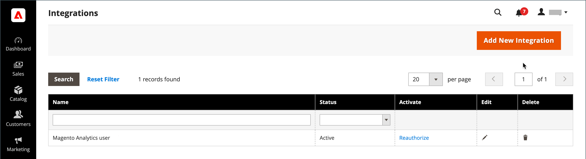

# Integraciones

Al definir una integración en el administrador de Commerce, se establece la ubicación de las credenciales de OAuth y la URL de redireccionamiento para integraciones de terceros, y se identifican los recursos de API disponibles que se necesitan para la integración. Para obtener información más detallada sobre el proceso de registro de la integración, consulte [Autenticación basada en OAuth](https://developer.adobe.com/commerce/webapi/get-started/authentication/gs-authentication-oauth/) en la documentación para desarrolladores de Commerce.

{width="700" zoomable="yes"}

## Flujo de trabajo de incorporación

1. **Autorizar la integración** - Vaya a la página **[!UICONTROL System]** > _[!UICONTROL Extensions]_>**[!UICONTROL Integrations]**, busque la integración relevante y autorice.
1. **Verificar y establecer inicio de sesión**: cuando se le solicite, acepte el acceso solicitado. Si se le redirige a un tercero, inicie sesión en el sistema o cree una cuenta. Después de iniciar sesión correctamente, vuelve a la página de integración.
1. **Recibir confirmación de integración autorizada** - El sistema envía una notificación de que la integración se ha autorizado correctamente. Después de configurar una integración y recibir las credenciales, ya no es necesario realizar llamadas para acceder a tokens o solicitarlos.

## Añadir una integración

1. En la barra lateral _Admin_, vaya a **[!UICONTROL System]** > _[!UICONTROL Extensions]_>**[!UICONTROL Integrations]**.

   {width="600" zoomable="yes"}

1. Introduzca la siguiente información de integración:

   - Escriba **[!UICONTROL Name]** de la integración y la dirección de contacto **[!UICONTROL Email]**.

   - Escriba **[!UICONTROL Callback URL]** donde se pueden enviar las credenciales de OAuth al usar OAuth para el intercambio de tokens. Se recomienda usar `https://`.

   - Escriba **[!UICONTROL Identity Link URL]** para redirigir a los usuarios a una cuenta de terceros con estas credenciales de integración de Adobe Commerce o Magento Open Source.

   >[!NOTE]
   >
   > La etiqueta de advertencia `Integration not secure` se muestra cerca de cada nombre de integración en la cuadrícula [!UICONTROL Integrations] como recordatorio, hasta que las direcciones URL HTTPS se guarden en los campos [!UICONTROL Callback URL] y [!UICONTROL Identity Link URL].

   - Cuando se le pida, introduzca su contraseña para confirmar su identidad.

1. En el panel izquierdo, elija **[!UICONTROL API]** y haga lo siguiente:

   - Establezca **[!UICONTROL Resource Access]** en una de las siguientes opciones:

      - `All`
      - `Custom`

   - Para el acceso personalizado, seleccione la casilla de verificación de cada recurso necesario.

     {width="600" zoomable="yes"}

1. Una vez finalizado, haga clic en **[!UICONTROL Save]**.

## Activación de una integración

De forma predeterminada, aparece una integración guardada en la cuadrícula con un estado `Inactive`. Para activarla, complete los siguientes pasos:

1. En la barra lateral _Admin_, vaya a **[!UICONTROL System]** > _[!UICONTROL Extensions]_>**[!UICONTROL Integrations]**.

1. Busque la integración recién creada y haga clic en el vínculo **[!UICONTROL Activate]**.

1. En la esquina superior derecha, haga clic en **[!UICONTROL Allow]**.

   Esta acción muestra los tokens de integración para extensiones. Copie esta información en una ubicación segura y cifrada para usarla con su integración.

   {width="600" zoomable="yes"}

1. En la esquina superior derecha, haga clic en **[!UICONTROL Done]**.

## Reautorización de una integración

Para generar un nuevo token de acceso de integración y un secreto de token de acceso, vuelva a autorizar la integración desde el administrador:

1. En la barra lateral _Admin_, vaya a **[!UICONTROL System]** > _[!UICONTROL Extensions]_>**[!UICONTROL Integrations]**.

1. Busque la integración con el estado **[!UICONTROL Active]**.

1. En la columna _[!UICONTROL Activate]_, haga clic en **[!UICONTROL Reauthorize]**.

1. Haga clic en **[!UICONTROL Reauthorize]** para aprobar el acceso a los recursos API.

1. Guarde los nuevos tokens de integración para las extensiones y haga clic en **[!UICONTROL Done]**.

## Cambiar la configuración de seguridad del acceso de invitado de API

De forma predeterminada, el sistema no permite el acceso anónimo de invitados a CMS, catálogos y otros recursos de la tienda. Si debe cambiar la configuración, haga lo siguiente:

1. En la barra lateral _Admin_, vaya a **[!UICONTROL Stores]** > _[!UICONTROL Settings]_>**[!UICONTROL Configuration]**.

1. En el panel izquierdo, expanda **[!UICONTROL Services]** y elija **[!UICONTROL Magento Web API]**.

1. Expanda  en la sección **[!UICONTROL Web API Security Setting]**.

   {width="600" zoomable="yes"}

1. Establezca **[!UICONTROL Allow Anonymous Guest Access]** en `Yes`.

1. Una vez finalizado, haga clic en **[!UICONTROL Save Config]**.

Para obtener más información, consulte [Restricción del acceso a las API web anónimas](https://developer.adobe.com/commerce/webapi/rest/use-rest/anonymous-api-security/) en la documentación para desarrolladores de Commerce.

## Eliminación de una integración

1. En la barra lateral _Admin_, vaya a **[!UICONTROL System]** > _[!UICONTROL Extensions]_>**[!UICONTROL Integrations]**.

1. Busque la integración existente y haga clic en el icono (  ) en la columna **[!UICONTROL Delete]**.

1. Para confirmar la acción, haga clic en **[!UICONTROL OK]**.
