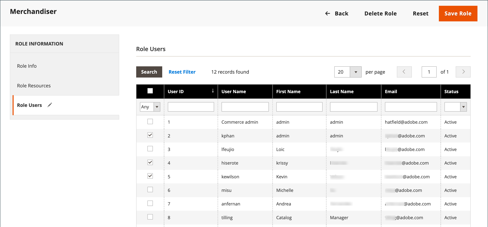

# Funciones de usuario

Para conceder a alguien acceso restringido al administrador, el primer paso es crear una función que tenga el nivel adecuado de permisos. Una vez guardada la función, puede agregar nuevos usuarios y asignar la función restringida para concederles acceso limitado al administrador.

{width="600" zoomable="yes"}

## Definir una función

1. En la barra lateral _Admin_, vaya a **[!UICONTROL System]** > _[!UICONTROL Permissions]_>**[!UICONTROL User Roles]**.

1. En la esquina superior derecha, haga clic en **[!UICONTROL Add New Role]**.

1. Complete los pasos para definir la función:

### Paso 1: Añadir el nombre de la función

1. En _[!UICONTROL Role Information]_, escriba un **[!UICONTROL Role Name]**&#x200B;descriptivo.

1. En _[!UICONTROL Current User Identity Verification]_, escriba su contraseña.

   {width="600" zoomable="yes"}

### Paso 2: Asignación de recursos

>[!IMPORTANT]
>
>Al asignar recursos, asegúrese de deshabilitar el acceso a la herramienta Permisos si está limitando el acceso a una función determinada. De lo contrario, los usuarios pueden modificar sus propios permisos.

1. Establezca **[!UICONTROL Role Scopes]** en una de las siguientes opciones:

   - `All`
   - `Custom`

   Si se establece en `Custom` para una instalación de varios sitios, active la casilla de verificación del sitio web y el almacén donde se va a utilizar el rol.

   {width="600" zoomable="yes"}

   >[!NOTE]
   >
   >Los usuarios con un ámbito de rol `Custom` no pueden crear sitios web y categorías, asignar productos a categorías o editar productos en el ámbito _[!UICONTROL All Store Views]_&#x200B;cuando se les asigna a tiendas restringidas. Estos usuarios no pueden realizar otras_ acciones globales _que afecten a ámbitos en los que no tengan acceso.

1. En _[!UICONTROL Roles Resources]_, establezca **[!UICONTROL Resource Access]**&#x200B;en `Custom`.

   >[!NOTE]
   >
   >Si se requiere Autenticación de doble factor (2FA) para iniciar sesión en el administrador, asegúrese de habilitar el recurso `Permissions` > `Two Factor Auth` para este rol. De lo contrario, los usuarios recién creados con este ámbito de función `Custom` no podrán configurar 2FA cuando accedan al administrador por primera vez.

1. En la estructura de árbol **[!UICONTROL Resource]**, seleccione la casilla de verificación de cada capacidad de administración a la que el rol puede acceder.

   Para crear un rol de administrador con acceso a la configuración de impuestos, seleccione los recursos de ventas/impuestos y de sistema/impuestos. Si configura un sitio web para una región que difiere de su [punto de origen de envío](../stores-purchase/shipping-settings.md#point-of-origin) predeterminado, debe permitir el acceso a los recursos de sistema/envío para el rol. La configuración de envío determina la tasa de impuestos de la tienda que se utiliza para los precios del catálogo.

   {width="600" zoomable="yes"}

   La lista de permisos disponibles puede incluir opciones adicionales para extensiones agrupadas e instaladas. Al seleccionar el permiso más alto para cada función, se asignan todos los permisos disponibles para el usuario.

   >[!NOTE]
   >
   >Un usuario administrador debe tener permisos de **[!UICONTROL Sales / Archive]** para el ámbito de su rol con el fin de ver las _[!UICONTROL Invoices]_,_[!UICONTROL Credit Memos]_ y _[!UICONTROL Shipments]_, así como [fichas](../stores-purchase/order-processing.md).

1. Una vez finalizado, haga clic en **[!UICONTROL Save Role]**.

   La función aparece ahora en la cuadrícula y se puede asignar a cuentas de usuario.

## Asignar una función a los usuarios

1. En la cuadrícula _[!UICONTROL Roles]_, abra el registro en modo de edición.

1. En _[!UICONTROL Current User Identity Verification]_, escriba la contraseña de su cuenta de usuario.

1. En el panel izquierdo, elija **[!UICONTROL Role Users]**.

   La opción _[!UICONTROL Role Users]_&#x200B;solo aparece después de guardar un nuevo rol.

   {width="600" zoomable="yes"}

1. Para buscar un registro de usuario específico, haga lo siguiente:

   - Escriba el valor en el filtro de búsqueda en la parte superior de una columna y presione **Entrar**.

   - Cuando esté listo para volver a la lista completa, haga clic en **[!UICONTROL Reset Filter]**.

1. Seleccione la casilla de verificación de los usuarios que se van a asignar al rol.

1. Haga clic en **[!UICONTROL Save Role]**.

## Editar una función

1. En la barra lateral _Admin_, vaya a **[!UICONTROL System]** > _[!UICONTROL Permissions]_>**[!UICONTROL User Roles]**.

1. Localice la función con filtros encima de la cuadrícula y haga clic en el nombre de la función.

1. Realice los cambios necesarios.

   Revise los pasos para crear una función de usuario para obtener información acerca de la configuración de la función.

1. Cuando se le pida, introduzca su contraseña para confirmar su identidad.

1. Haga clic en **[!UICONTROL Save Role]**.

## Eliminar un rol

1. En la barra lateral _Admin_, vaya a **[!UICONTROL System]** > _[!UICONTROL Permissions]_>**[!UICONTROL User Roles]**.

1. Localice la función con filtros sobre la cuadrícula y ábrala en modo de edición.

1. En la esquina superior derecha, haga clic en **[!UICONTROL Delete Role]**.

1. Para confirmar la acción, haga clic en **[!UICONTROL OK]**.

## Demostración de funciones de usuario

Vea este vídeo para obtener más información sobre la administración de funciones de usuario:

>[!VIDEO](https://video.tv.adobe.com/v/3443510?captions=spa&quality=12&learn=on)

## Recursos de roles

Se puede asignar acceso a los siguientes recursos a una función personalizada. Consulte la página vinculada para obtener más información sobre las funciones asociadas a cada recurso.

 - Solo Adobe Commerce

 - Disponible solo con Adobe Commerce B2B

| Recurso |   |   |
| --- | --- | --- |
| [`Dashboard`](../getting-started/admin-dashboard.md) |  |  |
| [`Sales`](../stores-purchase/sales-menu.md) | [`Operations`](../stores-purchase/orders.md) |  |
|  | [`Quotes`](../b2b/quotes.md)   [`Orders`](../stores-purchase/orders.md) [`Invoices`](../stores-purchase/invoices.md) [`Shipments`](../stores-purchase/shipments.md) [`Credit Memos`](../stores-purchase/credit-memos.md) [`Billing Agreements`](../stores-purchase/paypal-billing-agreements.md) [`Returns`](../stores-purchase/returns.md)  [`Transactions`](../stores-purchase/transactions.md) |
|  | [`Archive`](action-log-archive.md)![Adobe Commerce] |  |
|  | [`Shopping Cart Management`](../stores-purchase/cart.md) |  |
| [`Catalog`](../catalog/catalog-menu.md) | [`Category Permissions`](../catalog/categories.md)  |  |
|  | [`Inventory`](../inventory-management/introduction.md) | [`Products`](../catalog/products-list.md) [`Categories`](../catalog/categories.md) |
|  | [`Shared Catalog`](../b2b/catalog-shared-create.md)  | [`Manage Shared Catalog`](../b2b/catalog-shared-manage.md) |
| [`Customers`](../customers/guide-overview.md) | [`All Customers`](../customers/customers-all.md) [`Now Online`](../customers/now-online.md) [`Customer Groups`](../customers/customer-groups.md) [`Segments`](../customers/customer-segments.md)  |  |
|  | [`Login as Customer`](../customers/login-as-customer.md) | `Allow Login as Customer Button` `View Login as Customer Log`  |
|  | [`Companies`](../b2b/account-companies.md)  | [`Manage Companies`](../b2b/account-company-manage.md)  `Add New Company`  `Delete Company`  `Reimburse Balance` |
| [`Carts`](../stores-purchase/shopping-assisted-cart-manage.md) | [`Manage carts`](../stores-purchase/shopping-assisted-cart-manage.md) |  |
| [`My Account`](../customers/account-dashboard-my-account.md) |  |  |
| [`Marketing`](../merchandising-promotions/marketing-menu.md) | [`Promotions`](../merchandising-promotions/marketing-menu.md#uicontrol-promotions) | [`Catalog Price Rule`](../merchandising-promotions/price-rules-catalog.md)  [`Cart Price Rules`](../merchandising-promotions/price-rules-cart.md)  [`Related Products Rules`](../merchandising-promotions/product-related-rules.md) [`Gift Card Accounts`](../stores-purchase/product-gift-card-accounts.md)  |
|  | [`Private Sales`](../merchandising-promotions/events-private-sales.md)  | [`Events`](../merchandising-promotions/event-create.md)  [`Invitations`](../merchandising-promotions/invitations.md) |
|  | `Communications` | [`Email Templates`](email-templates.md)  [`Newsletter Template`](../merchandising-promotions/newsletter-template.md)  [`Newsletter Queue`](../merchandising-promotions/newsletter-queue.md)  [`Newsletter Subscribers`](../merchandising-promotions/newsletter-subscribers.md)  [`Email Reminders`](../merchandising-promotions/email-reminder-rules.md) |
|  | `Sales Channel` | [`Amazon Sales Channel`](https://experienceleague.adobe.com/docs/commerce-channels/amazon/overview.html?lang=es) |
|  | [`SEO & Search`](../merchandising-promotions/marketing-menu.md#uicontrol-seo--search) | [`Search Terms`](../catalog/search-terms.md)  [`Search Synonyms`](../catalog/search-terms.md#search-synonyms)  [`URL Rewrites`](../merchandising-promotions/url-rewrite-custom.md)  [`Site Map`](../merchandising-promotions/sitemap-xml.md) |
|  | [`User Content`](../merchandising-promotions/product-reviews-moderate.md) | [`All Reviews`](../merchandising-promotions/product-reviews.md)  [`Pending Reviews`](../merchandising-promotions/product-reviews-moderate.md)   |  |
| [`Content`](../content-design/content-menu.md) | [`Elements`](../content-design/content-menu.md#uicontrol-elements)) | [`Pages`](../content-design/pages.md) [`Hierarchy`](../content-design/page-hierarchy.md)  [`Blocks`](../content-design/blocks.md) [`Dynamic Blocks`](../content-design/dynamic-blocks.md)  [`Widgets`](../content-design/widgets.md) [`Media Gallery`](../content-design/media-gallery.md) |  |
|  | [`Design`](../content-design/introduction.md#design) | [`Themes`](../content-design/themes.md) [`Schedule`](../content-design/schedule.md) |  |
|  | [Ensayo de contenido](../content-design/content-staging.md)   |  |
| [`Reports`](../getting-started/reports-menu.md) | [`Marketing`](../getting-started/marketing-reports.md) | `Shopping Cart` [`Search Terms`](../catalog/search-terms.md#search-terms-report) `Newsletter Problem Reports` |  |
|  | [`Reviews`](../getting-started/review-reports.md)  |  |
|  | [`Sales`](../getting-started/sales-reports.md) |  |
|  | `System Insights`  | [`Site-Wide Analysis Tool`](https://experienceleague.adobe.com/docs/commerce-operations/tools/site-wide-analysis-tool/access.html?lang=es) |
|  | [`Customers`](../getting-started/customer-reports.md) [`Products`](../getting-started/product-reports.md) [`Private Sales`](../getting-started/private-sales-reports.md)  [`Statistics`](../getting-started/reports-menu.md#uicontrol-statistics) [`Business Intelligence`](../getting-started/business-intelligence.md) |  |
| [`Stores`](../stores-purchase/stores.md) | [`Settings`](../stores-purchase/stores-menu.md) | [`All Stores`](../stores-purchase/stores.md) [`Configuration`](../configuration-reference/guide-overview.md) [`Terms and Conditions`](../stores-purchase/terms-and-conditions.md) [`Order Status`](../stores-purchase/order-status.md) |  |
|  | [`Inventory`](../inventory-management/sources-stocks.md) | [`Sources`](../inventory-management/sources-manage.md) [`Stocks`](../inventory-management/stocks-manage.md) |  |
|  | [`Taxes`](../stores-purchase/taxes.md) |  |  |
|  | [`Currency`](../stores-purchase/currency.md) | [`Currency Rates`](../stores-purchase/currency-update.md) [`Currency Symbols`](../stores-purchase/currency-configuration.md#step-5-customize-currency-symbols-optional) |  |
|  | [`Attributes`](../catalog/product-attributes.md) | [`Product`](../catalog/attribute-product-create.md) [`Update Attributes`](../catalog/attribute-product-create.md) [`Attribute Set`](../catalog/attribute-sets.md) [`Ratings`](../merchandising-promotions/product-reviews.md#create-custom-ratings) |
|  | [`Other Settings`](../stores-purchase/stores-menu.md) | [`Customer Groups`](../customers/customer-groups.md) |
| [`System`](system-menu.md) | [`Data Transfer`](data-transfer.md) | [`Import`](data-import.md) [`Export`](data-export.md) [`Import/Export Tax Rates`](data-transfer-tax-rates.md) [`Import History`](data-import.md#import-history) |  |
|  | [`Magento Connect`](../getting-started/commerce-marketplace.md) | `Connect Manager` `Package Extensions` |  |
|  | [`Tools`](system-menu.md#tools) | [`Cache Management`](cache-management.md) [`Backups`](backups.md) [`Index Management`](index-management.md) [`Change Indexer Mode`](index-management.md) |  |
|  | [`Permissions`](permissions.md) | [`All Users`](permissions-users-all.md) [`Locked Users`](permissions-users-all.md#locked-users) [`User Roles`](permissions-user-roles.md) |
| [`Action Log`](action-log.md) | [`Report`](action-log.md) [`Archive`](action-log-archive.md) |
|  | [`Other Settings`](system-menu.md) | [`Notifications`](notifications.md) [`Custom Variables`](variables-custom.md) [`Manage Encryption Key`](encryption-key.md) |  |
| [`Global Search`](../getting-started/admin-workspace.md#workspace-search) |  |  |

{style="table-layout:auto"}
