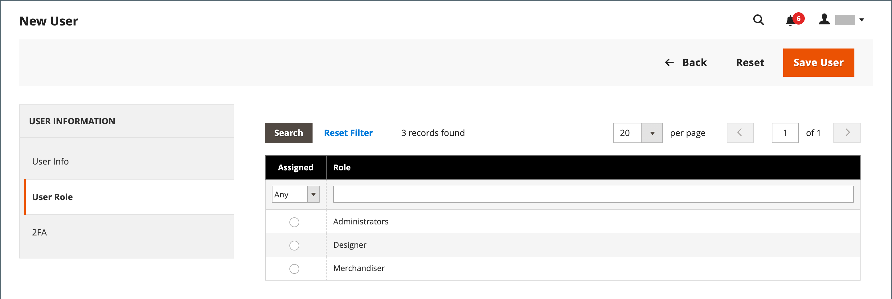
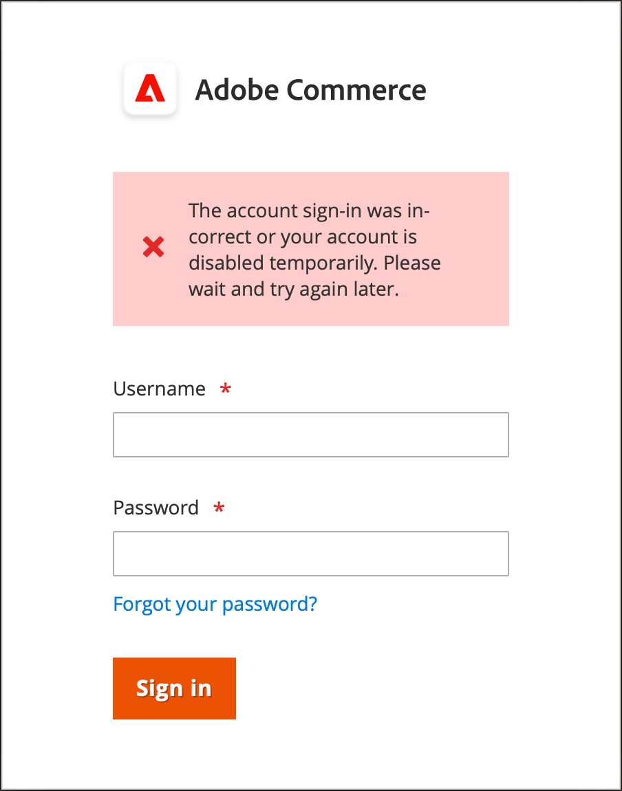

# Administrar cuentas de usuario de administrador

Cuando se instala la tienda por primera vez, se crea una cuenta de administrador predeterminada con credenciales de inicio de sesión que le proporciona acceso administrativo completo. Se recomienda crear otra cuenta de usuario con acceso completo de administrador. De este modo, puede utilizar una cuenta para sus actividades administrativas diarias y reservar la otra como una cuenta de &quot;superadministrador&quot;. Esto puede resultar útil si olvida sus credenciales normales o si, de alguna manera, se vuelven inutilizables.

Si otros integrantes del equipo o proveedores de servicios necesitan acceso, puede crear cuentas de usuario individuales para ellos y asignar acceso restringido según sus necesidades comerciales específicas. Para limitar los sitios web o tiendas a los que los usuarios pueden acceder en el Admin, primero debe [crear un rol](permissions-user-roles.md) con ámbito limitado y solo los recursos necesarios seleccionados. A continuación, puede asignar la función a una cuenta de usuario específica. Los usuarios administradores asignados a una función restringida solo pueden ver y cambiar los datos de los sitios web o tiendas asociados a la función, pero no pueden cambiar la configuración global ni los datos.

>[!NOTE]
>
>Los comerciantes de Adobe Commerce que tengan un Adobe ID y deseen un inicio de sesión optimizado en los productos de Adobe Commerce y Adobe Business pueden integrar la autenticación de Commerce con el flujo de trabajo de autenticación IMS de Adobe. Una vez habilitada esta integración en la tienda Commerce, los usuarios administradores deben usar sus credenciales de Adobe, no sus credenciales de Commerce, para iniciar sesión. Consulte [Información general sobre la integración de Adobe Identity Management Service (IMS)](https://experienceleague.adobe.com/docs/commerce-admin/start/admin/ims/adobe-ims-integration-overview.html?lang=es).

Para los usuarios o roles temporales, también puede establecer una fecha de caducidad para la cuenta de usuario.

<!--  update this to a better info-graphic  -->

## Crear un usuario

1. En la barra lateral _Admin_, vaya a **[!UICONTROL System]** > _[!UICONTROL Permissions]_>**[!UICONTROL All Users]**.

1. En la esquina superior derecha, haga clic en **[!UICONTROL Add New User]**.

   Para editar un usuario existente, haga clic en un nombre de usuario en la cuadrícula. Puede modificar las secciones _[!UICONTROL User Info]_&#x200B;y&#x200B;_[!UICONTROL User Role]_ según sea necesario.

1. En la sección _[!UICONTROL Account Information]_, haga lo siguiente:

   {width="600" zoomable="yes"}

   - Escriba **[!UICONTROL User Name]** para la cuenta.

     El nombre de usuario debe ser fácil de recordar. No distingue entre mayúsculas y minúsculas. Por ejemplo, si el nombre de usuario es `John`, también puede iniciar sesión como `john`.

   - Complete la siguiente información:

      - **[!UICONTROL First Name]**
      - **[!UICONTROL Last Name]**
      - **[!UICONTROL Email address]**

     Cada cuenta de usuario debe tener una dirección de correo electrónico única.

   - Escriba un **[!UICONTROL Password]** para la cuenta.

     >[!NOTE]
     >
     >La contraseña de administrador debe tener siete caracteres o más e incluir letras y números. Para obtener más opciones de contraseña, consulte [Configuración de Admin Security](security-admin.md).

   - Para **[!UICONTROL Password Confirmation]**, vuelva a escribir la contraseña para asegurarse de que se escribió correctamente.

   - Si su tienda tiene varios idiomas, establezca **[!UICONTROL Interface Locale]** en el idioma que se utilizará en la interfaz de administración.

1. Establezca **[!UICONTROL This Account is]** en `Active`.

1. Haga clic en el icono de calendario para establecer **[!UICONTROL Expiration Date]** para la cuenta de usuario.

   Definir una fecha de caducidad resulta útil cuando un usuario o un rol es temporal. Después de la fecha de caducidad, el estado de la cuenta de usuario cambia a `Inactive` y se puede actualizar, si es necesario.

1. En _[!UICONTROL Current User Identity Verification]_, escriba la contraseña de su cuenta de usuario.

>[!IMPORTANT]
>
>Una vez completada la sección _[!UICONTROL Account Information]_, puede guardar el usuario. El nuevo usuario se muestra en la cuadrícula&#x200B;_[!UICONTROL Users]_, pero el nombre de usuario no puede iniciar sesión hasta que se asigne un rol.

## Asignar una función de usuario

1. En el panel izquierdo, haga clic en **[!UICONTROL User Role]**.

   La cuadrícula enumera todas las funciones de usuario existentes. Para una nueva tienda, _[!UICONTROL Administrators]_&#x200B;es la única función disponible.

   {width="600" zoomable="yes"}

1. En la columna _[!UICONTROL Assigned]_, seleccione un rol de usuario.

   Puede [ver los roles de usuario existentes o definir roles de usuario adicionales](permissions-user-roles.md). Una vez definida una función, debe editar la cuenta de usuario para asignarla.

## Verificar o restablecer proveedores 2FA

1. Abra la cuenta de usuario Administrador.

1. En el panel izquierdo, haga clic en **[!UICONTROL 2FA]**.

   {width="600" zoomable="yes"}

1. Compruebe las soluciones de 2FA que están disponibles para los usuarios de _Admin_ y recomiende a cada usuario que instale las soluciones que desee usar antes de iniciar sesión.

   Se requiere autenticación por una sola solución de 2FA para iniciar sesión en _Admin_.

1. Si el usuario necesita volver a instalar la solución 2FA, puede restablecer la configuración actual de 2FA.

   Esto requiere que el usuario repita el proceso de configuración antes de poder iniciar sesión de nuevo. Por ejemplo, es posible que el usuario tenga un nuevo smartphone y tenga que volver a instalar Google Authenticator. Para borrar la configuración actual de 2FA del usuario, haga clic en **[!UICONTROL Reset (Provider)]** para cada solución que desee borrar. Cuando se le solicite, haga clic en **[!UICONTROL OK]** para confirmar.

   El usuario recibe un correo electrónico con un vínculo a [configurar 2FA](security-two-factor-authentication.md). El vínculo solo se puede utilizar una vez. Si el usuario intenta iniciar sesión varias veces, se envía un nuevo vínculo después de cada intento.

1. Haga clic en **[!UICONTROL Save User]**.

1. Cuando se le pida, escriba su contraseña para confirmar su identidad y vuelva a hacer clic en **[!UICONTROL Save User]**.

   Se abre la cuadrícula _[!UICONTROL Users]_&#x200B;y se enumeran todos los usuarios.

## Eliminar un usuario administrador

1. En la barra lateral _Admin_, vaya a **[!UICONTROL System]** > _[!UICONTROL Permissions]_>**[!UICONTROL All Users]**.

1. Busque la cuenta de usuario mediante los filtros situados encima de la cuadrícula y haga clic en el nombre de usuario.

1. Cuando se le pida, introduzca su contraseña para confirmar su identidad.

1. En la esquina superior derecha, haga clic en **[!UICONTROL Delete User]**.

1. Para confirmar la acción, haga clic en **[!UICONTROL OK]**.

## Contraseña olvidada y correos electrónicos restablecidos

La configuración de la plantilla de correo electrónico Administrador determina los mensajes de correo electrónico que se envían cuando los usuarios olvidan y restablecen sus contraseñas. Esta configuración especifica el contacto de almacén que aparece como remitente del mensaje y cuánto tiempo permanece válido el vínculo de recuperación de contraseña.

**_Para configurar las plantillas de correo electrónico del administrador:_**

1. En la barra lateral _Admin_, vaya a **[!UICONTROL Stores]** > _[!UICONTROL Setting]_>**[!UICONTROL Configuration]**.

1. En el panel lateral izquierdo, expanda **[!UICONTROL Advanced]** y elija **[!UICONTROL Admin]**.

1. Expandir  en la sección **[!UICONTROL Admin User Emails]**.

   {width="600" zoomable="yes"}

1. Establezca **[!UICONTROL Forgot Password Email Template]** en la plantilla que se enviará cuando un usuario administrador olvide sus contraseñas.

1. Establezca **[!UICONTROL Forgot and Reset Email Sender]** en el contacto de tienda que aparece como el remitente del mensaje.

1. Establezca **[!UICONTROL User Notification Template]** en la plantilla de correo electrónico que se usa como predeterminada para las notificaciones de administración.

1. Una vez finalizado, haga clic en **[!UICONTROL Save Config]**.

## Usuarios bloqueados

Para la seguridad de su empresa, las cuentas de usuario están bloqueadas de manera predeterminada después de seis intentos fallidos de [iniciar sesión](../getting-started/admin-signin.md) en el administrador. Cualquier cuenta de usuario que esté bloqueada aparecerá en la cuadrícula Usuarios bloqueados. Cualquier otro usuario con permisos de administrador completos puede desbloquear una cuenta.

Se pueden implementar medidas de seguridad de contraseña adicionales en la configuración de [Administración avanzada](../configuration-reference/advanced/admin.md#security). Consulte [Seguridad de administración](security-admin.md).

{width="300"}

**_Para desbloquear una cuenta de administrador:_**

1. En la barra lateral _Admin_, vaya a **[!UICONTROL System]** > _[!UICONTROL Permissions]_>**[!UICONTROL Locked Users]**.

1. En la cuadrícula, seleccione la casilla de verificación de la cuenta bloqueada.

   {width="600" zoomable="yes"}

1. En la esquina superior izquierda, establezca **[!UICONTROL Actions]** en `Unlock`.

1. Haga clic en **[!UICONTROL Submit]** para desbloquear la cuenta.
