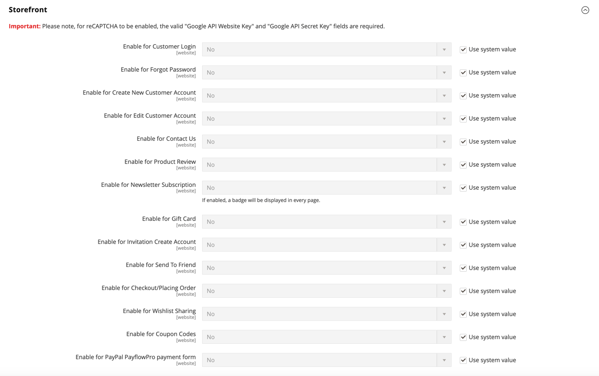

# Google reCAPTCHA Enterprise

[Google reCAPTCHA Enterprise](https://cloud.google.com/security/products/recaptcha#protect-against-fraud-and-abuse-with-modern-bot-protection-and-fraud-prevention-platform) proporciona protección avanzada contra bots para su tienda de Adobe Commerce as a Cloud Service mediante el análisis de riesgo adaptable y el aprendizaje automático para diferenciar entre usuarios humanos y bots. Esto ayuda a evitar actividades fraudulentas, spam y abusos en el sitio.

>[!NOTE]
>
>Esta función NO proporciona compatibilidad con reCAPTCHA para el administrador.

[Integración de reCAPTCHA](https://experienceleague.adobe.com/developer/commerce/storefront/dropins/user-auth/recaptcha/) describe cómo agregar compatibilidad con reCAPTCHA Enterprise a tu tienda.

Consulte [Google reCAPTCHA V3 y V2](security-google-recaptcha.md) para obtener información sobre cómo configurar otras versiones de Google reCAPTCHA.

## Funciones

Google reCAPTCHA Enterprise incluye las siguientes funciones:

- **Detección avanzada de bots**: Utiliza los modelos de aprendizaje automático de Google Cloud para lograr una detección superior de bots
- **Análisis de puntuación de riesgo**: Proporciona puntuaciones de riesgo detalladas (0,0-1,0) para cada interacción
- **Umbrales configurables**: establezca puntuaciones de riesgo aceptables mínimas por inquilino
- **Compatibilidad con varios inquilinos**: Configuración por inquilino con proyectos aislados de Google Cloud
- **Credenciales cifradas**: credenciales de cuenta de servicio almacenadas cifradas en una base de datos
- **Protección de formularios**: protege todos los formularios Commerce estándar, incluidos el inicio de sesión, el cierre de compra, las revisiones de productos y mucho más.

## Requisitos previos

Necesita los siguientes recursos para poder configurar Google reCAPTCHA Enterprise para su tienda de Adobe Commerce as a Cloud Service:

- Una cuenta activa de Google Cloud con reCAPTCHA Enterprise habilitado.
- Acceso a la consola de Google Cloud para crear y administrar claves empresariales reCAPTCHA.

En instalaciones de as a Cloud Service de Adobe Commerce de varios inquilinos, cada inquilino debe tener su propio proyecto de Google Cloud y claves empresariales reCAPTCHA.

## Paso 1: Configuración de Google reCAPTCHA Enterprise

Siga estos pasos generales para configurar Google reCAPTCHA Enterprise para su tienda. Para obtener instrucciones detalladas, consulte la [documentación de Google reCAPTCHA Enterprise](https://docs.cloud.google.com/recaptcha/docs/overview).

1. [Cree un proyecto de Google Cloud](https://developers.google.com/workspace/guides/create-project) para su implementación de reCAPTCHA Enterprise.

1. Habilite [reCAPTCHA Enterprise API](https://docs.cloud.google.com/recaptcha/docs/prepare-environment).

1. Cree una clave de sitio [reCAPTCHA Enterprise basada en puntuación](https://docs.cloud.google.com/recaptcha/docs/choose-key-type).

1. Cree una cuenta de servicio con el rol `roles/recaptchaenterprise.admin` de IAM.

1. Descargue el archivo de clave JSON de la cuenta de servicio, que contiene las credenciales necesarias para autenticar la tienda de Adobe Commerce as a Cloud Service con Google reCAPTCHA Enterprise.

## Paso 2: Configuración de Google reCAPTCHA para la tienda

1. En la barra lateral de Adobe Commerce _Admin_, vaya a **[!UICONTROL Stores]** > _[!UICONTROL Settings]_>**[!UICONTROL Configuration]**.

1. Expanda _[!UICONTROL Security]_&#x200B;y elija **[!UICONTROL Google reCAPTCHA Storefront]**.

1. Desplácese hacia abajo hasta la sección **[!UICONTROL reCAPTCHA Enterprise]** y complete la configuración como se indica a continuación.

   - Para **[!UICONTROL Site Key]**, copie y pegue la clave de sitio empresarial de reCAPTCHA desde la consola de Google Cloud.

   - Para **[!UICONTROL Google Cloud Project ID]**, copie y pegue el ID de proyecto del proyecto de Google Cloud.

   - Para **[!UICONTROL Service Account JSON]**, copie el contenido del archivo de clave JSON de la cuenta de servicio que descargó en [Paso 1: Configurar Google reCAPTCHA Enterprise](#step-1-set-up-google-recaptcha-enterprise).

   - Para **[!UICONTROL Minimum Score Threshold]**, escriba la puntuación mínima (0,0-1,0) para identificar cuándo se marca una interacción de usuario como un riesgo potencial. Una puntuación de 1,0 es una interacción típica del usuario y 0,0 es probablemente un bot.

   - Para **[!UICONTROL Badge Position]**, elija la posición del distintivo reCAPTCHA invisible en cada página. Opciones: `Inline` / `Bottom Right` / `Bottom Left`.

   - Para **[!UICONTROL Theme]**, elija `Light Theme` (predeterminado) o `Dark Theme` para determinar el estilo del cuadro reCAPTCHA de Google.

   - Para **[!UICONTROL Language Code]**, escriba un [código de dos caracteres](https://developers.google.com/recaptcha/docs/language) que especifique el idioma utilizado para el texto y los mensajes de Google reCAPTCHA.

   - Para **[!UICONTROL Validation Failure Message]**, si lo desea, puede cambiar el mensaje que se muestra en la tienda cuando la validación no se realice correctamente.

1. Expanda la sección **[!UICONTROL Storefront]** y establezca cada formulario de tienda que desee proteger en **[!UICONTROL reCAPTCHA Enterprise]**.

   {{recaptcha-forms-list}}

   {width="600" zoomable="yes"}

## Paso 3: guardar la configuración

1. Una vez completada la configuración, haga clic en **[!UICONTROL Save Config]**.

1. En el mensaje que aparece en la parte superior del área de trabajo, haga clic en **[!UICONTROL Cache Management]** y actualice cada caché no válida.
