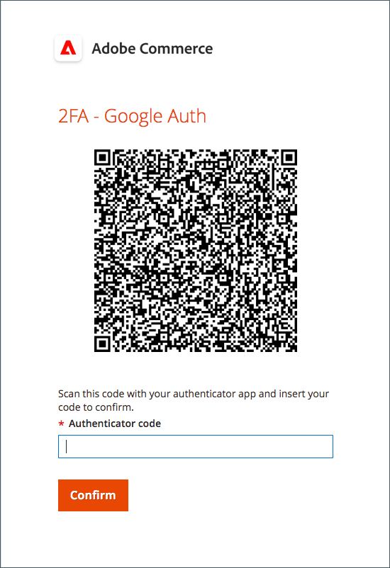

# Configuración de autenticación de doble factor para cuentas de usuario

Estas instrucciones muestran cómo configurar la autenticación de doble factor durante el inicio de sesión inicial en Adobe Commerce o Magento Open Source y cómo autenticar su identidad mediante las siguientes aplicaciones y dispositivos.

Para obtener instrucciones completas, consulte [Inicio de sesión de administrador](../getting-started/admin-signin.md).

>[!NOTE]
>
>Las tiendas que han habilitado la autenticación [!DNL Adobe Identity Management Services] (IMS) tienen Adobe Commerce nativo y el Magento Open Source 2FA deshabilitado. Los usuarios administradores que han iniciado sesión en su instancia de Commerce con sus credenciales de Adobe no necesitan volver a autenticarse en muchas tareas de administración. La autenticación la gestiona Adobe IMS cuando el usuario administrador inicia sesión en su sesión actual. Ver [[!DNL Adobe Identity Management Service] (IMS) Descripción general de la integración](../getting-started/adobe-ims-integration-overview.md).

## [!DNL Google Authenticator]

### Paso 1: Configurar [!DNL Google Authenticator]

1. Escriba las credenciales de su cuenta e inicie sesión en _Admin_. Aparece una nueva pantalla de autenticador con un código QR.

1. Abra la aplicación **[!UICONTROL Google Authenticator]** en su dispositivo móvil.

1. Haga clic en el signo más ( **+** ) para agregar una entrada y alinear el cuadro rojo con el código QR para escanear con la cámara del smartphone.

1. Cuando el teléfono reconozca el código QR y agregue una entrada, escribe ese código de 6 dígitos en el campo _Admin_ **[!UICONTROL Authenticator code]**.

1. Una vez finalizado, haga clic en **[!UICONTROL Confirm]**.

   {width="300"}

### Paso 2: Iniciar sesión con [!DNL Google Authenticator]

1. Escriba las credenciales de su cuenta e inicie sesión en Commerce _Admin_.

   {width="300"}

1. Abra [!DNL Google Authenticator] en su dispositivo móvil.

1. Cuando se le solicite, introduzca el código de autenticación de seis dígitos.

1. Para guardar la autenticación para futuros inicios de sesión, marque la casilla de verificación **[!UICONTROL Trust this device, do not ask again]**.

1. Una vez finalizado, haga clic en **[!UICONTROL Confirm]**.

## [!DNL Duo Security]

[!DNL Duo] ofrece una versión de prueba gratuita y cargos según el número de usuarios asociados a la cuenta. Siga sus [instrucciones para configurar su cuenta y descargar la aplicación](https://duo.com/product/multi-factor-authentication-mfa/duo-mobile-app).

### Paso 1: Configurar [!DNL Duo Security]

1. Escriba las credenciales de su cuenta e inicie sesión en _Admin_.

1. Cuando aparezca la página de instalación de [!DNL Duo], haga clic en **[!UICONTROL Start setup]** y haga lo siguiente:

   {width="300"}

1. Seleccione el dispositivo.

1. Cuando se le solicite, escriba su número de teléfono y haga clic en **[!UICONTROL Continue]**.

   En este ejemplo se solicita el número de teléfono, ya que se utiliza un dispositivo móvil.

1. Cuando se le pida que instale [!DNL Duo Mobile] para su tipo de teléfono, haga clic en **[!UICONTROL I have Duo Mobile]**.

1. Abra [!DNL Duo Mobile] y escanee el código QR para sincronizar el autenticador con Adobe Commerce. Cuando se completa la activación, aparece una marca de verificación.

1. Para establecer la configuración del dispositivo, elija la acción que desea que tenga lugar al iniciar sesión.

   - `Ask me to choose an authenticator method`: permite al usuario seleccionar al iniciar sesión y autenticarse en _Admin_.
   - `Automatically send this device a Duo Push`: envía un mensaje al dispositivo para que acepte o deniegue el acceso.
   - `Automatically call this device`: llama a y proporciona un código de acceso para el acceso.

   {width="300"}

### Paso 2: Iniciar sesión con [!DNL Duo Security]

El siguiente ejemplo muestra las opciones de `Ask me to choose an authenticator method`:

1. Cuando se le solicite, escriba sus credenciales de _Admin_ para iniciar sesión.

   {width="300"}

1. Elija el método que desee utilizar para autenticarse:

   - `Send Me a Push` — Haga clic para recibir un aviso push para [!DNL Duo Mobile]. Aceptar para autenticarse.
   - `Call Me`: haga clic en esta opción, reciba una llamada con un código e introduzca el código de acceso.
   - `Enter a Passcode`: haga clic en esta opción para recibir e introducir un código de acceso.

1. Complete la inserción o el código para iniciar sesión por completo en _Admin_.

## [!DNL Authy]

[!DNL Authy] ofrece su aplicación y servicio sin cargo a los usuarios. Siga las instrucciones para descargar y configurar la aplicación para su dispositivo o explorador. Para obtener más información, consulte la [[!DNL Authy] documentación](https://authy.com/features/setup/).

### Paso 1: Configuración de la autoridad

1. Escriba las credenciales de su cuenta e inicie sesión en _Admin_.

   ![[!DNL Authy] registro](./assets/storefront-2fa-authy-auth.png){width="300"}

1. Cuando se le pida que se registre en Authy, haga lo siguiente:

   - Seleccione su país.

   - Introduzca su número de teléfono.

   - Seleccione **[!UICONTROL Verification method]**: `SMS` o `Call Me`

   Haga clic en **[!UICONTROL Continue]**. Se envía un mensaje al teléfono a través de un mensaje de texto SMS o una llamada.

1. Escriba el código de verificación que recibió y haga clic en **[!UICONTROL Verify]**.

1. Una vez finalizado, haga clic en **[!UICONTROL Confirm]**.

   ![[!DNL Authy] código de verificación](./assets/storefront-2fa-authy-verify.png){width="300"}

### Paso 2: Iniciar sesión con [!DNL Authy]

1. Escriba las credenciales de su cuenta e inicie sesión en _Admin_.

   ![[!DNL Authy] - iniciando sesión](./assets/storefront-2fa-authy-access.png){width="300"}

1. Elija uno de los siguientes métodos para autenticarse:

   - `Use one touch` — envía una alerta a su aplicación [!DNL Authy]. En la aplicación, acepte el acceso.
   - `Use authy token`: solicita escribir un código desde su aplicación [!DNL Authy].

1. Si tiene problemas para iniciar sesión, elija el método que desee utilizar para recibir el código. A continuación, escriba el código que recibirá para obtener acceso a _Admin_.

   La aplicación incluye estos métodos de emergencia adicionales.

   - `Send me a code via SMS`: se envía un mensaje SMS de texto al dispositivo móvil configurado.
   - `Send me a code via phone call`: el usuario recibe una llamada telefónica con un código.

   Su cuenta se verifica y abre.

## U2F ([!DNL Yubikey] y otros dispositivos)

Siga las instrucciones del proveedor de soluciones para configurar el dispositivo U2F. Para obtener más información, consulte la documentación del proveedor, como [[!DNL YubiKey]](https://support.yubico.com/hc/en-us/articles/360013790339-Getting-Started-with-Your-YubiKey) por [!UICONTROL Yubico].

1. Escriba las credenciales de su cuenta e inicie sesión en _Admin_.

   {width="300"}

1. Presione el botón de la tecla.

   La autenticación déclencheur inmediatamente y abre _Admin_.

1. Inserte **[!UICONTROL U2F key]** en un puerto USB del equipo.
