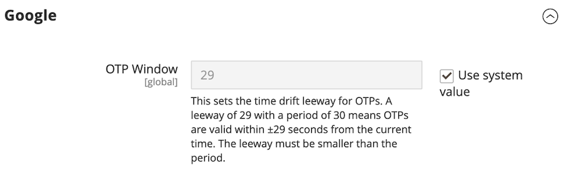

# Autenticación de doble factor (2FA)

El _administrador_ de Commerce para la instalación de Adobe Commerce o de Magento Open Source proporciona acceso a tu tienda, pedidos y datos de clientes. Para evitar el acceso no autorizado a tus datos, todos los usuarios que intenten iniciar sesión en _Admin_ deben completar un proceso de autenticación para verificar su identidad.

>[!NOTE]
>
>Esta implementación de la autenticación de doble factor (2FA) se aplica solo a _Admin_ y no está disponible para las cuentas de clientes. La autenticación de doble factor que protege su cuenta de Commerce tiene una configuración independiente. Para obtener más información, ve a [Proteger tu cuenta de Commerce](../getting-started/commerce-account-secure.md).

La autenticación de doble factor se utiliza ampliamente y es común generar códigos de acceso para diferentes sitios web en la misma aplicación. Esta autenticación adicional garantiza que solo usted pueda iniciar sesión en su cuenta de usuario. Si pierde la contraseña o un bot la adivina, la autenticación de doble factor agrega una capa de protección. Por ejemplo, puede utilizar Google Authenticator para generar códigos para el administrador de su tienda, su cuenta de Commerce y la cuenta de Google.

{width="300"}

Adobe Commerce admite métodos 2FA de varios proveedores. Algunos requieren la instalación de una aplicación que genere una contraseña de un solo uso (OTP) que los usuarios introduzcan al iniciar sesión para verificar su identidad. Los dispositivos de segundo factor universal (U2F) se parecen a un llavero y generan una clave única para verificar la identidad. Otros dispositivos verifican la identidad cuando se insertan en un puerto USB. Como administrador del almacén, puede requerir uno o más de los métodos 2FA disponibles para verificar la identidad del usuario. La configuración de 2FA se aplica a todos los sitios web y tiendas asociados con la instalación de Adobe Commerce.

La primera vez que un usuario inicia sesión en _Admin_, debe configurar cada método [2FA](../configuration-reference/security/2fa.md) que necesite y comprobar su identidad mediante la aplicación o el dispositivo asociado. Después de esta configuración inicial, el usuario debe autenticarse con uno de los métodos configurados cada vez que inicia sesión. La información 2FA de cada usuario se registra en su cuenta de _Admin_ y se puede [restablecer](security-two-factor-authentication-manage.md) si es necesario. Para obtener más información sobre el proceso de inicio de sesión, ve a [_Administrador_ Iniciar sesión](../getting-started/admin-signin.md).

>[!NOTE]
>
>Las tiendas que han habilitado la autenticación de Adobe Identity Management Services (IMS) tienen Adobe Commerce nativo y el Magento Open Source 2FA deshabilitado. Los usuarios administradores que han iniciado sesión en su instancia de Commerce con sus credenciales de Adobe no necesitan volver a autenticarse en muchas tareas de administración. La autenticación la gestiona Adobe IMS cuando el usuario administrador inicia sesión en su sesión actual. Consulte [Resumen de integración del servicio Identity Management de Adobe (IMS)](https://experienceleague.adobe.com/docs/commerce-admin/start/admin/ims/adobe-ims-integration-overview.html).

Puede ver esta [demostración en vídeo](https://video.tv.adobe.com/v/339104?quality=12&learn=on) para obtener información general sobre la autenticación de doble factor en el administrador.

## Configure los proveedores 2FA necesarios

1. En la barra lateral _Admin_, vaya a **[!UICONTROL Stores]** > _[!UICONTROL Settings]_>**[!UICONTROL Configuration]**.

1. En el panel izquierdo, expanda **[!UICONTROL Security]** y elija **[!UICONTROL 2FA]**.

1. En la sección _[!UICONTROL General]_, seleccione los proveedores que desea utilizar.

   | Proveedor | Función |
   |--- |--- |
   | [!UICONTROL Google Authenticator] | Genera una contraseña de un solo uso en la aplicación para la autenticación de usuarios. |
   | [!UICONTROL Duo Security] | Proporciona notificaciones push y SMS. |
   | [!UICONTROL Authy] | Genera un código de seis dígitos dependiente del tiempo y ofrece protección o token SMS o de llamada de voz 2FA. |
   | [!UICONTROL U2F Devices (Yubikey and others)] | Utiliza un dispositivo físico para autenticarse, como [[!DNL YubiKey]](https://www.yubico.com/). |

   Para seleccionar varios métodos, mantenga presionada la tecla Ctrl (PC) o la tecla Comando (Mac) y haga clic en cada elemento.

1. Complete la [configuración](../configuration-reference/security/2fa.md) para cada método 2FA requerido.

   {width="600" zoomable="yes"}

1. Una vez finalizado, haga clic en **[!UICONTROL Save Config]**.

   La primera vez que los usuarios inicien sesión en _Admin_, deben configurar cada método 2FA requerido. Después de esta configuración inicial, deben autenticarse con uno de los métodos configurados cada vez que inician sesión.

## Configuración de proveedor 2FA

Complete la configuración de cada método 2FA que necesite.

### Google

Para cambiar la duración de la disponibilidad de la contraseña de un solo uso (OTP) durante el inicio de sesión, desactive la casilla de verificación **[!UICONTROL Use system value]**. A continuación, especifique el número de segundos que desea que el **[!UICONTROL OTP Window]** sea válido.

{width="600" zoomable="yes"}

>[!NOTE]
>
>En Adobe Commerce 2.4.7 y versiones posteriores, el ajuste de configuración de la ventana OTP controla cuánto tiempo (en segundos) acepta el sistema una contraseña única (OTP) de un administrador una vez caducada. Este valor debe ser inferior a 30 segundos. La configuración predeterminada del sistema es `29`.   En la versión 2.4.6, la configuración de la ventana OTP determina el número de códigos OTP pasados y futuros que siguen siendo válidos. Un valor de `1` indica que el código OTP actual más un código del pasado y un código futuro siguen siendo válidos en cualquier momento.

### [!DNL Duo Security]

Introduzca las siguientes credenciales de su cuenta de Duo Security:

- Clave de integración
- Clave secreta
- Nombre de host API

{width="600" zoomable="yes"}

### [!DNL Authy]

1. Escriba la clave de API de su cuenta de [!DNL Authy].

1. Para cambiar el mensaje predeterminado que aparece durante la autenticación, desactive la casilla de verificación **[!UICONTROL Use system value]**. A continuación, escriba el(la) **[!UICONTROL OneTouch Message]** que desea que aparezca.

   {width="600" zoomable="yes"}

### Dispositivos U2F ([!DNL Yubikey] y otros)

El dominio de almacén se utiliza de forma predeterminada durante el proceso de autenticación. Para utilizar un dominio personalizado para los desafíos de autenticación, desactive la casilla de verificación **[!UICONTROL Use system value]**. A continuación, escriba **[!UICONTROL WebAPi Challenge Domain]**.

{width="600" zoomable="yes"}
