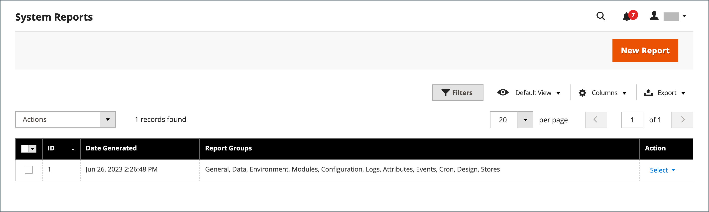

# Herramientas de asistencia

{{ee-feature}}

Las herramientas de soporte están diseñadas para identificar problemas conocidos en su sistema. Pueden utilizarse como recurso durante los procesos de desarrollo y optimización, y como herramienta de diagnóstico para ayudar a nuestro equipo de asistencia a identificar y resolver problemas.

## Informes del sistema

La herramienta de sistema de informes le permite realizar instantáneas periódicas completas o parciales del sistema y guardarlas para referencia futura. Puede comparar la configuración de rendimiento antes y después de los ciclos de desarrollo de código o los cambios en la configuración del servidor. La herramienta de sistema de informes puede reducir drásticamente el tiempo empleado en preparar y enviar la información requerida por el Soporte para comenzar una investigación.

Desde la cuadrícula Informes del sistema, puede ver y descargar informes existentes, eliminar informes y crear informes.

### Acceso a informes del sistema

En la barra lateral _Admin_, vaya a **[!UICONTROL System]** > _[!UICONTROL Support]_>**[!UICONTROL System Report]**.

{width="600" zoomable="yes"}

### Generación de un informe

1. Haga clic en **[!UICONTROL New Report]**.

1. En la lista **[!UICONTROL Groups]**, seleccione cada conjunto de información que desee incluir en el informe. De forma predeterminada, se seleccionan todos los grupos.

   {width="600" zoomable="yes"}

1. En la esquina superior derecha, haga clic en **[!UICONTROL Create]**.

   El informe puede tardar unos minutos en generarse, según el número de tipos de informe seleccionados. Cuando el informe esté listo, aparecerá en la parte superior de la cuadrícula con la fecha y la hora generadas.

### Ver información del módulo

Puede encontrar información útil sobre los módulos instalados.

**_Para ver la información del informe de cada módulo instalado:_**

1. En la barra lateral _Admin_, vaya a **[!UICONTROL System]** > _[!UICONTROL Support]_>**[!UICONTROL System Report]**.
1. Haga clic en **[!UICONTROL New Report]**.
1. Seleccione `Modules` de la lista **[!UICONTROL Groups]**.
1. Haga clic en **[!UICONTROL Create]**.
1. Una vez generado el informe, haga clic en **[!UICONTROL Select]** y luego en **[!UICONTROL View]** para ver todas las versiones de los módulos.
1. Haga clic en **[!UICONTROL Download]** para descargar el informe.

### Administrar informes del sistema

En la columna **[!UICONTROL Action]** de la cuadrícula, seleccione una de las siguientes opciones:

- `View`: utilice esta función para ver los detalles del informe.
- `Delete` - Utilice esta función para eliminar el informe generado de la lista.
- `Download`: utilice esta función para guardar el informe como archivo HTML.

### Ver detalles del informe del sistema

1. Para el informe que necesita, seleccione **[!UICONTROL View]** en la columna _[!UICONTROL Actions]_.

1. En el panel izquierdo, expanda  cada sección del informe para ver los detalles.

   {width="600" zoomable="yes"}

### Informes del sistema disponibles

| Grupo de informes | Información incluida |
| ------------ | -------------------- |
| [!UICONTROL General] | Versión de Adobe Commerce Recuento de datos Estado de la caché Estado del índice |
| [!UICONTROL Environment] | Información del entorno Estado de MySQL |
| [!UICONTROL Data] | Duplicar categorías por clave URL Duplicar productos por clave URL Duplicar productos por SKU Duplicar pedidos por id. de incremento Duplicar usuarios por correo electrónico Datos de categorías dañadas |
| [!UICONTROL Modules] | Lista de módulos personalizados Lista de módulos deshabilitados Lista de todos los módulos |
| [!UICONTROL Configuration] | Configuración Datos de `app/etc/env.php` Métodos de envío Métodos de pago Matriz de funcionalidad de pagos |
| [!UICONTROL Logs] | Archivos de registro Mensajes principales del sistema Mensajes principales del sistema de hoy Mensajes principales de depuración Mensajes principales de depuración de hoy Mensajes principales de excepción de hoy Mensajes principales de excepción de hoy |
| [!UICONTROL Attributes] | Atributos EAV definidos por el usuario Nuevos atributos EAV Tipos de entidad Todos los atributos EAV Atributos EAV de la categoría Atributos EAV del producto Atributos EAV del cliente Atributo EAV de la dirección del cliente Atributos EAV del elemento RMA |
| [!UICONTROL Events] | Eventos globales personalizados Eventos de administración personalizados Eventos de front-end personalizados Eventos de documentos personalizados Eventos de crontab personalizados Eventos de REST personalizados Eventos de SOAP personalizados Eventos globales principales Eventos de administración central Eventos de front-end principales Eventos de documentos principales Eventos de Core Crontab Eventos de Core REST Eventos de Core SOAP Todos los eventos globales Todos los eventos de administración Todos los eventos de front-end Todos los eventos de Doc Todos los REST Eventos Todos los eventos de SOAP Todos los eventos de Crontab |
| [!UICONTROL Cron] | Programaciones de Cron por código de estado Programaciones de Cron por código de trabajo Errores en la cola de programaciones de Cron Lista de programaciones de Cron Trabajos de Cron globales personalizados Trabajos de Cron configurables personalizados Trabajos de Cron globales principales Trabajos de Cron configurables principales Todos los trabajos de Cron globales Todos los trabajos de Cron configurables |
| [!UICONTROL Design] | Lista de temas de Adminhtml Lista de temas de FrontEnd |
| [!UICONTROL Stores] | Árbol de sitios web Lista de sitios web Lista de tiendas Lista de vistas de tiendas |
| Conector de OMS  _(visible con la integración de OMS)_ | Versión del conector Supervisión del conector Resultados del procesamiento de mensajes |

{style="table-layout:auto"}
