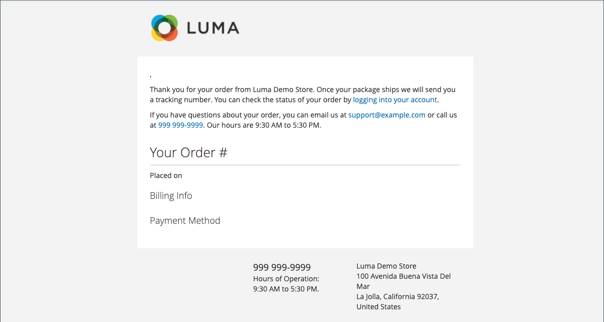

# Usar variables predefinidas

[Predefinido](variables-predefined.md) Las variables de facilitan la personalización [email](email-templates.md) y [newsletter](../merchandising-promotions/newsletters.md) plantillas y otros tipos de contenido. La lista de permitidos [predefinido](variables-predefined.md) aparecen al hacer clic en el botón Insertar variable. Como se muestra en la siguiente imagen, la lista de variables disponibles para una plantilla de correo electrónico específica viene determinada por los datos asociados a la plantilla. Consulte la [Referencia de variables](variables-reference.md) para obtener una lista de las plantillas de correo electrónico utilizadas frecuentemente y sus variables asociadas.

{width="700" zoomable="yes"}

## Añadir una variable a una plantilla de correo electrónico

1. En el _Administrador_ barra lateral, vaya a **[!UICONTROL Marketing]** > _[!UICONTROL Communications]_>**[!UICONTROL Email Templates]**.

1. Realice una de las siguientes acciones:

   - Para añadir la variable a una plantilla existente, haga clic en la plantilla de la lista para abrirla en modo de edición.

   - Para utilizar la variable en una nueva plantilla, haga clic en **[!UICONTROL Add New Template]** y personalizar el código de plantilla predeterminado. Consulte [Plantillas de mensaje](email-template-custom.md#message-templates).

1. En _[!UICONTROL Load default template]_, elija la **[!UICONTROL Template]**que desee personalizar.

1. Para aplicar una plantilla, haga clic en **[!UICONTROL Load Template]**.

   El _[!UICONTROL Currently used for]_El campo muestra la ruta de configuración de la plantilla. El_[!UICONTROL Template Subject]_ y _[!UICONTROL Template Content]_se generan automáticamente en relación con la plantilla seleccionada.

   - **[!UICONTROL Template Subject]** : Este texto se muestra en la línea de asunto de un correo electrónico.

   - **[!UICONTROL Template Content]** : Este texto se muestra en todo el contenido del correo electrónico enviado.

   {width="600" zoomable="yes"}

1. Introduzca una **[!UICONTROL Template Name]**.

1. Para obtener una lista de [predefinido](variables-predefined.md) que se pueden utilizar con esta plantilla de correo electrónico, haga clic en **[!UICONTROL Insert Variable]**.

   Determine qué variable desea insertar en la plantilla. A continuación, haga clic en _Cerrar_ (X) en la esquina superior derecha. (Volverá a esto más tarde).

1. Para ver una maqueta de la plantilla, haga clic en **[!UICONTROL Preview Template]** en la barra de botones.

   Cuando la vista previa se abra en una nueva pestaña, determine dónde desea colocar la variable en relación con el otro contenido. A continuación, vuelva a la pestaña original para continuar.

   {width="600" zoomable="yes"}

1. En el **[!UICONTROL Template Content]** , coloque el punto de inserción donde desee que aparezca la variable y haga clic en **[!UICONTROL Insert Variable...]**.

1. En la lista de variables disponibles, haga clic en la que desee insertar en la plantilla.

1. Cuando termine, haga clic en **[!UICONTROL Save Template]**.

## Convertir la plantilla en texto sin formato

1. Abra una plantilla en modo de edición.

1. En la parte superior de la página, haga clic en **[!UICONTROL Convert to Plain Text]**.

1. Cuando se le pida que elimine etiquetas, haga clic en **[!UICONTROL OK]**.

1. Para guardar la versión de texto sin formato, haga clic en **[!UICONTROL Save Template]**.

## Restaurar la versión del HTML

1. En la parte superior de la página, haga clic en **[!UICONTROL Return HTML Version]**.

1. Para guardar la versión del HTML, haga clic en **[!UICONTROL Save Template]**.
